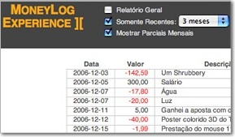
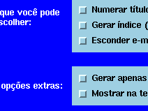
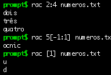
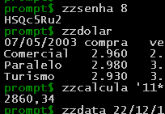
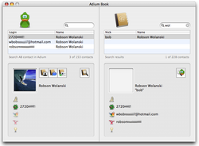
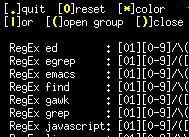
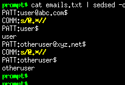

> **Programar é criar** — Uma idéia de sua cabeça vira um "ser vivo" que habita o computador e se relaciona com outros programas e seres humanos.
>
> **Programar é um desafio** — Para concretizar idéias, vários problemas e obstáculos aparecem e é preciso fazer algoritmos para resolvê-los.
>
> **Programar é se dedicar** — Mesmo depois de "pronto" o programa, sempre há algo a melhorar, bugs para corrigir, versões para lançar.
>
> **Programar é um prazer** — É um brinquedo que não enjoa. É sempre diferente, é sempre uma aventura.

Esta página reúne todos os programas que fiz. É um grande índice descritivo, com informações gerais sobre cada programa.

Todos estes programas são gratuitos e possuem o código fonte aberto (GPL, Open Source, etc). Você pode baixar, usar e modificar sem medo.

## Primeiro a historinha

Sou um programador autodidata, não tendo estudado formalmente nessa área. Tanto no curso técnico (Eletrônica) quanto na faculdade (Processamento de Dados), não cursei matérias sobre compiladores, algoritmos, autômatos e outros bichinhos do "mundo da programação" que qualquer aluno de bacharelado estuda. Também nunca li livros sobre esses assuntos, livros técnicos são muito chatos.

> Parênteses: Os únicos livros técnicos que já li foram "Mastering Regular Expressions", "Unix Text Processing" e o "The Art of Unix Programming".

Aprendi na prática, pesquisando na Internet, participando de listas de discussão e olhando o código de outros programas. Poder "olhar o código" foi essencial para o meu aprendizado, por isso todos os programas que faço têm o **código fonte aberto**, para que qualquer um possa ver e também aprender.

Gosto de **linguagens interpretadas** e de fazer programas alto-nível, sem precisar se preocupar com as entranhas da máquina: bits, bytes e essas malices. Para mim programar é criar algoritmos e estruturas de dados, essa é a parte divertida. Se for para ficar massageando o hardware cuidando de ponteiros de memória, coletor de lixo e shift de bits, estou fora.

Meu negócio é **manipular texto**. Me coloque para fazer um conversor, um tradutor, um gerador de relatório ou coisa parecida e me veja feliz. Os programas que fiz são retratos dessa preferência. Nada de drivers, cálculos, compiladores e essas coisas chatas.

O primeiro programa que fiz foi um [joguinho de labirinto para MS-DOS](lelolab/) em 1995. Desde então aprendi outras linguagens (*Bash*, *SQL*, *SED*, *PHP*, *Python*, *AppleScript*, nesta ordem) e fiz outros programas, tanto em casa quanto no trabalho (virei programador).

Nas horas vagas (cada vez mais escassas!), continuo atualizando e melhorando os programas mais importantes, aqueles que possuem página na Internet, lançamentos freqüentes de versões novas e comunidade de usuários. De vez em quando também aparece algum programa novo.

O **pagamento**? Fico feliz e satisfeito quando alguém me manda um e-mail dizendo "*Teu programa foi útil para mim*" ou "*Fiz um programa inspirado no seu*". Considero que dar a minha contribuição à cadeia de uso-aprendizado-produção de software é uma boa maneira de investir parte de meu tempo livre.

Confira no [Changelog Nerd](/doc/changelog-nerd.html) o ritmo intenso de lançamento de versões novas dos programas.

## A minha primeira vez foi assim...

Ingredientes:

- 1995
- Bastante tempo livre
- Começando a fuçar no computador
- Descobrindo o MS-DOS
- Namorada compreensiva
- Muita vontade, pouco conhecimento
- Meses a fio, noites adentro

Resultado:

- [LELOLAB](/bin/lelolab/) - Jogo de labirinto em Batch para MS-DOS

## Filhos mimados

Estes são os queridinhos, os programas que eu gosto de cuidar e melhorar. Eles são completos, com documentação, versionamento, página na Internet, comunidade de usuários e toda a parafernália que acompanha um programa grande.

<!-- A maioria conta com registro no [Freshmeat](http://freshmeat.net) para anunciar versões novas e cadastro no [SourceForge](http://sourceforge.net) para hospedar o site. Ambos sites gratuitos e que apóiam o software livre. -->

Alguns desses programas já deram passos importantes, entre eles:

- Ser incluso em distribuições de Linux/Unix
- Ser o tema de artigos escritos em revistas/sites nacionais e internacionais
- Ter conseguido uma legião de usuários que contribuem na divulgação e no desenvolvimento

### MoneyLog

- Site: https://aurelio.net/moneylog/
- Linguagem: Javascript
- Interface: Web
- Idioma: Português e [Inglês](/projects/moneylog/)
- Nascimento: 8 de Julho de 2006
- Versão Atual: 4

Acompanhe suas finanças de maneira simples e prática. Em um único arquivo ficam os seus lançamentos (quanto ganhou e gastou) e o gerador de extratos. É uma página de Internet e um programa ao mesmo tempo. Baixe a página, adicione dados novos utilizando um editor de textos comum e veja o resultado no navegador. Tudo localmente, sem precisar estar conectado na Internet. Simples, rápido, leve, personalizável, tudo-em-um. Possui suporte a tags, filtro ativo (funciona enquanto digita, usa [expressões regulares](/regex/)), colunas ordenáveis com um clique, saldo mensal, saldo acumulado, lançamentos futuros, visão dos meses recentes, visão geral (resumo). Veja mais detalhes no [site do Moneylog](/moneylog/).

### EmoMemory

- Site: https://aurelio.net/projects/emomemory/
- Linguagem: AppleScript
- Interface: Gráfica Interativa
- Idioma: Inglês
- Nascimento: 17 de Abril de 2007
- Versão Atual: 1

O EmoMemory é um jogo que mexe com a memória e com o coração. Ao invés de ficar memorizando símbolos, desenhos ou cartas, você se concentra nas pessoas que ama. Sua família, seus amigos, colegas e parceiros. Além da memória visual, esse jogo exercita a sua [Memória Emocional](http://www.memory-key.com/NatureofMemory/emotion.htm), levando em conta resultados de estudos que comprovam que memórias boas (eventos prazerosos e pessoas próximas) possuem mais detalhes contextuais e são lembradas mais facilmente. Você sabia que [emoções afetam sua memória](http://en.wikipedia.org/wiki/Emotion_and_memory)? Foi lançado como shareware, mas [ficou gratuito (e livre)](/blog/2011/12/17/jogo-emomemory-agora-e-gratuito-codigo-fonte-liberado/) em 2011.

### txt2tags

- Site: http://txt2tags.org
- Linguagem: Python
- Interface: Linha de comando, Web e Gráfica
- Idioma: Português, Inglês e outros
- Nascimento: 26 de Julho de 2001
- Versão Atual: 2.6

É um conversor de arquivos texto para vários formatos: HTML, XHTML, Sgml, LaTeX, Lout, Man Page, Wikipedia, Google Code Wiki, DokuWiki, MoinMoin, MagicPoint (mgp) e Adobe PageMaker, entre outros. Você escreve seu texto normalmente e coloca marcações mínimas, como ****negrito**** e **//itálico//**, e o programa o converte para o formato desejado. Este programa eu utilizo para tudo: gerar as páginas do meu site (como esta que você está lendo), gerar os artigos e documentos que escrevo, slides de palestras, site da banda, site dos outros programas... É também utilizado por diversos sites nacionais e gringos (já são mais de 100, veja a [lista completa](http://txt2tags.org/children.html)) e é o formato original do meu [Guia de Expressões Regulares](/regex/guia/). Também tem listas de discussão em português e inglês, uma grande comunidade de usuários, tradução para várias línguas e vasta documentação. Ufa! Esse já virou um monstro.

### RAC

- Site: https://aurelio.net/rac/
- Linguagem: C
- Interface: Linha de comando
- Idioma: Português
- Nascimento: 12 de Dezembro de 2003
- Versão Atual: 1.3

Uma ferramenta de extração de texto, feita em parceria com meu amigo [Thobias](http://thobias.org). Ele programa (sou 100% leigo em C), eu faço a test-suite, site e documentação e juntos definimos as especificações. A idéia é ter uma ferramenta simples e flexível de se usar na tarefa de extrair pedaços de textos, podendo dizer coisas como "da 5ª até a antenúltima linha", ou "da terceira ocorrência de BLA até a penúltima ocorrência de BLI". Este programa ainda é um bebê, mas já tem implementada mais da metade da especificação e tem agradado os usuários. Seu site e documentação estão escritos em linguagem didática, em português, para que o usuário possa experimentá-lo facilmente, sem medo. Nossa intenção é dominar o mundo, acreditamos estar na trilha certa :)

### Funções ZZ

- Site: https://funcoeszz.net
- Linguagem: Bash
- Interface: Linha de comando
- Idioma: Português
- Nascimento: 22 de Fevereiro de 2000
- Versão Atual: 10.12

Coletânea de mini-programas com funcionalidades diversas. São mais de 120 funções para o shell Bash que fazem tarefas como arrumar nomes de arquivos, calcular horas e datas, conversão entre medidas, validação de CPF/CNPJ, gerador de senha, entre outras. Várias funções fazem pesquisa na Internet, extraindo e formatando dados de vários sites, entre eles: dicionários, tradutores, notícias, loteria, Detran, Google, cotação de moedas, previsão do tempo... Enfim, um grande canivete suíço. É codificado à quatro mãos (eu e o amigo [Thobias](http://thobias.org)) e é constantemente atualizado, pois os sites consultados sempre mudam de lugar e formato. Interfaces ICQ e Windows foram feitas por usuários dedicados. Por falar em usuários, eles são muitos. E estão sempre nos ajudando a manter tudo funcionando, participando ativamente na lista de discussão do programa.

### AdiumBook

- Site: https://aurelio.net/projects/adiumbook/
- Linguagem: AppleScript
- Interface: Gráfica Interativa
- Idioma: Inglês
- Nascimento: 23 de Agosto de 2005
- Versão Atual: 1.3

É um programa para Mac OS X que serve para manter sincronizados os contatos da Agenda e do Adium (cliente ICQ/MSN/*). O programa foi feito no Xcode (IDE do Mac), a interface Cocoa foi feita no Interface Builder e o código é AppleScript puro. É meu primeiro programa gráfico, com botões, menus, pesquisa, apelo visual e tratamento de eventos. Já tem uma boa base de usuários e foi [destaque no site do próprio Adium](/blog/2006/09/26/adium-book-nos-holofotes/).

### txt2regex

- Site: https://aurelio.net/projects/txt2regex/
- Linguagem: Bash
- Interface: Interativa para console
- Idioma: Inglês (interface do programa em Português também)
- Nascimento: 02 de Novembro de 2000
- Versão Atual: 0.8

É um assistente (programa interativo) para se fazer expressões regulares em vários programas conhecidos. Apenas navegando entre menus (no modo texto) e escolhendo opções você vai construindo sua expressão. O programa já se tornou referência, faz parte de várias distribuições de Linux/Unix (*Conectiva, Debian, Mandrake, FreeBSD, ...*) e já foi matéria em revistas internacionais (*França, Alemanha, Japão*). Está traduzido para 10 idiomas e entende as expressões de mais de 20 programas. Um detalhe interessante é que seu código é escrito inteiramente com os comandos internos do shell Bash, não usando nenhum outro comando externo do sistema, como *sed*, *cut*, e outros.

### sedsed

- Site: https://aurelio.net/projects/sedsed/
- Linguagem: Python
- Interface: Linha de comando
- Idioma: Inglês
- Nascimento: 21 de Dezembro de 2001
- Versão Atual: 1.0

É um depurador (*debugger*) para o programa [SED](/sed/). Um salva-vidas. Com ele você pode "enxergar" o conteúdo dos registradores internos (*buffers*) do SED enquanto os comandos são executados, facilitando o entendimento de seu funcionamento. A grande vantagem desse depurador é que ele gera um script em SED! Então você depura seu script usando o próprio SED do sistema. Além disso ele ainda faz outras coisinhas legais como alinhar (*indent*) o script e convertê-lo para HTML, com a sintaxe colorida, links e tudo mais. Com ele é possível ver como funciona o inacreditável [dc.sed](http://sed.sf.net/local/scripts/dc.sed.html).

### SedSokoban

- Site: https://aurelio.net/projects/sedsokoban/
- Linguagem: SED
- Interface: Interativa para console
- Idioma: Inglês
- Nascimento: 15 de Março de 2002
- Versão Atual: 0.3

Isso mesmo, o lendário jogo de empurrar caixas, Sokoban, inteiramente escrito em [SED](/sed/) :) O jogo está bem completo, com 90 níveis, cores, comandos, detecção de vitória e movimentação do personagem usando as setinhas! Tudo começou como uma brincadeira, mas se transformou num projeto desafiador. Foram 8 horas de programação intensa e abstrata. "*Viajar na maionese*" de repente ganhou um significado palpável para mim. A recompensa veio logo. No dia seguinte ao anúncio, ele se espalhou de maneira impressionante, conseguindo algo que eu nunca imaginei atingir: [uma notícia no Slashdot](http://developers.slashdot.org/article.pl?sid=02/03/21/0217219), a central mundial dos nerds. Foi uma felicidade tremenda, meu joguinho tosco sendo visto por centenas (talvez milhares?) de pessoas do mundo todo. Foram vários comentários, muitos deles perguntando: "MAS POR QUÊ?". Porque programar é divertido, oras.

**Aviso:** Este não é um jogo que lhe cativará pelo seu visual ou jogabilidade, o seu único charme é ter sido escrito em SED, uma mini-linguagem de manipulação de texto. O mérito é pela tosquice. É algo como fazer uma casa com palitos de sorvete, não é pela casa em si, mas pelo desafio da construção.

**Extra:** Se você gostou do Sokoban, saiba que também tem o [SedArkanoid](/projects/sedarkanoid/) :) Este é BEM chato de jogar, tendo que apertar a tecla ENTER para que a bolinha se mova. Mas está completo, com cores, explosões cadenciadas, possibilidade de segurar a bolinha no bastão e tem 3 vidas. O joguinho tem alguns segredos. O comando "#" faz você ficar invencível. Legal para segurar o ENTER e ver a bolinha andando rápido e destruindo tudo. Os níveis escondidos t1, t2, t3 e t4 são legais para demonstrar o algoritmo das explosões cadenciadas.

## Filhos distantes

Estes são outros programas que fiz. Alguns são estudos, outros ferramentas pequenas e alguns são programas completos. Alguns pararam no tempo, outros eu atualizo de vez em quando, enfim, é um grande saco de gatos.

- [Scraps](php/scraps.phps) (**PHP**):
Este script pode ser usado tanto como livro de visitas (mural de recados, scraps) quanto comentários de artigos. O HTML gerado é enxuto e estrutural, com toda a formatação sendo feita via CSS. Funciona como módulo, podendo ser embutido em qualquer página já existente, bastando uma única linha de *require()*. O e-mail do visitante é "escondido" como tooltip no nome e há uma checagem contra SPAM. Funciona em inglês e português (configurável). Pequeno, flexível, adaptável, comentado em Português.

- [BookCash](python/bookcash.py) (**Python**):
Este é o programa que uso para gerar o relatório de vendas de meus livros e apostilas. Tudo o que faço é no fim do mês colocar a quantidade de livros vendida e ele já me gera uma tabela com todos os números deste e dos meses anteriores, com valores totais, acumulados e médias. O programa também gera [um gráfico das vendas](python/bookcash.png), para ficar mais fácil visualizar os dados. Funciona como módulo, podendo ser usado por vários scripts, um para cada livro. Além de livros e apostilas, pode ser usado para qualquer outra coisa que você queira acompanhar o número de unidades vendidas por mês.

- [Importa contatos em CSV para o tocador de MP3](python/s1mp3-import-contacts.py) (**Python**):
Vá na sua agenda (Outlook, Kontact, Yahoo!, ...) e exporte os contatos para o formato CSV. Então rode este programa e ele criará um arquivo binário com os seus contatos. Este arquivo pode ser então copiado para o seu tocador de MP3 do Paraguai (China, Coréia, ...) e ele lerá os dados, incluindo-os em sua agendinha. Mais informações no código do programa.

- [iTunes SED](/projects/itunes-sed/) e [iPhoto SED](/projects/iphoto-sed/) (**AppleScript**):
Que tal usar todo o poder do SED para fazer substituições automáticas (com [expressões regulares](/regex/)) nas tags ID3 (nome da música, artista, álbum, etc) de suas músicas do iTunes? Ou então fazer o mesmo nos dados das fotos do iPhoto (título, comentários)? É isso que estes dois scripts fazem.

- [iTunes Rename Disk File](/projects/itunes-rename-disk-file/) (**AppleScript**):
Esse script renomeia os arquivos de áudio (MP3, AAC, etc) selecionados no iTunes, baseando-se nas informações da música (nome, banda, disco, etc). Ele remove os caracteres estranhos e tem a opção de usar ou não espaços em branco. Além dos formatos pré-cadastrados, o usuário pode fazer um formato personalizado.

- [Export Contacts To Yahoo CSV](/projects/export-contacts-to-yahoo-csv/) (**AppleScript**):
Meu primeiro AppleScript, serve para migrar os contatos da agenda do MacOS X (*Address Book*) para a agenda via Web do Yahoo!. O script extrai os dados e os converte para o formato CSV do Yahoo. Está bem completo, lidando inclusive com codificação de caracteres, grupos e os campos de data.

- [Import Contacts From Yahoo CSV](as/ImportContactsFromYahooCSV.py) (**Python+AppleScript**):
Este script é o complemento do anterior, importando o dump dos contatos do Yahoo! Endereços (CSV) para o *Address Book* do MacOS X. O detalhe interessante: é um script em Python, que gera um AppleScript, que por sua vez insere os contatos na agenda. Fiz assim pois eu já tinha pronto em Python o parser do arquivo CSV do Yahoo, que havia usado em outro programa.

- [Contador da página](php/counter.phps) (**PHP**):
Eu costumava usar um contador de acesso nas minhas páginas, que é esse script simples. Ele soma 1 ao número atual e cospe o resultado na tela. Não conta *Reloads* vindos consecutivos do mesmo endereço IP e envia relatórios periódicos com os endereços de origem do visitante. Funciona 100% estável há anos, então o considero "pronto". Tem um [mini HOWTO](php/contador-HOWTO-ataliba.txt) de como instalá-lo, feito pelo amigo [Ataliba Teixeira](http://ataliba.eti.br).
 **APOSENTADO: Estou usando o Google Analytics agora.**

- [Gerador de RSS (segundo)](sed/rss.sed) (**SED**):
Um script SED que extrai as notícias da página principal do meu site e as converte para o formato RSS (validado). Além do título e conteúdo, cada notícia vem com a data de publicação e um link para o site principal. Este script pode ser usado em outros sites, porém adaptações terão que ser feitas nos padrões de pesquisa. casa toda a notícia e depois ela é separada em chamada e conteúdo.
 **APOSENTADO: Estou usando o <del>WordPress</del>[Jekyll](https://github.com/aureliojargas/aurelio.net/blob/master/feed.xml) agora.**

- [Gerador de RSS (primeiro)](php/rss-old.phps) (**PHP**):
O primeiro script gerador de RSS que usei, uma contribuição do amigo *Deivison Alves Elias*, que me "deu de presente". Fiz pequenas modificações. Uma única expressão regular casa toda a notícia e depois ela é separada em chamada e conteúdo.
 **APOSENTADO: Estou usando o <del>WordPress</del>[Jekyll](https://github.com/aureliojargas/aurelio.net/blob/master/feed.xml) agora.**

- [Página com cores aleatórias](php/randbody.phps) (**PHP**):
Numa versão antiga de meu site, cada vez que você entrava na página, o fundo e o texto apareciam em cores diferentes, escolhidas ao acaso (aleatórias). Este é o script tosco de 18 linhas que faz isso. Você pode inclusive colocar suas próprias opções de cores, pois o código está bem facinho de entender.

- [Projeto Final da Faculdade - Lojinha Virtual](php/ESEEI-proj_final/) (**PHP**):
Esse eu fiz em 2000, pra pegar o diplominha. É um sistema em PHP que usa banco de dados (Postgres). É o famoso programa da "vídeo locadora" no contexto Web: cadastrar, alterar, excluir, consultar. Era empresa virtual de vendas on-line de fitas demo de bandas independentes (seria a nova incarnação do site da [DDD](/musica/#ddd)). Ficou legalzinho até, mas nunca usei.

- [Simulador das eleições 2002](python/urna.py) (**Python**):
Fiz um programelho no trabalho para simular uma urna eletrônica via Web e fazermos uma "prévia" das eleições para presidente. É um script Python que funciona como CGI. A autenticação dos "eleitores" é feita via Apache. É um exemplo bem simples de programa de enquetes, útil para brincar e para aprender, pois o código está bem explicado e em português.

- [aass](bash/aass) (**Bash**):
Ascii Art Screen Saver. Um típico exemplo de uma tarde sem muito o que fazer no trabalho. Nesse dia resolvi aprimorar os conhecimentos sobre os caracteres de controle do terminal, fazendo este programinha que usa os códigos de cores, posicionamento do cursor e limpa tela. Você passa pra ele uma letra, ou uma frase e ele enche sua tela com isso, em posições e cores aleatórias. Também tem uns "temas" já prontos em Ascii Art como siri, espaço sideral e avião. Ficou limpo, com help, diversas opções de linha de comando e funciona redondo. Ele foi resumido e hoje é parte das Funções ZZ, a **zzss**.

- [Biblioteca shell](bash/lib/) (**Bash**):
Biblioteca básica para Bash implementando tarefas comuns como fazer perguntas Sim/Não, menu, alinhamento de texto, etc. As funções têm um nome padronizado e também há uma versão da biblioteca que usa o programa Dialog.

- [ccat](bash/ccat) e [cgrep](bash/cgrep) (**Bash**):
O "c" é de "color" ou "colorido", feitos com Bash+SED+caracteres de controle. O *cgrep* mostra o texto procurado em amarelo e o nome dos arquivos em branco. Hoje as versões mais novas do grep já possuem uma opção para colorizar o texto. O *ccat* sempre mostra todo o conteúdo de um arquivo, mas deixa coloridas as palavras especificadas na linha de comando.

- [showlink](bash/showlink) (**Bash**):
Mostra todos os links para os quais páginas *html de um diretório apontam. Aceita várias opções para dizer que tipo de link se deseja, como arquivos de som, imagem, ftp, email etc. É útil para controlar os links de um site de internet.

- [sed](/sed/):
Sou aficcionado por SED e fiz vários programinhas com ele. Eles estão listados no link indicado.

- [java](java/) e [sql](sql/):
Alguns programinhas/comandos que fiz para a faculdade, de repente pode ser útil pra quem está iniciando nessas linguagens. Esta área era acima de tudo uma cópia de segurança, pois máquinas de faculdade sabe como é...
