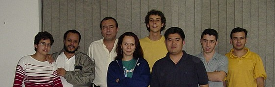

Em agosto de 2003, saí da minha toca em Florianópolis para ir
a São Paulo ministrar um curso de programação em Shell de uma
semana na empresa 4Linux. Foi a primeira vez que viajei à
trabalho e a primeira vez que fui "professor".

Este documento descreve como foi essa experiência. É uma
história, um depoimento pessoal, e não um documento técnico ou
descritivo do curso.

## O Início

Tudo começou 2 meses antes, no início de maio, no IV Fórum
Internacional de Software Livre em Porto Alegre. Ou melhor, começou
três dias antes, quando fui demitido do emprego, resultado da
"Política de Contenção de Despesas" [tm].

Como de um dia para o outro fiquei "com tempo livre", pude viajar ao
Fórum tranqüilamente. Lá, dois grandes amigos, o Julio Cezar Neves
(Livro de Shell) e o Rubens Queiroz (Dicas-L) me convenceram a tentar
a carreira de instrutor de cursos nerds. Ambos são escolados na área e
me incentivaram a seguir este caminho. Com duas personalidades como
estas dizendo que sim, como eu poderia dizer não? :)

Eles fizeram o contato com a empresa 4Linux e algumas semanas depois
a idéia do curso tinha virado um projeto real! Ficou decidido que
seria sobre Shell, mas um Shell Avançado, para quem já faz Scripts
e quer realmente dominar o assunto. Ficou acertado um total de 40
horas em 10 aulas, a serem ministradas de manhã e à tarde na semana
dos dias 4 a 8 de Agosto de 2003.

## A Apostila

Tive que escrever do zero uma apostila completa, que após 85 horas de
trabalho ficou pronta. A ferramenta utilizada no processo foi o
[txt2tags](http://txt2tags.sf.net), é claro. Escrevi apenas texto, e o
programa o converteu para HTML, que por sua vez foi convertido para
PDF pelo excelente [htmldoc](http://www.easysw.com/htmldoc).

Só que me empolguei, e no final a "apostila" acabou se tornando um
quase-livro de 108 páginas no tamanho A4 :) Este é o resumo de seu
conteúdo:

 * Revisão do Básico
 * Programas Não São Scripts
 * Explorando as Possibilidades do Shell
 * As Ferramentas do Sistema
 * Caracteres de Controle
 * Expressões Regulares
 * Arquivos de Configuração
 * Banco de Dados com Arquivos Texto
 * Interfaces Amigáveis com o Dialog
 * CGI em Shell

Os assuntos foram descritos de maneira completa, e não como uma
simples lista de tópicos. A idéia é o aluno poder usar a apostila como
referência após o curso, tendo explicados os conceitos e sua
aplicação, com vários exemplos de código funcionais.

Foi minha primeira vez escrevendo uma apostila, e tive a sorte de
fazer algo que agradou. Tanto os alunos quanto o pessoal da 4Linux
elogiaram bastante a apostila, dizendo ser bem escrita, completa e com
conteúdo. Parece que meu tiro acertou algo :)

Todos os detalhes sobre a apostila, índice, amostra e informações de
venda avulsa estão [nesta outra página](../../shell/apostila/).

## A Viagem

Já fazia mais de 10 anos que eu não viajava de avião. De repente lá
estava eu no aeroporto da ilha, num domingo ensolarado, tendo que me
despedir.

Uma despedida dura, para embarcar numa viagem a um lugar desconhecido,
para ficar uma semana fora trabalhando em algo que eu nunca tinha
feito antes. Bem... Como ter me mudado para Floripa e casado já tinha
sido uma bruta mudança de vida, essa semana não poderia ser assim tão
difícil &;)

Avião é MASSA! Detona! A ilha foi ficando pequena, deu pra ver
Canasvieiras inteira, nossa rua, nosso telhado... Depois as nuvens,
ficar acima delas... Caramba, voar é MUITO MASSA.

Chegando em São Paulo, fui direto ao Hotel Century Paulista que (ainda
bem!) ficava na frente da 4Linux, mas na frente mesmo, bastando
atravessar a rua para "ir ao trabalho".

## A Turma

Primeiro dia. O curso estava marcado para começar às 09:00, mas
cheguei antes para conhecer o local, as instalações, etc. Uma sala
normal, pequena, com quadro branco, uma televisão e nove computadores.

Logo de manhã, a primeira surpresa: apenas quatro alunos confirmaram a
presença. Os outros quatro desistiram na última hora e não deu tempo
de preencher as vagas com a lista de espera... Foram escalados três
funcionários da 4Linux para aproveitar os lugares vagos.

Segunda surpresa: dos sete alunos, dois eram mulheres. Eu nunca tinha
conhecido nenhuma mulher que 1) usasse a linha de comando e 2)
gostasse de programar em Shell, e de repente estava com duas dessa
espécie em minha turma. Vida longa aos nerds de todas as espécies!

                         

Outros alunos me chamaram a atenção por sua grande vontade de fazer o
curso. Um veio láááááá de longe, de Fortaleza, enfrentando mais de 5
horas de vôo com muitas escalas. Outro era um carioca que no auge dos
seus 50 anos de idade, já tinha tantos anos de Informática quanto eu
tenho de vida, e para mim foi uma honra poder lhe ensinar algo novo.

Por falar em idades, o resto dos alunos tinham todos seus vinte e
poucos anos. As motivações que os levaram a fazer o curso eram
variadas, mas todos usariam o conhecimento adquirido em Shell em seu
trabalho.

## A Mudança

Já na primeira aula após a conversa inicial com a turma, algo
inesperado: a maioria ainda não tinha o conhecimento básico necessário
para absorver o conteúdo da apostila.

Olha a situação: de cara, já em meu primeiro curso, tive que
simplesmente abandonar o cronograma planejado para as aulas e guiar o
curso conforme o progresso dos alunos.

O famoso "nivelar por baixo" teve que ser feito, caso contrário, de
que adianta simplesmente mostrar conteúdo se quem está ouvindo ainda
não está preparado para recebê-lo? Como resultado, a revisão do básico
que era para durar 3 horas acabou se estendendo por 16 (2 dias).

Toda esse mudança foi conversada com os alunos já na primeira aula, e
com o seu consentimento, a ordem das aulas da apostila foi esquecida,
e os tópicos foram sendo vistos na prática, durante o desenrolar dos
exercícios feitos em aula.

Outra mudança foi a decisão de começar as aulas mais cedo (08:30),
encolher um pouco o almoço e os intervalos, e ficar até um pouco
depois das 18:00 horas. Com isso, ao invés de oito foram nove horas
por dia de aulas, estendendo o curso para 45 horas para que todo o
conteúdo pudesse ser visto.

Mesmo com as horas extra de aula, infelizmente não sobrou tempo para o
proposto da última aula, que seria cada aluno fazer um programa
completo e apresentá-lo à turma. Novamente foi conversado com os
alunos e eles decidiram que ver todo o conteúdo da apostila era mais
importante que o programa final.

## O Decorrer

Nos dois primeiros dias foi feita a revisão do básico. Mas foi uma
revisão diferente.

Foram passados 10 exercícios relativamente simples para quem já
conhece Shell, mas desafiadores e didáticos para o aprendizado, pois
envolviam raciocínio e uso das estruturas da linguagem e das
ferramentas do sistema. A revisão só acabou quando todos os alunos
conseguiram fazer todos os 10 exercícios.

Durante a explicação de cada exercício e a análise das soluções,
vários tópicos que estavam planejados para serem vistos adiante foram
adiantados e trazidos à discussão, como ferramentas do sistema e
Expressões Regulares. Isso agilizou o desenrolar do curso.

Terminada a revisão, vimos vários tópicos de programação profissional,
como cabeçalho, comentários, código limpo, uso de variáveis, funções,
histórico de mudanças e versionamento.

Em seguida, foram vistas com detalhes as 25 ferramentas mais
importantes de um ambiente UNIX/Linux, suas opções mais úteis e onde e
como aplicar cada uma delas.

A última ferramenta vista foi o `sed`, e logo em seguida foi
arrematado o assunto de Expressões Regulares. Foi unânime a opinião de
que estes foram os assuntos mais difíceis de digerir. Olha que até eu
saí meio zonzo depois dessa aula &;)

Mas após judiar da turma com os assuntos complexos, no dia seguinte
foi a aula mais legal segundo opinião dos alunos. Também pudera, a
aula foi brincar de mover o cursor e mostrar letras coloridas com os
caracteres de controle, além de um aprendizado completo do Dialog,
ensinando como fazer interfaces mais agradáveis ao usuário.

Depois foi visto em profundidade como utilizar arquivos de
configuração em programas Shell, com os alunos fazendo seus próprios
"parsers" para extrair as chaves e valores, bem como os aplicativos
que o utilizam. De quebra, estes aplicativos foram incrementados com
--opções de --linha de --comando.

Para finalizar, uma passada completa em CGI, com dicas de configuração
do Apache, explicação do conceito usando a interface do Google e prática
onde cada aluno escreveu seu próprio CGI e o formulário de comunicação
entre o programa e o usuário. Mais uma aula divertida e que caiu no
gosto da turma.

Como o tempo estava acabando, o último assunto a ser visto: Banco de
Dados em Arquivos Texto, foi prejudicado e teve que ser passado de
maneira rápida, sem tempo de prática para os alunos.

## O Desfecho

Sexta-feira, fim do dia, cada aluno ganhou uma folha em branco e foi
pedido para que escrevessem de maneira sincera qual foi a opinião sobre o
curso de Shell e se os resultados esperados foram atingidos.

Eu guardei os papéis para ler em casa somente e fiquei muito
satisfeito ao constatar 100% de aprovação. Incrível! Em um curso que
foi planejado de um jeito e acabou saindo de outro :)

Seguem trechos dos depoimentos:

> "Material de apoio muito bem pensado e bem dimensionado. Os
> exemplos ricos e também bem pensados. A dinâmica do curso foi
> um pouco ruim pois você nivelou por baixo. O ideal é fazer uma
> média pois sempre haverá alunos dinâmicos e alunos perdidos.
> No mais, foi muito bom!!"
> "O que mais gostei foi a lógica. Normalmente programamos
> metodicamente buscando a consistência, e alguns bons exemplos
> seus através de inconsistência gerávamos uma consistência. Eu
> sempre montei script pensando base na consistência, e não
> aproveitava os recursos do UNIX."
> "O curso é bem legal, porém os próximos deverão ser
> direcionados para um nível mais iniciante [...] Cursos de
> Shell Script são raros de se achar. Quando se encontra um,
> mesmo que seja avançado, os principiantes não irão perder a
> oportunidade de fazer o curso também. Foi o meu caso.
> Resultado: Muito bom."
> "Gostei bastante, mas pena que durou apenas uma semana, pois o
> conteúdo é extenso e para que seja possível absorver 100%,
> será necessário de no mínimo um mês. Aurelio, a sua didática é
> boa, e espero que a cada dia melhore mais [...] Resultado:
> Ganhei bastante conhecimento e tirei bastante dúvidas sobre
> Shell."
> "O curso de Shell obteve um grande nível técnico e didático.
> [...] Aprendi que posso melhorar ainda mais minha lógica, meu
> raciocínio. Acho que o curso poderia ser estendido mais 1 ou 2
> dias. Resultado: Ótimo, não tenho palavras... Agora é aplicar
> no dia-a-dia. Foi muito proveitoso e comecei a entender melhor
> o real siginificado de Shell Script."
> "Curso nota 1000! [...] Aurelio, você está de parabéns com P
> gótico! [...] Com certeza será muito útil no meu trabalho.
> Obrigado mesmo."
> "O curso foi ótimo, muito bem elaborado e com riqueza de
> detalhes técnicos, um nível técnico muito aprofundado, algo
> que realmente falta aos cursos de hoje. [...] Poderíamos ter
> evoluído mais em Dialog. Resultado: Ótimo, descobri o que
> queria, o poder do Shell, sed e ERs, que já começaram a me
> poupar tempo e mostrar melhor como funciona o sistema."
> "Curso de ótima qualidade, o instrutor tem uma didática
> incrível. Bem estruturado!!! Material muito bem feito e auto
> didata. [...] Tomar cuidado para não deixar o curso fraco ou
> cansativo por causa do alunos MUITO atrasados!!! Resultado:
> Adorei o curso!!! Até comecei a achar que posso PROGRAMAR..."

## A Conclusão

Eu considero que este curso foi um sucesso total.

A viagem e o dinheiro que ganhei foram bons, mas o principal foi ter
um desafio vencido com aprovação total dos interessados.

 * Os alunos disseram ter gostado e saído satisfeitos;
 * O pessoal da 4Linux me tratou super bem, elogiou a apostila e
a conduta, manifestando interesse em outros cursos no futuro;
 * Eu gostei da experiência, me senti à vontade como "professor", e
pude até aprender junto com os alunos, que considero novos amigos.

## Curiosidades

 * As aulas foram feitas escrevendo no quadro-branco com minha letra
horrível e a saída do meu computador aparecia numa televisão (acho que
18").

 * Eu falo a palavra "então" toda hora, não tem jeito, quando vejo ela
já saiu :)

 * Houve um problema chato de troca de HDs durante o curso pois todos
eram "plugáveis" e cada dia eles apareciam em máquinas diferentes.
Nesse troca-troca alguns scripts feitos pelos alunos durante o curso
simplesmente sumiram :(

 * Outro problema chato é que as máquinas da sala não eram idênticas.
Era Red Hat numa, Debian na outra, o Vi funcionava com sintaxe aqui,
ali não... Perdeu-se tempo com configurações e trocas de máquina.

 * O incrível é que mesmo para os exercícios mais simples, praticamente
cada aluno fazia uma solução distinta, fazendo com que todos
aprendessem várias maneiras de se pensar e resolver um problema.

 * O maior tropeço no aprendizado de Shell, o que dá o maior nó na
cabeça de todos, é sem dúvida as aspas 'simples', "duplas" e as
`crases`, é uma confusão só.

 * Machistas, revoltai-vos! No dia de fazer o "parser" para arquivos de
configuração e o aplicativo, que foi a tarefa mais complexa de todo
o curso, as duas meninas foram as primeiras da turma a terminar.

 * Haviam dois "coffee breaks" todos os dias fornecidos pela 4Linux. Os
sanduíches e salgados eram muito saborosos. E o melhor: à tarde
tinha sorvete de palito, massa!

 * Ganhei de um aluno um CD com vários mp3 e clipes de bandas novas, do
chamado New Metal, como Korn e Linking Park, pois estou muito
desatualizado musicalmente. Ganhei também dois broches do grupo
LinuxChix!

 * No final do curso, foi lançado um desafio aos alunos, em que o
primeiro que me mandasse por e-mail todos os 10 primeiros exercícios
resolvidos em menos de 80 caracteres, ganharia um exemplar do meu
livro de Expressões Regulares. Machistas, revoltai-vos novamente! O
vencedor do desafio foi uma aluna.

 * A muié me fez comprar duas calças "ajeitadas" para
dar o curso, pois disse que minhas calças de agasalho toscas
poderiam prejudicar minha imagem perante os alunos. Levei e tive que
usar, fazer o quê... :)
