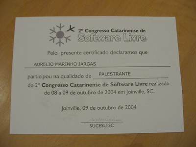
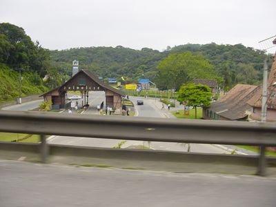
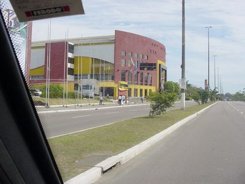
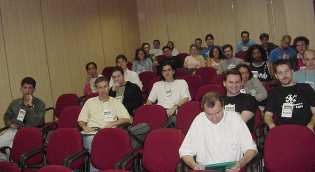
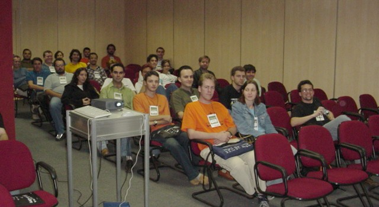
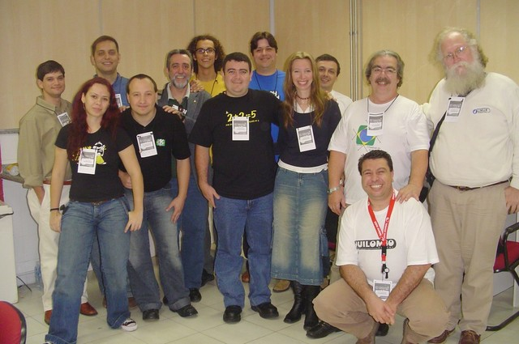
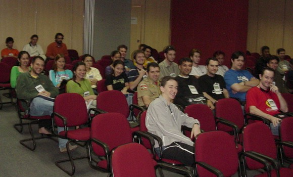
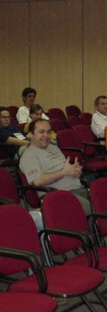
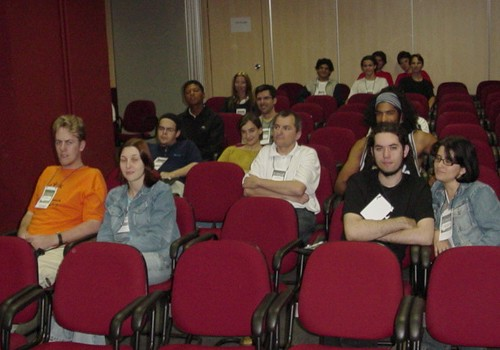
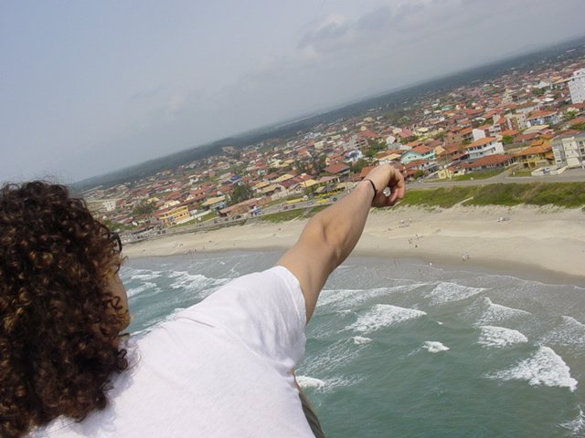

Nessa sexta e sábado dias 8 e 9 de Outubro teve
[um evento de Linux](http://www.softwarelivresc.org.br/congresso/2004/)
aqui perto de Curitiba, em Joinville. Eu ministrei duas
palestras no Sábado, uma de Expressões Regulares e outra sobre
Desenvolvimento de Software Livre.

Viagem tranqüila e rápida, palestras animadas, vários amigos
presentes, esticada até São Chico... Esse foi um evento muito
bacana.

Obrigado ao Douglas Conrad pelo convite, e a Dionara, André,
Ana e o pessoal da organização pelo apoio.

Links para os materiais:

* [Expressões Regulares - Apostila Introdutória](http://aurelio.net/curso/material/apostila-expressoes-intro.pdf)
* [Expressões Regulares - Meu Livro, versão online](http://aurelio.net/regex/guia/)
* [Expressões Regulares - Histórico da Linha de Comando](ccsl2-er-prompt.html)

* [Desenvolvimento de Software Livre - Slides](http://aurelio.net/curso/material/desenvolvedor/)

## Fui e Cheguei

Como o evento foi aqui perto de Curitiba (+- 120 Km), fui com o meu
*Power Uno 1.0 Ie Turbo Intercooler Flex GLS XR3 Luxo*. Para minha
total alegria, o sábado amanheceu ensolarado, tornando a viagem um
passeio tranqüilo pela serra, embalado por muito hardcore tosco de
minhas fitinhas k7 (CD no carro? Coisa de preibói ;).

Em duas horas estava em Joinville, a cidade que só chove. Mas aquele
dia estava sol forte, hooray!

*Portal de entrada de Joinville*

O evento foi num local chamado Centreventos. O amigo toti me garantiu:
"Pode vir tranqüilo que você acha". E foi mesmo. Parabéns à Prefeitura
de Joinville, tinha placas indicando onde era o tal Centreventos desde
a entrada de cidade, não tive como errar.

*Centreventos: bonito e grande, tudo novo e bem cuidado, legal*

## Expressões Regulares

A minha primeira palestra, a de Expressões Regulares, começou às 10 da
manhã. Na sala cabiam umas 120 pessoas, no momento de pico deve ter
chegado a uns 70 presentes.

Novamente, o meu problema mais temido: apenas uma hora para falar. É
difícil resumir tudo para fazer encaixar em tão pouco tempo, mas acho
que estou melhorando: foi.

O pessoal estava atento, e mais da metade disse já ter usado alguma
vez as expressões, legal! Todos os metacaracteres foram vistos, e no
final o clássico exemplo de trocar datas no formato americano
(MM/DD/AAAA) pelo nosso (DD/MM/AAAA).

Todo o [histórico da linha de comando](ccsl2-er-prompt.html) está disponível,
confira!

Lembro de ter visto alguns amigos na platéia: Helio (KDE), Bruder
(Haxent), André Ruiz (token), Boto (Conectiva), Binhara (Sucesu) e
MrPrompt (Floripa). Valeu a presença!

Ah! Galera que tirou foto durante a palestra, ou depois no bate-papo,
me mandem pra eu ver!

## Foooooooome

O almoço foi ali do lado, no supermercado BIG. Foi um encontro de
titãs, uma caravana de palestrantes e personalidades indo comer no
buffezão. Isso é muito legal nesses eventos, ter a oportunidade de
estar rodeado de mentes poderosas e poder papear e aprender com eles.

Parte do pessoal, reunido na sala dos palestrantes:

*Não sei, Sulamita, Cláudio, Helio, Roxo, Eu, Bolaños, Bruder, Fabianne, Marcelo, Julio, Paulino, Maddog*

Ah, essa sala dos palestrantes era massa! Tinha cadeiras, link com
Internet, água, refri, bolachas e frutas. Mordomia né?

> **Mico:** Eu comi demais no almoço (pra variar), e como ainda
> restava cerca de uma hora para a minha próxima palestra,
> fiquei lezo, quase dormi. Para evitar o sono tive a
> "brilhante" idéia de ir andar de skate (que está sempre no
> carro) no estacionamento do evento (asfalto lisinho, uma
> beleza). O sono foi embora, mas com o sol forte na cabeça,
> acabei ficando cansado. O "banho de pia" ajudou, mas não
> resolveu, fui palestrar cansado. Nota mental 1: não esqueitar
> antes de palestrar.

## Desenvolvedor de Software Livre

Nessa palestra, um dilema: eu tinha apenas uma hora para ministrar uma
palestra que dura 4 horas :/ Eu achei que ia ser um completo desastre,
mas no fim me surpreendi: consegui falar quase tudo o que queria.

Apesar de rapidinha e meio atropelada, foi uma palestra animada, eu
gostei. Acredito que o pessoal tenha curtido também. Devia ter umas 50
cabeças em média.

Nota mental 2: Fazer uma versão "light" da palestra, com poucos slides
e para caber em uma hora.

Opa, mais alguns amigos nessa palestra: Bruder (Haxent), MrPrompt
(Floripa), André Ruiz (token), Adilson Oliveira e Fabianne (Blender).

**Ah1!** Sempre nessa palestra eu cito a histórinha do Bruder e seu
jogo Xquatro, como um caso de "*Codificar antes de Googlear*", e
agora que ele estava lá assistindo, não deu tempo de contar. Escapou
dessa vez Bruder :D

**Ah2!** Valeu Adilson pela pilotagem do mouse nos slides, e desculpe
pelos "*Passa, passa... Não! Volta!*" :D

## s/Nerds/Praia/

Como a praia de Enseada (São Francisco do Sul) é ali do lado de
Joinville, também levei a minha prancha de surfe, e logo depois da
minha segunda palestra, toquei direto para lá.

No caminho, um pneu furou. Uma sujada rápida de mãos resolveu o
problema. A pousada que fiquei era bem bacana, e por sorte os vizinhos
eram surfistas e rolou hardcore em volume alto o tempo todo.

Pena que choveu domingo todo e não tinha onda. Na segunda abriu o
solzão e fez um dia animal, embora sem ondas também. O jeito foi subir
o morro e tirar fotos. Foi triste deixar a praia e voltar para
Curitiba sem ter entrado na água, mas enfim...

*Curitiba é pra lá, lá loooonge...*
