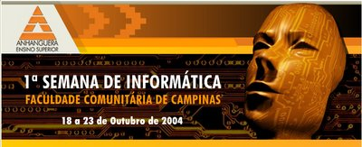
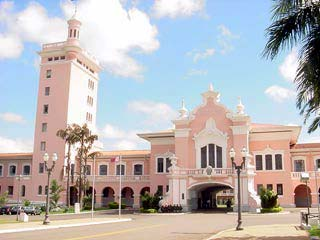
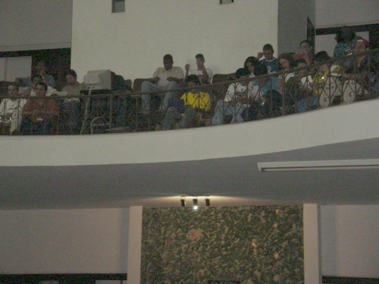
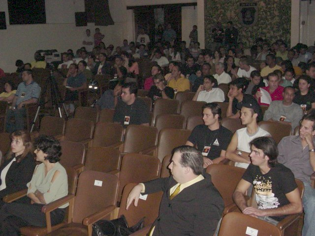
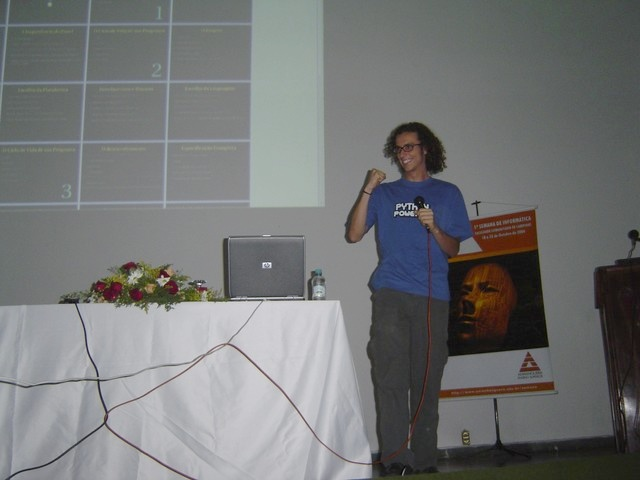
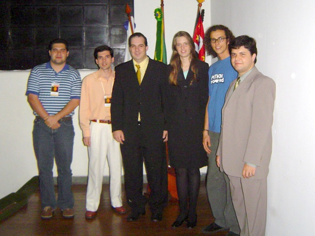
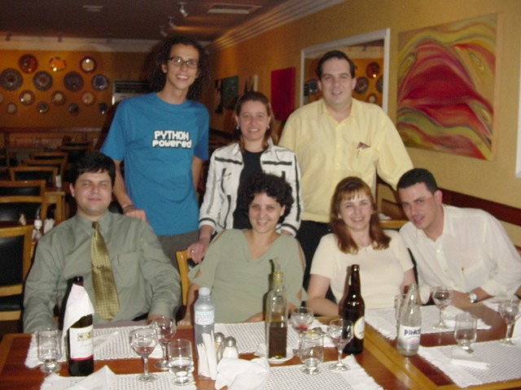
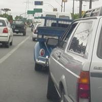

Na sexta dia 22 de Outubro de 2004 voei até Campinas para
dar a palestra de desenvolvimento de Software Livre num evento
da FAC - Faculdade Comunitária de Campinas, a
[I Semana de Informática da FAC](http://www.auri.com.br/semana/).

Viagem bem rápida, saindo de Curitiba na sexta à tarde e já
voltando no sábado de manhã. Mas foi muito agradável, com
platéia grande, jantar com os professores e hotel chique.

Obrigado ao André Déo pelo convite e organização e ao
Professor Carlos A. Miglinski pela oportunidade e
hospitalidade.

Links:
[Slides da Palestra](/curso/material/desenvolvedor/),
[Fotos oficiais do evento](http://www.auri.com.br/semana/fotos.php)

## Curitiba → Campinas → Hotel → Academia

O avião saiu de Curitiba perto das 16h30 e com menos de uma hora de
viagem estavam eu e minha mochila em Campinas. O professor Miglinski
me levou até o Hotel, que era show de bola. Quarto grandão, bem
decorado, aconchegante. Mas nem deu tempo de curtir, já fomos para o
local do evento.

A palestra foi na Escola Preparatória de Cadetes do Exército, que é
uma construção beeeeem antiga, pé direito gigantesco, prédio
retangular com um campo no meio, interessante. A cor externa é rosa,
parece que por ter sido feita com óleo de baleia ou algo assim.

*Academia de Cadetes do Exército*

## A Palestra

O auditório era bem grande, com uma banca superior inclusive (dois
andares). Parece que cabiam 300 pessoas sentadas, e no momento de pico
da palestra quase lotou, então imagino que tenham vindo umas 270
pessoas, meu maior público até hoje!

*Pessoal do auditório de dois andares*

> **Popismo:** Antes de começar a palestra, o amigo ex-virtual
> Andreyev veio me contar que viu um cara em Campinas com uma
> camiseta escrito AURELIO.NET. Caramba...

Antes de começar a palestra, teve uma apresentação formal da banca de
professores da faculdade, com uma moça falando e tudo mais. Depois
essa mesma moça me anunciou e fui começar o falatório.

Era pra ter começado às 19h30, mas atrasou uma hora. Foi bem legal ver
a "casa cheia". Perto das 22h muita gente saiu, imagino que por causa
do último ônibus, ou talvez por não aguentar mais ouvirem a minha voz
:)

*Eu, comemorando não lembro o que :)*

Foram 2h30 de palestra, acabando perto das 11 da noite. Nem eu
acreditei quando me falaram que horas eram, mas ainda restavam umas 70
cabeças no auditório que resistiram bravamente a minha tentativa de
fazê-los dormir &;)

O interessante é que toda a palestra foi filmada, parece que vão
tentar colocar ela num desses CDs de revistas de Linux, vamos ver se
rola.

*André Déo, Anselmo Zago, Carlos Miglinski, Moça Bonita, eu, Adriano Pila*

## O Depois

Depois fomos jantar num restaurante português, onde comi o tal do
bacalhau pela primeira vez na vida. Sempre achei que bacalhau era
ruim e palha, mas é bom.

*Em pé: Eu, Alexandra, Mig ::: Sentados: Adriano, Adriana, Magali, Marafon*

Enfim, cama, lá por 1h30 da manhã. Dia cheio: manhã e tarde
trabalhando na Conectiva, depois viagem, depois palestra de 2h30,
depois jantona. Simplesmente apaguei.

Dia seguinte cafézão e avião, e de volta em casa.

Ah! Lembrei. Quando estava indo para o aeroporto na sexta, eis que o
olho para o lado e está passando um **fusca com carroceria**.
Carroceria mesmo, daquelas de madeira, decoradas, igual de caminhão.
O cara cortou o fusca logo após o banco do motorista e enjambrou uma
mini-carroceria ali. Demorou até eu conseguir pegar a câmera dentro da
mochila, então só consegui uma foto de um ângulo ruim, mas está aí:

*Fusca com carroceria de madeira*
