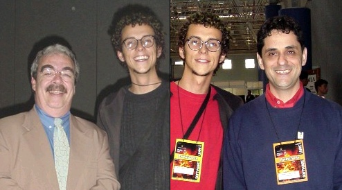
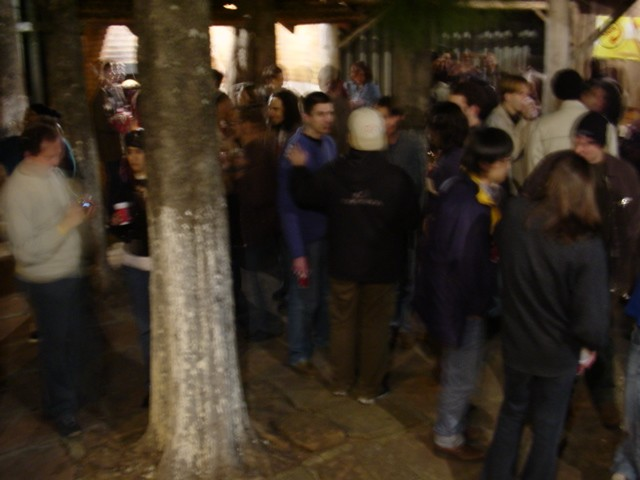
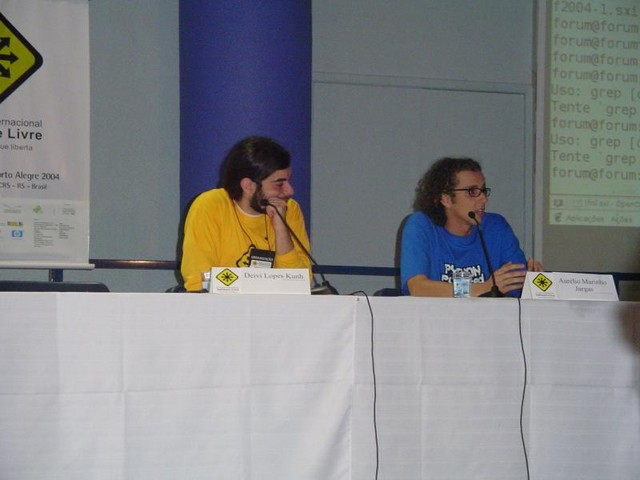
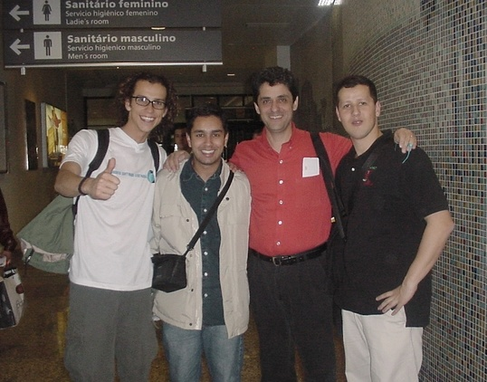
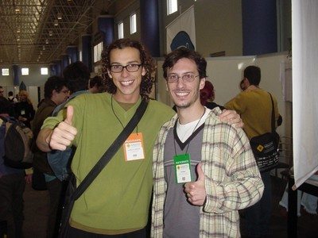
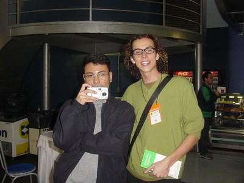
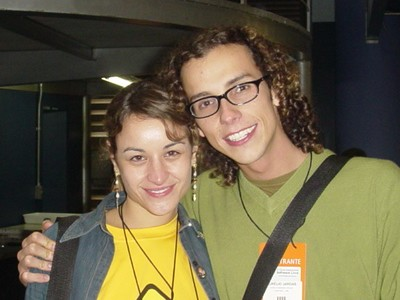
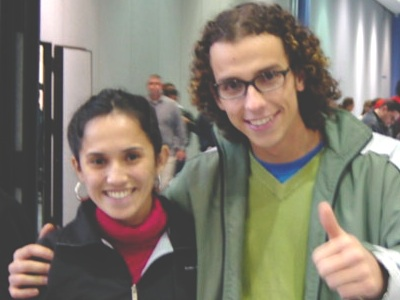
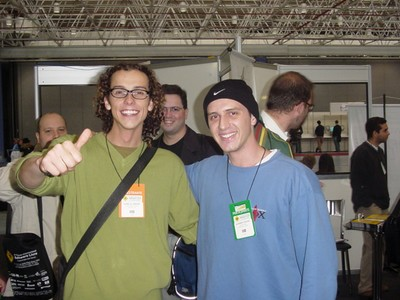

O fórum de Porto Alegre é sem dúvida o maior evento nacional
de Software Livre, e este ano tive a honra de participar como
palestrante.

Foi incrível. Uma grande festa com pessoas legais, divertidas,
animadas, dispostas, engajadas e nerds. E a melhor parte: o
reencontro com os amigos.

Na contabilidade geral, foram 5.000 participantes, vindos de
todos os estados do país, e ainda gringos que vieram de 35
países! Um mega evento.

Ministrei uma palestra de 1 hora sobre Expressões Regulares no
sábado dia 5, e esta página conta as histórias dessa viagem.

Meus agradecimentos à equipe do fórum pela oportunidade e
recursos, ao Deivi Kuhn pelo apoio, à Conectiva pela liberação
e um obrigado muito especial à Sulamita Garcia, pela força e
luta.

[Site Oficial do Evento](http://www.softwarelivre.org/forum2004/),
[Outros Álbuns de Fotos do Evento](http://brlinux.linuxsecurity.com.br/noticias/002585.html)

## Prefácio Sentimentalóide

Este trecho do relato é gay. Só leia se gostar de divagações emotivas
e sentimentalismo barato.

Há um ano atrás, em Junho de 2003, a contenção de custos na empresa me
fez "ser saído" do meu emprego em Florianópolis. De repente lá estava
eu, com todo o tempo do mundo nas mãos, quando li que naquela mesma
semana aconteceria o IV FISL em Porto Alegre.

Até aquele momento, eu nunca havia ido a nenhum evento de Software
Livre, e nem tinha o menor interesse nisso. Mas quando soube que dois
grandes amigos virtuais que eu nunca tinha visto "ao vivo" estariam
lá, o Julio Cezar Neves (livro shell) e o Thobias Salazar Trevisan
(funções ZZ), comecei a cogitar a idéia de ir até lá.

Dias depois, com alvará de soltura concedido pela esposa, lá estavam
eu, o Rudá e o Leslie (dois grandes amigos e ex-Conectivos), indo de
Toyota para Porto Alegre.

[A viagem e o fórum](/viagem/fisl-2003/) foram excelentes, e além
de encontrar vários amigos no evento, achei muito bacana aquele
esquema de palestras, divulgação do conhecimento e animação dos
palestrantes e visitantes. Assisti várias palestras e me senti
renovado, cheio de idéias novas e vontade de produzir mais.

E lá no meio daquela coisa toda, o que me surpreendeu foi que tanto o
Julio quanto o Rubens Queiroz (Dicas-L), vieram me falar que eu também
poderia estar lá no palco, dando palestras. Ambos incentivaram muito,
falando com uma certeza e segurança de quem parecia já saber tudo iria
dar certo.

Naquele momento, sem nunca ter pisado num palco para falar de
nerdices, aquilo parecia muito longe e inatingível. Imagina só, eu ali
falando para uma sala cheia num fórum internacional... Mas mesmo assim
comentei com o Rudá, numa convicção sonhadora:
"*No ano que vem, eu volto como palestrante.*"

A viagem acabou, e de volta em Floripa, sem emprego, aquela idéia do
Julio e do Rubens ficou me incomodando. Resumindo a história: dois
meses depois eu havia escrito uma apostila de Programação em Shell e
estava em São Paulo ministrando meu primeiro curso.

Um ano se passou e muito mudou: voltei para Curitiba, voltei a
trabalhar na Conectiva, vendi a Toyota, me separei... E no
meio de tudo isso, acabei ministrando vários cursos e palestras por
aí. Julio e Rubens, vocês estavam certos.

Toda essa história é para tentar ilustrar como foi importante para mim
quando recebi a notícia de que minha palestra tinha sido aceita no
fórum desse ano. Foi uma alegria imensa, uma realização, a profecia se
realizou: em 2003 visitante, em 2004 palestrante. Em um ano tudo
aconteceu.

Quero aproveitar o espaço para homenagear estes dois grandes amigos
que sempre me apoiaram, e que se não fosse o seu incentivo e força,
nada disso estaria acontecendo agora. Julio, Rubens, vocês são os
caras. **VALEU MESMO**.

*Meus padrinhos Julio Neves e Rubens Queiroz, no FISL de 2003*

## A Ida

O fórum começou na quarta-feira, mas eu só saí de **Curitiba** na
quinta de noite, às 22:30 horas. Estava cheio de trabalho na
Conectiva, e não tive como faltar 3 dias para pegar o evento desde o
início.

Vôo rápido, em 1 hora já estava aterrisando em POA. Ah, um detalhe
estranho: quando mais viajo de avião, **mais sinto medo** em voar
nessa máquina. A cada viagem cresce a sensação de estar dentro de um
sistema repleto de possibilidades de falha, que por milagre acaba
chegando e pousando no destino. Não raciocino, apenas sinto.

Ah, dessa vez me superei, e como não levei o iBook, consegui colocar
todas as minhas tralhas numa **mochilinha nas costas**. Como é bom
chegar e já sair direto, sem ter que esperar a boa vontade da mala
aparecer na esteira...

Do avião para a van, da van para o Hotel. Um tal de **Coral Tower**,
bem legal, quarto grande. Cheguei no hotel era meia-noite, e antes
mesmo de fazer o check-in, já conheci a Pia Smith, personalidade
autraliana que veio para palestrar no fórum mas naquele momento queria
saber como chegar na festa que estava acontecendo ali perto.

Bem, só deu tempo de fazer o check-in, deixar a mochila no quarto e ir
direto para a **gandaia**! Fomos a pé eu, ela, o Sandro (4 Linux) e a
Maureen (irlandesa que também falava português) para o tal de
Barbazul. Chegando lá, que surpresa: toda a turminha estava lá!

   

Parece que a noite era exclusiva dos participantes do fórum, então foi
no mínimo bizarro ver tantos nerds juntos numa casa noturna com banda
ao vivo, fazendo um social. A festa foi longe, até altas horas...
**Nerds também dançam!**

   

## A Sexta

Depois da gandaia, difícil acordar cedo, até o café da manhã do hotel
eu perdi. Meu **companheiro de quarto** ainda não apareceu, parece que
era de Curitiba também, mas ainda não chegou.

O evento foi no mesmo lugar do ano passado, a PUC. **As instalações**
estavam iguais as do ano passado, com estandes, salas de palestra,
máquinas com Internet e mesas de grupos de usuários.

   

Já na entrada, muitos, mas **MUITOS amigos** por lá. Acho que foram
umas 3 horas seguidas de "*Oi, quanto tempo!*", "*E aí, beleza?*",
"*Ah, você também veio!*". Foi incrível, todo mundo estava lá! Eu
não esperava encontrar tantos conhecidos no mesmo lugar, só isso já
valeu a viagem.

Fiquei só de papo o dia todo, vi só duas palestras de Python. Por
falar nisso, muitos me disseram que a palestra do dia anterior,
"**Matando o Java e mostrando o Python**", ministrada pelos amigos
Rudá Moura e Osvaldo Santana, foi um sucesso. Uma pena que não pude
assistir. E as camisetas de Python que o Osvaldo fez venderam como
água!

   

## A Mesa Redonda

Na sexta de tarde teve uma mesa redonda, na verdade um palco quadrado,
organizado pelo gente-que-faz Leonardo Vaz. Foram quase 20 pessoas que
sentaram e discutiram com a platéia sobre
**o lado negro do Software Livre no Brasil**, como a recente onda de
politização parasita, as guerras entre distros e o reduzido número de
desenvolvedores brasileiros, aqueles nerds que realmente produzem
código.

   

Foi interessante estar lá dividindo o palco com tanta gente boa, vou
tentar lembrar de todos:

* Alex Laner - rootsh (Debian)
* Alfredo Kojima (Window Maker)
* Aurelio Marinho Jargas (Desenvolvedor de Softwre Livre)
* Augusto Campos (br-linux.org)
* Deivi Lopes Kuhn (Organização FISL)
* Gustavo Noronha - kov (Gnome)
* Helio Castro (KDE)
* Jambrão (TcheLinux)
* Julio Cezar Neves (livro Shell Script)
* Leonardo Vaz (Guevara Tchê!)
* Marcelo Gondim (Desenvolvedor de Software Livre)
* Osvaldo Santana (pythonbrasil.com.br)
* Piter Punk (Slackware)
* Rafael Jeffman (GoboLinux)
* Ricardo Felipo (Abrasol RJ)
* Roberto Selbach - maragato (KDE)
* Rubens Queiroz (Dicas-L)
* Rudá Moura (Haxent)
* Sulamita Garcia (LinuxChix)

   

Como meu amigo Rudá não gosta de mim e me cortou na hora que eu estava
falando &;), vou colocar aqui o meu pensamento sobre o assunto:

> **Software Livre: Desenvolvedores e os outros**
> Muito antes da onda recente de politização do Software Livre,
> inclusão digital, liberdade tecnológica, ONGs digitais,
> certificação em Linux, representantes oficiais, porta-vozes da
> comunidade, paladinos, comitês, movimentos e comissões
> parlamentares, os desenvolvedores já estavam lá, sentados e
> produzindo códigos.
> Muito antes do Software Livre ser sexy e estar na moda, virar
> buzzword, aparecer na mídia, virar bandeira política, ganhar
> revistas especializadas, sites, fórums e listas de discussão,
> os desenvolvedores já estavam lá, sentados e produzindo
> códigos.
> Muito antes das intermináveis discussões de qual a melhor
> distro, da fragmentação de comunidades, das ofensas pessoais
> em canais públicos, da batalha de egos, das brigas internas de
> um mesmo time e da crítica gratuita, os desenvolvedores já
> estavam lá, sentados e produzindo códigos.
> O mundo vai continuar girando e o sol vai nascer todos os
> dias, assim como continuarão os ruídos, as brigas e as modas.
> Enquanto isso, aqueles que fazem, **continuarão fazendo**.

## O Fim de Sexta

No fim da tarde, um lanche na lanchonete da PUC, para conhecer e
analisar a "**flora local**". Não há muito o que dizer, aliás não há
nada para dizer. Só nos cabe não babar muito e lembrar de recolher o
queixo de vez em quando para não entrar muita sujeira na boca.

De noite teve um **mega-churrasco** organizado pelo incansável
Leonardo Vaz. Era uma festinha íntima, para umas 20 pessoas, e se
tornou um evento com quase 100 cabeças. Foi um legítimo churrasco
gaúcho feito por gaúchos tchê!

*Bohne - O Churrasqueiro ::: Piter - O Controle de Qualidade*

A comilança aconteceu na sede do Serpro, mas como eu estava com pouca
blusa e o frio naquela noite resolveu dar as caras, **fui embora cedo**
para tentar recuperar o sono não dormido da noite passada.

   

Ao chegar no quarto do hotel uma surpresa! Havia **uma mala no quarto**
que não era a minha, então meu companheiro tinha chegado, porém só vi
mesmo a mala.

## O Sábado

Dia seguinte, a mala continuava lá, mas a cama ao lado estava
desarrumada, o que significava que alguém tinha de fato dormido ali.
Eu não vi ele chegar nem sair. Estranho né? Parece aquele filme, Os
Outros. No café da manhã o mistério foi finalmente resolvido e eu
conheci o **Diego Linke**, o FreeBSD-man.

Já no evento, mais papo com os amigos. Ah! Escapei de uma bomba. Tinha
sido marcada para as 10 horas, uma "**sessão de autógrafos**", onde eu ia
ficar numa mesa, autografando [o livrinho verde](http://aurelio.net/regex/guia/) de
Expressões Regulares. Acho mega palha e estrelinha esse negócio de
ficar lá, no "vinde a mim". Mas, como tinha sido marcado, fui lá.

Para meu alívio e total alegria, todos os 50 livrinhos que a Tempo
Real levou já tinham sido vendidos, então **não precisei pagar o mico**.
Ufa! Durante o evento várias pessoas chegaram com o livrinho na mão e
eu autografei, assim é melhor, mais pessoal.

   

## A Palestra

E 12:45, concorrendo com o almoço, começou a minha palestra sobre
Expressões Regulares. A sala tinha capacidade para +- 150 pessoas, e
para minha surpresa, ficou **lotada**. Bastante gente foi solidária e
ficou lá comigo, passando fome :)

Ela começou com uma apresentação breve que o Deivi Kuhn fez, e então
lá estava eu, no FISL, falando para uma sala cheia. O momento tão
esperado se concretizou. Me surpreendi ao ver que a maioria dos
ouvintes **levantaram a mão** quando eu perguntei quem já havia usado
Expressões Regulares.

Nunca havia feito essa palestra em apenas 1 hora, e pude comprovar na
prática que é pouco tempo para o assunto. **Comecei falando** sobre as
expressões, como e onde utilizá-las. Depois fui para o teclado para
demonstrar na prática (no prompt) como elas funcionam, usando o
comando grep.

Lá estava eu, mais ou menos em 50, 60% da palestra quando o Deivi vira
para mim e diz: "**Faltam 5 minutos**". Aquela frase foi como um
trovão, que depois do estrondo, tudo parece que se aquieta. Pude até
ouvir os grilos cantando.

Foram longos 10 segundos pensando o que fazer naquela situação. Não
tinha muitas alternativas. **Acelerei a língua** e tentei mostrar o
mais importante, mas ficou faltando o arremate e infelizmente a
palestra ficou incompleta. Foi então aberto às perguntas e um pessoal
veio tirar suas dúvidas.

Na correria, esqueci totalmente de tirar a já tradicional
**foto da turma**, o que me deixou muito triste. Por favor, peço
encarecidamente para quem tirou alguma foto da palestra que me envie.
**ATUALIZAÇÃO:** recebi algumas fotos da palestra, valeu amiguinhos!

*Hora da propaganda: Expressões Regulares e Python ;)*

*No final sessão de perguntas, com o Deivi coordenando*

A palestra em si durou 45 minutos e depois foram mais 10 para
as perguntas do pessoal. Foi a primeira vez que "tentei" falar menos
de duas horas sobre Expressões Regulares. Não rolou. Realmente
**1 hora é pouco**, ou eu que sou muito tagarela :)

Vou colar aqui um relato que recebi por e-mail, de um cara que mandou
**o pai dele** assistir à minha palestra (!!?!) e que me deixou muito
contente:

> "Valeu pela força. Depois da sua palestra meu pai, que é um
> nerd de mainframe aposentado e mal e porcamente queria mexer
> no Windows, agora tá interessado em fuçar no Linux e com regex
> ..."

## O Fim de Sábado

Lá pelas 6 da tarde teve a cerimônia de **encerramento** do evento,
com direito a hino nacional e côros de "Software Livre". Também
divulgaram os números do fórum, e os próximos eventos em outros
estados brasileiros. O representante do Ministério da Cultura pulando
em cima da mesa foi uma atração única.

A próxima parada foi o **Bar Pinguim**, onde o papo rolou até tarde.
Outra parte do pessoal foi para o CTG 35, comer churrasco. Nós não
fomos lá porque o taxista disse que era mega caro, e no fim nem era
:/

## O Domingo

Depois do café no hotel, eu e o Diego saímos para um passeio à pé
pelas redondezas, e fomos até uma **praça** onde os gaúchos vão andar,
correr, levar o cachorro... Como era um domingo de sol, estavam todos
lá. Mais uma vez a flora local impressionou.

No almoço, uma parada no **último churrasco** da viagem, que não
lembro quem que estava oferecendo. Muitos gringos por lá, que não se
cansavam de tirar fotos dos espetos, das carnes, como quem não estava
acreditando em toda aquela fartura de comida.

*Eu, Paulino e Anahuac*

Depois **aeroporto e avião**. Viemos eu, o Diego e o Rubens Queiroz
papeando até Curitiba. Ah, o Rubens estava de aniversário! Pouso às
15:50.

*No aeroporto de POA: Eu, Marcus Maciel (UnderLinux.com.br), Rubens Queiroz (Dicas-L), Diego Linke (FreeBSD)*

Para minha surpresa, o Diego, meu companheiro de quarto que eu nunca
tinha visto antes, é **meu vizinho**, de poucas quadras, então ainda
ganhei uma carona na faixa até a porta de casa. Cada coisa né, tem que
ir até Porto Alegre para conhecer o cara que mora aqui pertinho...

## Relatório Pop

O medidor pop nesse evento acusou altos indíces de popismo, devido ao
grande número de incidências de ocorrências pop. Segue o relatório.

* Uns 12 livrinhos verdes autografados

* Umas 15 fotos com pessoas que nunca vi antes (me mandem as fotos!)

* Uma entrevista rápida para um pessoal que estava registrando o
evento (depois quero ver como ficou!)

* Eu me vi no telão do ITI :)

Essa última foi engraçada, eu estava lá fazendo pose para uma foto com
o Fernando Aires, quando vi meu cabeção no telão do estande do ITI
(Governo Federal), que estava passando um vídeo. Saí na foto com cara
de bobo e apontando para frente.

*Olha eu lá! Olha eu lá!*

Depois que fui ver que foi de uma entrevista que dei lá em Brasília,
no evento de capacitação. Falei uns 30 minutos e no vídeo apareceram
somente duas frases sem graça e sem sal. Fazer o quê...

## A Galera

*Thobias Salazar Trevisan (ZZ, RAC)*

*Carlos Morimoto (Kurumin)*

*Augusto Campos (br-linux.org)*

*Guaracy Monteiro (Ruby-Man)*

*Frederico Bohne*

*Tiago Sobral, Alfredo Kojima (Window Maker)*

*Fabianne Balvedi (Blender)*

*Paloma Costa (Java-Woman)*

*Pablo Dall'Oglio (PHP-Gtk)*

*Priscilla Pimenta*

*Fabio Brito*

*Tania Moreira*

*José (CCL-BR)*

*Kimie*

*Leandro Toledo*

*Glauber Costa*

*Fabio Henrique (Honeypot-BR)*

*Paulo Henrique (PH)*

*Diego Linke, Till Kamppeter, Oscar Santos*

*Marcelo Gondim, Rudá Moura, Augusto Campos, eu, Thobias Trevisan, Lucas Santos*

*Lucas, Gondim, Simpson, Sulamita, eu, Wilson, Ramoni, Piter Punk*

*Cláudio Ferreira (à esquerda) e time do projeto OpenOffice Brasil*
