II Encontro Nacional LinuxChix-BR
São Paulo, 1 e 2 de Maio de 2004
Aurelio Jargas

Convidado pela amiga Sulamita a participar do evento, fui para
São Paulo dar a palestra de desenvolvedor no encontro das
LinuxChix.

Mais uma vez, um descontraído encontro com os amigos e o
prazer de participar de um evento de nerds para nerds.

Um obrigado à Sula pela oportunidade, ao RootSh e ao gar0t0
pelas caronas, e aos amigos pela camaradagem e apoio.

## Alguns Links 

 * [Página do LinuxChix-BR](http://www.linuxchix.org.br)

 * [Slides da minha palestra](http://aurelio.net/curso/material/desenvolvedor/)

 * [Relato da Sulamita sobre o evento](http://brlinux.linuxsecurity.com.br/noticias/002360.html)

## A Viagem de Ida 

Saída marcada de Curitiba para sexta à meia-noite, fui até a
Rodoferroviária para pegar o ônibus. A Sula já tinha pago em São
Paulo, mas deu algum **piripaque nos trâmites** e ao chegar no balcão
da Cometa ninguém sabia de passagem nenhuma...

Alguns telefonemas feitos e nada resolvido, a passagem ficou num limbo
que ninguém encontrou, então tive que comprar outra passagem para o
ônibus das 00:20, convencional. Como sou alto e banco são feitos para
os medianos, passei a noite me virando de um lado pra outro sem caber
direito, e isso que pude usar os dois bancos! Também não levei
travesseiro nem blusa quente, então foi uma
**looooonga noite de frio e sono picotado**...

Mas tudo bem, foram só seis horas :) Encontrei o Santos, o Gondim e o
Ramoni na rodoviária, vindos do Rio, e pegamos o metrô. Encontramos o
RootSh na estação Paraíso e ele nos levou até o **Hotel** Real
Paulista. Deu tempo de tomarmos o café da manhã com tranquilidade, e
depois ir para o evento.

|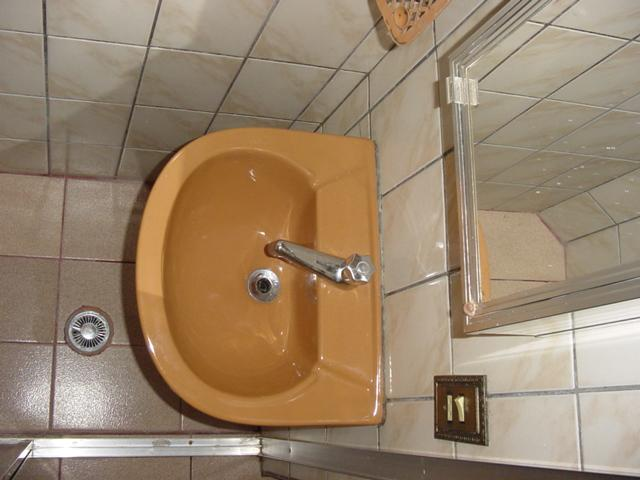|
|Peculiaridade: pia, espelho e tomada dentro do box do chuveiro!|

O dia foi bem **descontraído**, (re)encontrando vários amigos, batendo
papo, assistindo às palestras, aquele social massa.

## 01.Mai.2004 ::: Experiências de um Desenvolvedor de Software Livre 

|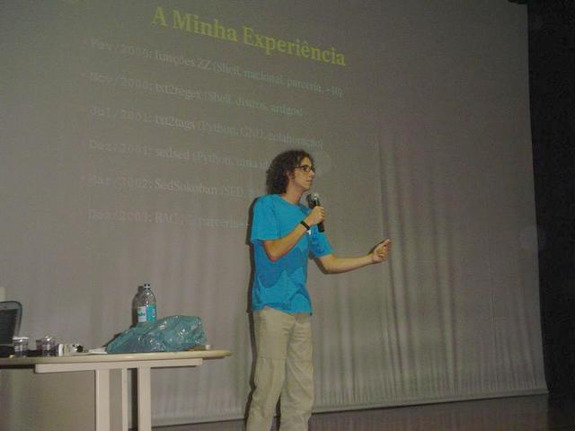|

Às 16:00 a minha palestra começou. O auditório estava cheio, e assim
como na última palestra da UFPR que tinha bastante gente, deu um
**nervosismo** nos primeiros 30 segundos, com direito e tremedeira no
microfone e tudo mais :)

Não houve uma contagem precisa, mas depois conversando com o pessoal,
estimamos que devia ter um **total de 200 pessoas** no momento de
lotação máxima do auditório, show de bola! Então bati o recorde antigo
de 150.

|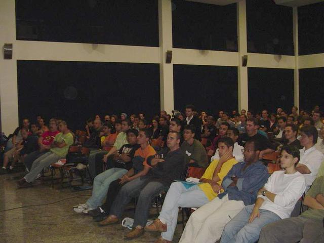|

O previsto eram duas horas de falatório, mas como era a última
palestra do dia e não tinha hora certa para fechar o auditório, avisei
o pessoal que ia ser loooooooonga e **durou pouco mais de três horas**.
Como eu sempre aviso, eu me empolgo falando e aí já viu... :)

Já ministrei algumas vezes esse tema, mas dessa vez a palestra saiu
mais **"recheada"**, pois eu consegui lembrar de bastante detalhes e
histórias. Também foi diferente pois na platéia a maioria eram nerds
já familiarizados com o Linux e Software Livre, então o nível foi
alto.

|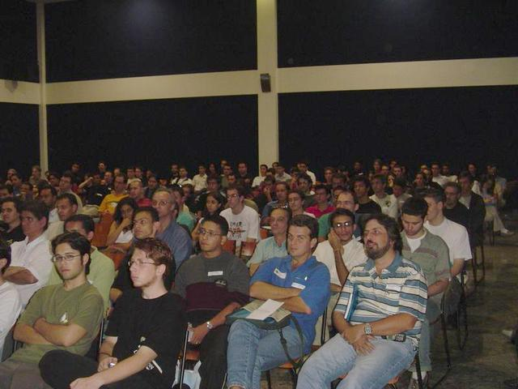|

Um detalhe muito interessante foi que **toda a palestra foi filmada**!
Estou desde já salivando e esfregando as mãos, doido para ver minha
própria palestra... Nunca vi.

No final, foi sorteado o livro do Linus, "Só por prazer" e uma
apostila minha de Programação em Shell Script. O **sorteio** foi
diferente, usando o prompt do Linux e a variável `$RANDOM` para
gerar um número aleatório de 4 digítos, e ganhava quem apresentasse um
papel com a sequência de números impressa. O primeiro achou o número
no telefone 0800 de uma fatura e o segundo num código do comprovante
do pagamento do almoço com o Visa Electron. Foi engraçado ver todos
esvaziarem as carteiras, deixando vários papeizinhos abertos nas coxas
:)

|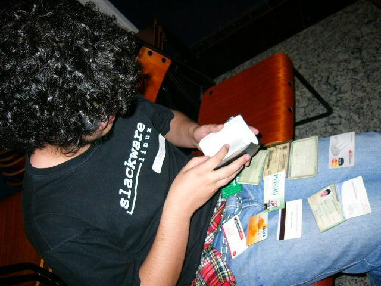|

Fiquei **bastante emocionado** com os aplausos no final, que se
estenderam por vários segundos, com pessoas em pé, outras assobiando,
outras batendo na cadeira de madeira, senti que o pessoal realmente
gostou das minhas historinhas. Isso foi muito gratificante. Valeu
mesmo.

## Aleatoriedades 

 * Depois da palestra fomos para uma pizzaria, se entupir de comida e
falar de coisas nerds durante horas. Depois o pessoal ainda foi para
a balada, numa cachaçaria ou algo assim, mas eu como estava sem
dormir e cansado da palestra, fui dormir.

 * Dividi o quarto com o Julio Neves (livro de Shell), agora já posso
falar por aí que "dormi com o Julio" hehehehe

 * Me pediram para tirar fotos, autografar o guia de Expressões
Regulares e conheci várias pessoas que já tinham visitado minha
página ou usado alguns de meus programas. É constrangedor de
admitir, mas acho que realmente estou virando pop &;)

 * A viagem de volta foi Classe A, na parte vip do ônibus de dois
andares, com espaço, poltrona que vira quase uma cama, TV com filme,
ar condicionado, travesseiro, coberta, água... Vou me acostumar mal
desse jeito.

 * Quero deixar registrado aqui os nomes dos camaradas que encontrei (e
consegui lembrar agora): Sula, Lucas, Santos, Gondim, Ramoni, Julio,
Léo, Root, Garoto, Caio, Priscila, Piter Punk, Márcio, Ralf, Toledo,
Claudinei, Blanes, Sobral, Spy, Renata, Paulo Cubo-Mágico, Acme,
Covolo, Indiox, Rafael.

A comunidade do Software Livre é mesmo muito bacana. Longa vida a ela!

|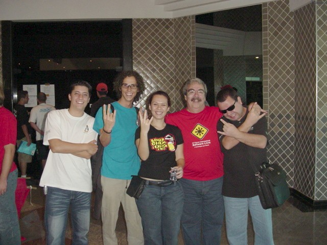|
|Sobral, eu, Sula, Julio, Léo|
|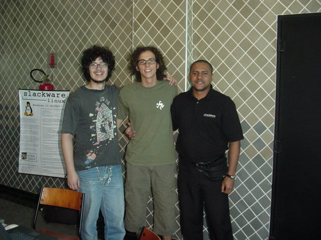|
|Piter Punk, eu, Santos|
|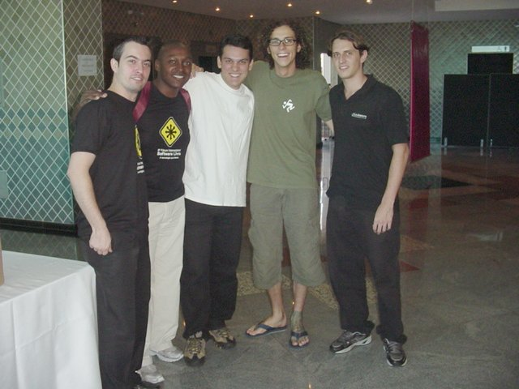|
|Márcio, Ralf, Lucas, eu, Toledo|
|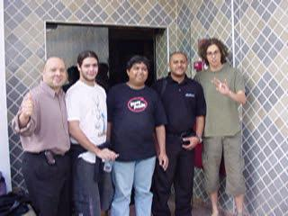|
|Gondim, Ramoni, Indiox, Santos, eu|
|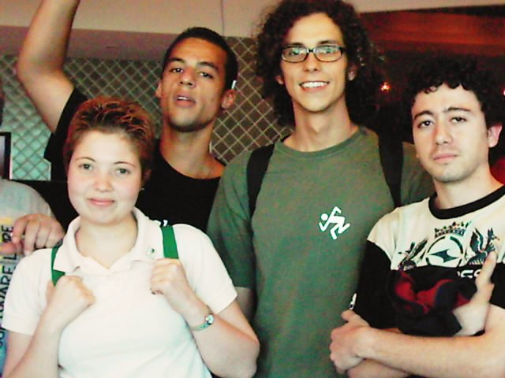|
|Alunos do Centro Público de Formação Profissional em Tecnologia da Informação em Software Livre de Santo Andre - SP (ufa!)|
|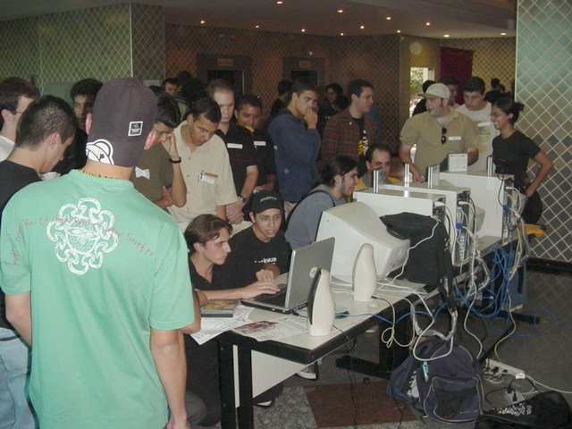|
|Nerds e seus computadores|
|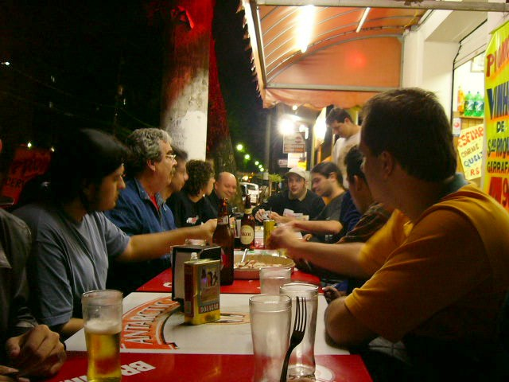|
|Galera no boteco comendo uma pizza|
