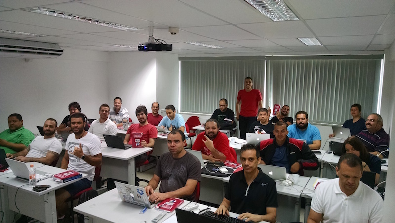
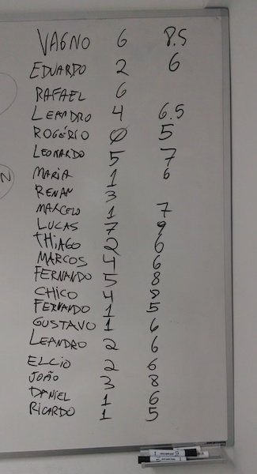
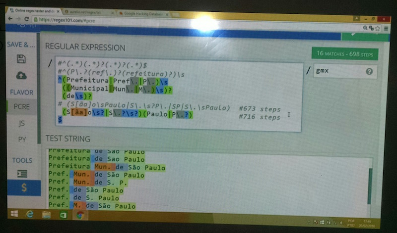

Fui à São Paulo dar um curso de 8 horas de [Expressões Regulares](http://aurelio.net/regex/) no dia 20/02/2016, no [Centro de Treinamento da Novatec Editora](http://ctnovatec.com.br).

Esse curso é o que eu mais gosto de fazer. É um intensivão, o dia todo viajando pelo mundo das regex, ensinando desde o básico até chegar em tópicos avançados. Sempre tem um engajamento muito bom da turma, mesmo quem nunca viu regex consegue terminar o dia criando suas próprias expressões, e isso me dá uma satisfação muito grande.

## Joinville ↔︎ São Paulo, de avião+táxi

Esta foi segunda vez que fui dar curso no CT da Novatec. Na primeira eu fui de ônibus leito (9h de viagem), mas não consegui dormir e cheguei lá quebrado ([leia o relato completo](../i/)). Dessa vez resolvi fazer diferente e fui de avião.

Odiei.

Eu detesto viajar de avião, por toda a perda de tempo e burocracia envolvida. Dessa vez não foi diferente. Avião atrasou mais de uma hora, aeroporto com preços abusivos, filas irracionais para entrar e sair do avião (que eu aguardo calmamente se desfazer) e vários WTF ao observar o comportamento grosseiro das pessoas. Para completar o cenário, táxis com preços surreais, que sai quase mais caro que a própria passagem de avião.

Uma viagem que tem somente 45 minutos de voo durou 5 horas no total. Saí direto do trabalho para o aeroporto de Joinville às 16:30 e cheguei no hotel em São Paulo às 21:30. Na volta foi mais rápido, pois era domingo cedo e durou somente 3 horas. Engraçado que tinha somente 12 passageiros no avião todo, veio vaziozão.

> **Pegadinha do portão:** Enquanto esperava meu voo de volta, no bilhete que imprimi na hora dizia que o embarque seria no portão 12, porém na TV do aeroporto dizia que seria no portão 7. Na dúvida, fiquei ali pelo meio no portão 9. Nada disso, em cima da hora o cara no microfone falou que era no portão 11 e era embarque imediato. ¯\\\_(ツ)\_/¯

## O curso

Passado o estresse da viagem do dia anterior, o sábado foi inteiro dedicado ao curso e foi muito bom. Pude ir à pé até o CT, pois ele fica a poucas quadras do hotel.

Com a caminhada matinal revigorante, cheguei uns 40 minutos antes do horário do curso. Pude ver “ao vivo” pela primeira vez a [capa vermelha luxo](https://twitter.com/novateceditora/status/699232860134367232) da 5ª edição do [meu livro de regex](http://www.piazinho.com.br), que tinha sido recém-lançada. Cada aluno também ganhou um exemplar, que autografei no fim do curso.

Pela foto dá pra perceber que eu fui dar o curso vestindo uma camiseta vermelha, para combinar com o livro. E não é que mais três alunos tiveram a mesma ideia? :)

No início do curso, cada aluno se apresentou e deu uma nota para o que julgava ser seu conhecimento atual sobre expressões regulares, pré-curso. No fim do dia, depois de muitos neurônios incinerados combinando os símbolos místicos das regex, teve uma nova autoavaliação e o resultado foi excelente:

**Na pausa para o almoço** fomos todos numa churrascaria ali perto. Ela não era muito grande, então os nerds lotaram o ambiente. Além do bate-papo descontraído sobre assuntos diversos (nada de regex!), ainda teve uma boa surpresa na hora de pagar: o preço era barato para os padrões de São Paulo.

> Difícil é ter disposição para voltar para o exercício mental depois de tanta carne, mas o pessoal conseguiu :)

Na parte da tarde foi 100% **exercícios**, onde cada um vai avançando conforme seu nível, e eu tenho a chance de ir mesa a mesa, auxiliando e tirando dúvidas. É nesse momento que o aluno realmente fixa o aprendizado e cria suas próprias soluções para os problemas propostos. É a hora de criar, errar, testar, experimentar. De repente, todos estão criando expressões regulares por conta própria, e aquele “bicho papão” torna-se uma ferramenta conhecida.

Ao mesmo tempo é também um momento de descontração, pois eu vou nas mesas e tento “quebrar” as expressões do pessoal, inserindo textos com variações, que expõem falhas de precisão nas expressões. **Eu** me divirto :D

No fim do dia, com todos já bem treinados e sintonizados, conseguimos ver **tópicos mais avançados**, como expressões com comentários, grupos nomeados, otimização e diferentes maneiras de resolver um mesmo problema. Foi a hora que o “papo de louco” estava no seu ápice, com a turma discutindo algo abstrato como se fosse fácil.

Como hoje é tudo muito moderninho e fácil, posso dar o curso utilizando somente ferramentas online, como o excelente http://regex101.com. Só preciso de um navegador, então nem levei meu notebook, usei um qualquer que já tinha lá. Por isso o Windão na foto, não me julgue ;)
