Após 7 anos de hiato, voltei a dar cursos nerds. Aproveitei as férias no trabalho e dei cinco cursos diferentes durante quatro dias consecutivos, em São Paulo capital (de 19 a 22/08/2015) no [Centro de Treinamento da Novatec Editora](http://ctnovatec.com.br).

 * 19/08/2015 (Qua) 9h às 18h — [Expressões Regulares: Imersão](http://ctnovatec.com.br/cursos/trilha-aurelio/expressoes-regulares-imersao/)
 * 20/08/2015 (Qui) 9h às 18h — [Shell Script Fundamental](http://ctnovatec.com.br/cursos/trilha-aurelio/shell-script-fundamental/)
 * 21/08/2015 (Sex) 9h às 18h — [Shell Script para Programadores](http://ctnovatec.com.br/cursos/trilha-aurelio/shell-script-para-programadores/)
 * 22/08/2015 (Sáb) 9h às 13h — [Expressões Regulares em Python](http://ctnovatec.com.br/cursos/trilha-aurelio/expressoes-regulares-em-python/)
 * 22/08/2015 (Sáb) 14h às 18h — [Expressões Regulares em JavaScript](http://ctnovatec.com.br/cursos/trilha-aurelio/expressoes-regulares-em-javascript/)

Veja também: o [anúncio original](http://aurelio.net/blog/2015/07/29/cursos-novatec/) destes cursos, que fiz lá no meu blog.

## Deu trabalho, mas valeu

Eu e o Rubens, editor da Novatec, quando estávamos planejando quais seriam os cursos, nos empolgamos demais e decidimos fazer uma maratona de 5 cursos diferentes, para aproveitar ao máximo a minha curta estadia em São Paulo.

Agora imagine. Para quem não dava cursos há 7 anos, de repente ter que preparar 5 cursos diferentes de uma vez, foi um trabalhão: estudos, ementas, conteúdo, ambiente, ferramentas, roteiro, exemplos, exercícios… Eu tinha me esquecido como era demorado e trabalhoso preparar um curso. Fazer vários então?

O que aconteceu foi que dos meus 15 dias de férias, só descansei mesmo no último, após os cursos. Os outros dias eu passei preparando ou dando cursos :)

Foi bem cansativo, mas no final valeu a pena. Gostei da experiência de ter voltado a dar cursos (tenho prazer em ensinar), ganhei uma grana legal, conheci gente nova e principalmente: os alunos gostaram e aprenderam.

## Joinville ↔︎ São Paulo, de ônibus

Eu detesto todo o estresse e demora que envolve voar de avião, então decidi ir e voltar de ônibus mesmo. A viagem é longa (dura 9 horas), mas acontece durante a noite e chega no destino no dia seguinte, bem cedo.

> “Tranquilo, vou dormir durante todo o trajeto, chego lá descansado e ainda economizo uma noite de hotel!”, pensei, inocentemente.

Peguei o assento leito, que é caro (R$180, o dobro do preço do normal), achando que nele eu poderia dormir confortavelmente. Que nada! O banco não deitava totalmente, e como eu sou alto (1,90m), não coube nele: não consegui esticar as pernas e o encosto de cabeça ficou na altura dos meus ombros :/

Resultado: não dormi direito e fiquei todo doído, tanto na ida quanto na volta. Caí na pegadinha do leito.

## Diversos

* A localização ficou excelente pra mim. O [hotel Íbis](http://www.ibis.com/pt-br/hotel-9596-ibis-styles-sao-paulo-anhembi/index.shtml) já era na frente da rodoviária, e o CT da Novatec ficava tão perto (700m) que pude ir à pé todos os dias. No mesmo prédio do CT tinha um restaurante, facilitando o almoço. Que alívio não precisar rodar por São Paulo!

* Ficou **muito bom o CT** que a Novatec montou: tudo novo e limpo, salas bem equipadas (quadro branco, projetor, ar condicionado, tomadas, wi-fi, cadeiras confortáveis), espaço para lanches e até uma “banca” de livros manuseados com mega desconto de 70%. Os alunos fizeram a feira! :)

* Havia duas paradas para um lanche (**coffee break**) durante o dia, às 10:30 e 16:30. Muito boa a comida! Os alunos se empolgavam tanto conversando entre si ou comprando os livros com desconto, que eu tinha que chamar para voltar à aula :)

* **Acordei resfriado/alérgico** todos os dias. Não entendi direito o porquê, pois não passei frio. Mas das 6 da manhã até às 8:30 lá estava eu espirrando. Daí a caminhada até o CT me fazia melhorar. Sei lá.

* Foi legal conhecer pessoalmente e conversar com os alunos que já **me conheciam virtualmente**, por acessar meu site e ler o blog. Como eles chegam já sabendo muito sobre mim, citando histórias do blog e tudo mais, dá uma impressão que já somos amigos há tempos.

* Só uso teclado e não costumo **escrever à mão**, mas tive que demonstrar toda minha falta de habilidade com a caneta ao usar meus garranchos para assinar os certificados dos alunos e autografar seus livros :)

* Na última noite, dormia eu tranquilo, quando às 2 da manhã tocou o **alarme de incêndio do hotel**. Levei alguns segundos até entender o que era e fiquei esperando ele parar. Não parava. Glup, parece ser sério. Modo sobrevivência, ativar! Pulei da cama, catei o que pude e desci correndo pelas escadas (9 andares). Lá na portaria, me informaram que estava tudo bem, que o alarme disparou por causa de um hóspede que estava fumando no quarto. Grrrrrrr 😠

## A metodologia

Não uso slides, não tenho um roteiro.

Eu tenho uma lista de assuntos para ensinar, mas a ordem em que eles aparecem durante o curso é dinâmica, e varia conforme o interesse e as dúvidas da turma. Assim, os assuntos novos vão aparecendo naturalmente, seguindo o fluxo corrente, sem quebras. Acredito que este andamento orgânico é mais benéfico para o aprendizado, comparado a um roteiro rígido “ideal” que eu tenha decidido sozinho em casa.

Tudo o que eu explico é demonstrado na hora, usando o computador. Uso ferramentas online, a linha de comando do Unix e o prompt interativos das linguagens de programação. Não trago comandos e códigos prontos. Tudo é criado e digitado na hora, com o resultado já aparecendo imediatamente, comprovando (ou não hehe) o que acabei de explicar. Mesmo quando o resultado é diferente do esperado, isso abre o caminho para os alunos me corrigirem (demonstrando que estão prestando atenção e entendendo) ou para explorar exceções e pegadinhas. Os alunos podem acompanhar digitando os mesmos comandos em seu próprio computador, criar variações, e assim surgem as dúvidas.

Eu deixo os alunos livres para me interromper a qualquer momento. Seja para perguntar algo, complementar algo que acabei de explicar ou até me corrigir caso eu tenha falado besteira. Não me considero dono da verdade, estamos todos lá para aprendermos juntos, e a participação dos alunos é fundamental para a riqueza do curso.

No início de cada curso, pedi que cada aluno se apresentasse e contasse um pouco sobre sua experiência atual com o assunto da aula. Assim, eu posso ter uma visão geral do nível da turma, se a maioria é iniciante, ou se já possuem experiência. Com estas informações preliminares, decido o andamento geral do curso, se será mais básico ou mais denso.

Durante a aula, tento perceber o sentimento geral dos alunos, se estão entendendo, entediados ou se algo está confuso, para decidir se devo acelerar ou explicar melhor determinados pontos.

## Expressões Regulares: Imersão

Expressões regulares é um assunto bom de explicar e de aprender. Não é vasto como uma linguagem de programação ou um sistema, você consegue aprender todos os conceitos em um único dia e já começar a criar suas próprias expressões. E assim foi.

Passei as primeiras quatro horas explicando e demonstrando cada um dos metacaracteres. É importante entender o que faz cada um deles individualmente, para depois poder combiná-los e compor expressões maiores. Usei as ferramentas online http://regexpal.com e http://regex101.com, que mostram ao vivo o texto casado pela expressão digitada.

Após a parada para o almoço, focamos na aplicação das expressões: grupos, replace, extração de dados e claro, exercícios. É na hora dos exercícios que tudo fica realmente divertido, quando cada um tem que pensar sozinho e criar suas próprias expressões. Nessa hora pude dar uma boa assistência individual, e tirar dúvidas pontuais.

> Eu sempre me surpreendo como aparecem soluções criativas, que fogem da maneira mais “tradicional” de resolver certos exercícios. Neste curso não foi diferente.

Os exercícios também foram bons para lidar com uma turma heterogênea como esta, pois enquanto os iniciantes aprendiam com os primeiros exemplos, os mais experientes já foram resolvendo os próximos, que são mais complexos. Assim, todos ficaram ocupados, pensando em regex, cada um no seu ritmo.

> Meu passatempo predileto durante os exercícios foi “quebrar” as expressões finalizadas dos alunos, ou seja, detectar pequenas falhas na construção da expressão e editar o texto de exemplo para que estas falhas apareçam e o aluno tenha o desafio de corrigi-las. Parece cruel, mas eles gostaram :)

Para fechar o dia, terminamos o curso fazendo juntos a já tradicional expressão para casar uma data no formato brasileiro dd/mm/aaaa. Ela pode ser simples, ou muito complexa. Qual o ponto certo entre precisão e legibilidade?

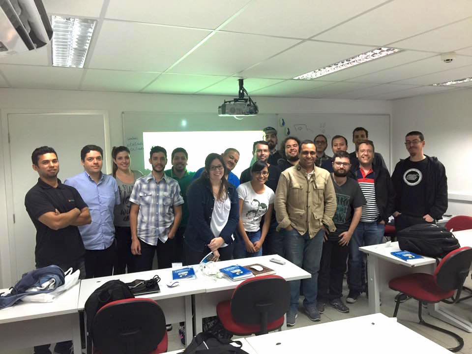

## Shell Script Fundamental

Sala cheia para aprender shell script, num curso de 8 horas. Resolvi fazer um curso diferente, e em vez de ficar mostrando comandos, opções e estruturas de programação, decidi focar mais na base Unix, na filosofia e nos conceitos que tornam o Unix o que ele é, pois isso influi diretamente na maneira que você cria e usa os comandos.

É o tal “jeito shell” de resolver problemas, que demonstro na minha série de vídeos [Tela Preta](http://aurelio.net/tela-preta/). Você tem que enxergar seu problema de maneira diferente, para que a solução usando shell fique simples. Sem esta visão, tudo fica muito complicado e esquisito.

Uma boa ideia que apareceu minutos antes de começar o curso, foi escrever no quadro branco os termos principais que definem a filosofia do Unix, e quais as características principais do ambiente shell.

Foi excelente poder apontar para estes termos durante as explicações, mostrando que tudo aquilo fazia sentido e era parte integrante de um pacotão chamado Unix. Foi bom também eu ter falado sobre a história do Unix, BSD, GNU e Linux, para os alunos entenderem quais as relações entre eles, e como as coisas evoluíram até chegar ao estado atual.

Depois da parte mais conceitual, demonstrei o uso da linha de comando, onde pude ao mesmo tempo explicar mais conceitos do ambiente e apresentar os principais comandos e opções. Esse foi um momento legal, onde os alunos podiam participar, ajudando a compor os comandos e resolver os problemas. Também acabei dando várias dicas rápidas no processo, que agradou aqueles que já tinham alguma experiência na linha de comando.

> Aliás, este foi um ponto que complicou um pouco o curso, a turma estava bem heterogênea. Minha ementa talvez não ficou clara o suficiente, mas este era um curso para iniciantes, que nunca viram ou usaram muito pouco o Unix/Linux. Porém havia alguns já bem experientes por ali :)

No final, ensinei como criar e executar scripts. Mas a grande mensagem que tentei passar é que linha de comando e script são a mesma coisa! É tudo um mesmo ambiente: a shell. Digitar na linha do comando ou executar num script, tanto faz, são os mesmos comandos, rodando num mesmo ambiente Unix. O mais importante é saber fazer, não importa onde.

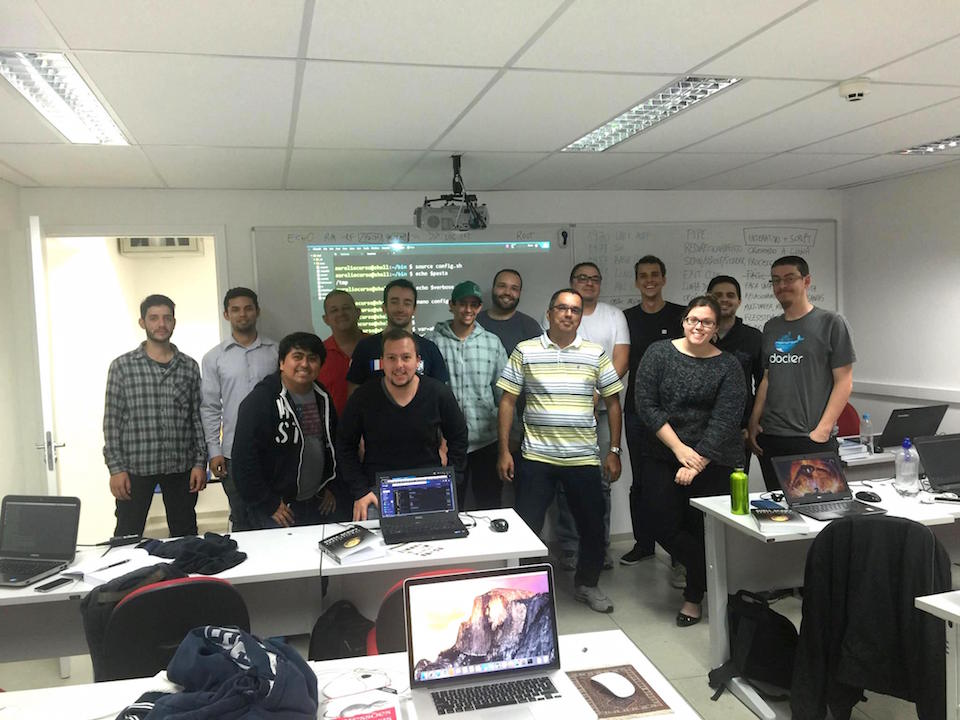

## Shell Script para Programadores

Mais um curso de shell de 8 horas, porém este era direcionado a programadores que já possuíam experiência com a linha de comando do Unix/Linux.

Igual no curso anterior, fiz questão de passar todo o histórico, filosofia e características do Unix, porém desta vez numa linguagem mais densa, nerd, de programador para programador. Durante todo o curso, fiz comparativos da diferença entre o “jeito shell” e as soluções comuns em programação, com loops, condicionais e algoritmos. É uma grande quebra de paradigma para um programador experiente.

Havia alguns alunos já bastante experientes, com grande conhecimento, como meu amigo Luciano Ramalho. Eles enriqueceram o curso, dando depoimentos e complementando as explicações. Assim, eu dei o curso mas também aprendi junto, pura diversão nerd! :)

Programador gosta é de código, então durante o curso analisamos alguns códigos prontos em shell, como algumas [Funções ZZ](https://github.com/funcoeszz/funcoeszz/tree/master/zz) e o testador [clitest](https://github.com/aureliojargas/clitest). Os códigos de ambos estão bem alinhados e comentados, então são boas fontes de estudo.

Depois criamos juntos, do zero, um script com elementos mais profissionais, como biblioteca de funções e opções de linha de comando.

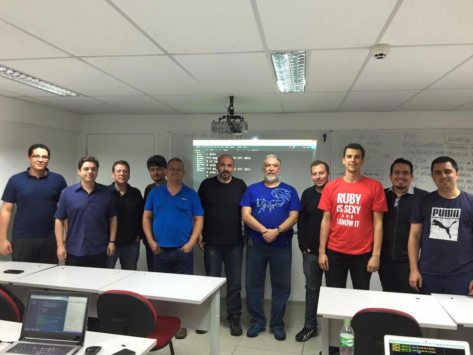

## Expressões Regulares em Python

Este foi um curso de 4 horas, para aprender o essencial de expressões regulares e como aplicá-las na linguagem Python. Como todos os alunos já tinham experiência com regex, pude acelerar a explicação e pudemos ver tópicos mais avançados das expressões.

> Viu como é bom não ter um roteiro fixo? :)

Usei a ferramenta online http://regex101.com, excelente para ensinar os conceitos e demonstrar o funcionamento das expressões. Ela possui um modo Python, onde pudemos usar a sintaxe específica do Python para as expressões.

Também usei o próprio prompt interativo do Python para digitar comandos e demonstrar na prática como aplicar as expressões nos vários métodos disponíveis.

Foi interessante que cada aluno tinha uma versão diferente do Python instalada, e isso foi bom para percebermos as diferenças entre versões. Acentuação, por exemplo, no Python 2 precisa de alguns modificadores para funcionar, enquanto no Python 3 tudo funciona 100% por padrão.

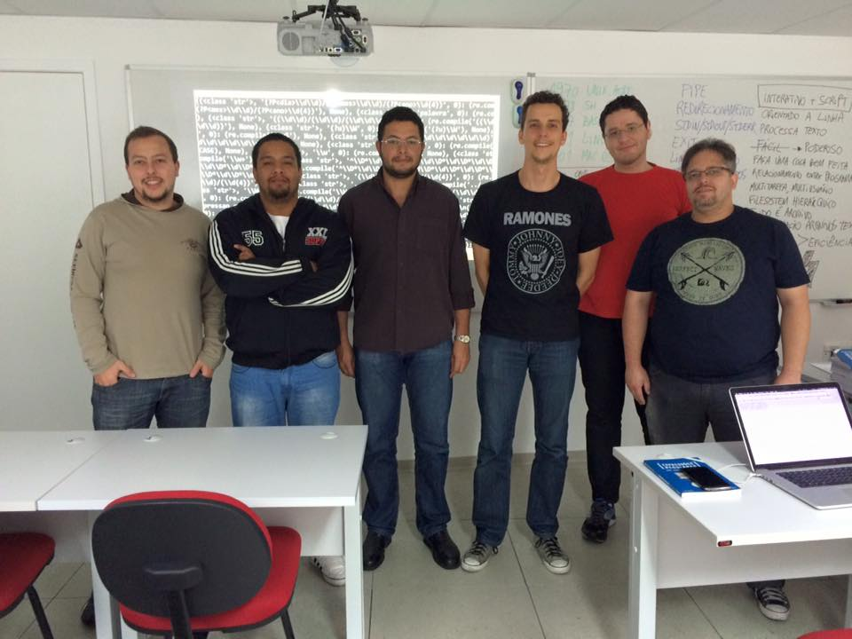

## Expressões Regulares em JavaScript

Mais um curso de 4 horas, com proposta bem similar ao anterior, porém desta vez focado na linguagem JavaScript. Com apenas 3 alunos, este curso foi praticamente uma aula particular :)

O inusitado foi que aconteceu com o notebook que eu estava usando para dar o curso: **o Windows 8 resolveu reiniciar e aplicar atualizações**. Sim! No meio do curso, sem chance de cancelar. A tela do projetor ficou preta e ia demorar vários minutos até a máquina voltar ao normal.

Desliguei o projetor e voltei ao bom e velho quadro branco para continuar as explicações. E não é que foi legal? Foi bom explicar usando o quadro, com bastante espaço para escrever, e o curso tomou um rumo diferente. Os alunos puderam participar mais e acho que a explicação ficou mais sólida. Mais uma vez, a vantagem de não ter roteiro fixo.

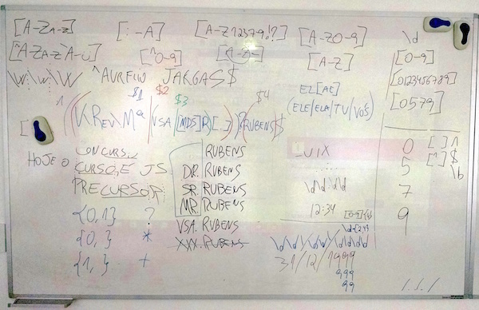

Depois o Windows voltou e pude continuar a demonstração no projetor, usando a ferramenta online http://regexpal.com e o console JavaScript do próprio navegador. Com um foco mais direcionado a aplicativos web, vimos bastante sobre validação de dados e formatação de conteúdo.

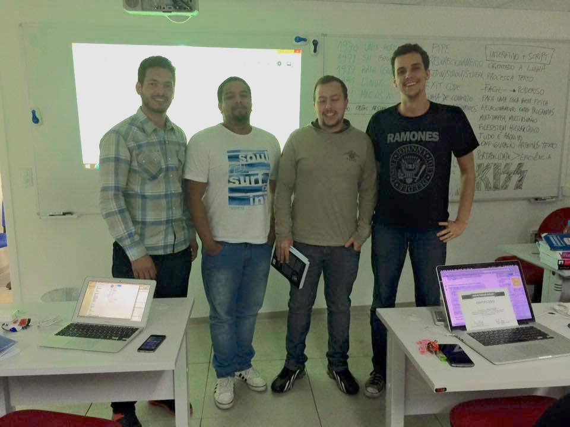

## Mais fotos

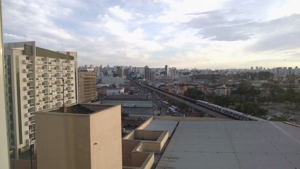

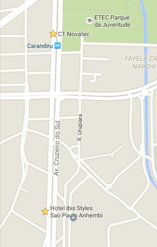

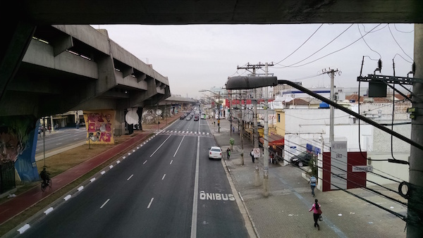

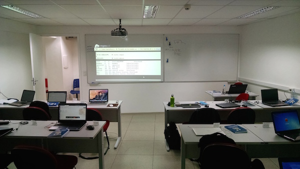

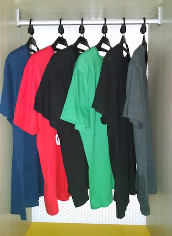

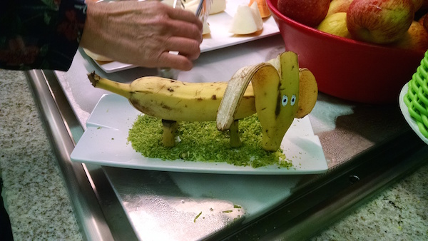
