Numa atitude inédita e grandiosa, o governo federal montou um
mega esquema de treinamento em Linux para os funcionários
públicos, reunindo em Brasília mais de 100 instrutores de todo
o país. Os números falam em mais de 2.000 alunos, que durante
uma semana assistiram desde cursos básicos até treinamentos
avançados em programação e servidores.

Para mim foi uma honra participar de um evento tão importante,
e ainda reencontrar amigos que moram longe e que só vejo
nessas viagens de treinamento, além das novas amizades.

Ministrei quatro cursos em três dias, foi corrido e cansativo,
mas valeu a pena!

Meus agradecimentos ao Carlos Cecconi e toda a sua equipe pela
oportunidade, presteza e apoio. Agradecimentos também à
Conectiva por ter me liberado para viajar e participar do
evento.

## A Viagem de Ida 

Domingão, dia de sol em Curitiba. De malas prontas, às 15:30 começou a
minha jornada, com o táxi até a Rodoferroviária. Lá encontrei o amigo
e colega de trabalho **Helio Chissini de Castro**, o Sr. Dr. "Contato
Oficial do KDE na América do Sul" :) Pegamos então o ônibus que vai
até o aeroporto, check-in, embarque e finalmente às 17:40 o avião
decolou.

Com a conexão demorada em São Paulo, só chegamos em Brasília perto das
21:00, totalizando **quase 4 horas de viagem**! Chegando lá,
desembarque, espera das malas e encontramos o motorista da van que
estava nos esperando. Alguns amigos já tinham chegado, e fomos
conversando num clima de festa enquanto a van percorria seu longo
caminho até o hotel.

|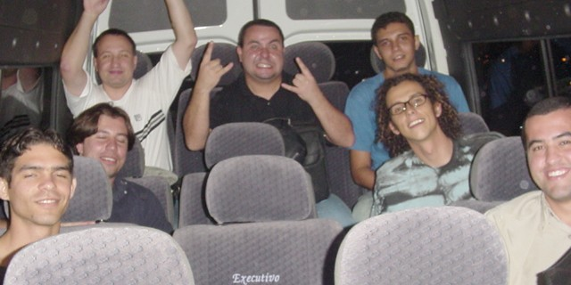|
|Galera na van, recém-chegada em Brasília|

## A Chegada (Ou Seria Ralada? :) 

Chegando no Hotel Nacional, nem descemos da van. Apenas descarregaram
as malas e já fomos direto para a **Universidade dos Correios**, local
onde os cursos iam ser ministrados. Eu estava cansado e com fome,
doido para chegar no hotel e deitar, mas os planos acabaram mudando um
pouquinho.

Com previsão inicial de 1.000 alunos, o número inchou para 2.200
inscritos até a data do evento. Como os laboratórios não foram
dimensionados para tantas pessoas, mais máquinas e salas precisavam
ser montadas. Cerca de 20, 30 instrutores estavam lá e os
organizadores expuseram o problema, pedindo a **colaboração** de todos
para preparar mais salas para o dia seguinte. Limpeza, arrumação de
mesas e cadeiras, instalação do Linux, tudo precisava ser feito.

|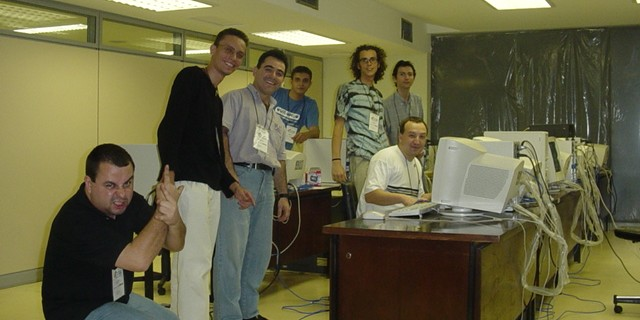|
|Robôs instaladores de máquinas, às 02:45 da madrugada|

Todos sem exceção arregaçaram as mangas e com um intervalo para
devorar sfihas do Habib's à meia-noite, seguimos aprontando os
laboratórios até às **3 da manhã**!

Mais passeio de van e a tão desejada chegada no hotel aconteceu.
Aleluia irmãos. Eu e o Helio dividimos o quarto 332.

## A Abertura do Evento 

Após preciosíssimas **3 horas de sono**, acordamos às 6 e meia da
manhã, café no hotel e van novamente para ir até o evento. Zumbis por
todos os lados, só faltou ouvir os gemidos de "*Miolos! Miolos!*"
:)

Mais tarde, perto das 9 da manhã estávamos no auditório, para a
**cerimônia de abertura**, que contou com a participação do Ministro José
Dirceu. Outras figuras importantes compunham a mesa de oratória, e
após todos terem dito suas falas, os cursos começaram.

|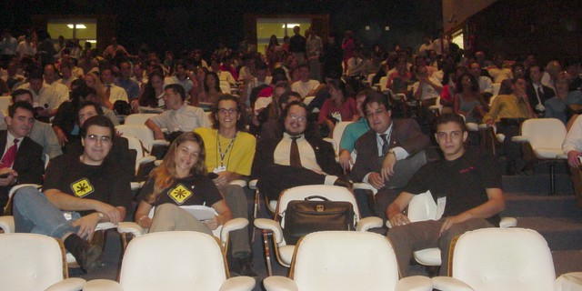|
|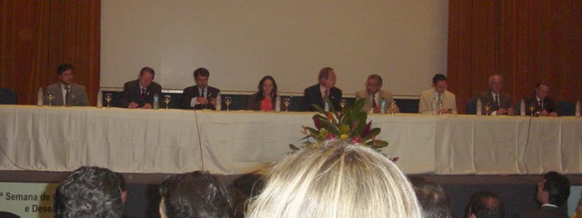|
|Ministro José Dirceu, Senadora Serys, ITI, Serpro, Anatel, Correios, UnB, ...|

## 26.Abr.2004 ::: O Editor VI 

 * [Material de Apoio](../material/vim-ref.html)

Com o início atrasado por causa da cerimônia de abertura, o curso de
VI não durou as 4 horas previstas, indo das 11 às 14 horas. Eram 15
alunos, alguns poucos já tinham usado o VI, mas a maioria não.

Indo bem devagar, foi visto o básico. Depois fiz uma demonstração das
características sexys do Vim, como ver as diferenças entre dois
arquivos com destaque em cores, folding, edição de colunas (vertical)
e gravação de comandos. Aí eles realmente gostaram do VI :)

Infelizmente me esqueci de tirar foto com a turma :/

## 26.Abr.2004 ::: Expressões Regulares 

 * [Apostila](http://aurelio.net/curso/material/apostila-expressoes-intro.pdf)

Após uma rápida pausa para meu almoço, às 14:40 começou o curso da
tarde, de Expressões Regulares. Foi na mesma sala do curso matutino,
porém o calor aumentou e castigou a todos.

No início, perguntei à turma de 15 pessoas quem já tinha conhecia as
expressões, ninguém levantou a mão. Para minha surpresa, no final da
tarde o pessoal estava lá discutindo uma expressão de **duas linhas**
para casar um IP válido!

Foi muito gratificante, eles realmente aprenderam.

|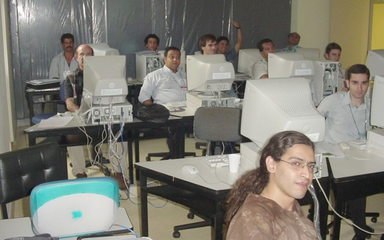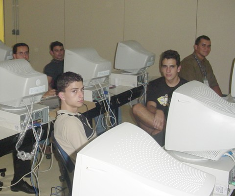|
|Turma do curso de Expressões Regulares|

## 27.Abr.2004 ::: Python Básico 

A terça-feira era meu dia de folga, então aproveitei o ônibus do
evento para ir conhecer a UnB, a **Universidade de Brasília**, o outro
local onde alguns cursos foram ministrados.

Fui lá junto com o Hélio, mas logo que chegamos, tocou o celular dele
e avisaram que o instrutor do curso de Python havia faltado.
Resultado: voltamos para a Universidade dos Correios de táxi para eu
dar o curso como instrutor substituto.

Passei o resto da manhã arrumando a sala que estava mal distribuída e
desorganizada, e de tarde foi o curso de 4 horas, para 9 alunos.

Foi tudo "na hora" mesmo, sem material nem preparativos. Foi disparado
o prompt interativo do Python e aos poucos fui mostrando os tipos de
dados, as estruturas e os conceitos básicos da linguagem.

No final vimos até como fazer uma biblioteca importável que ao mesmo
tempo é um executável na linha de comando.

Foi legal ter ministrado o curso assim "na loca", só que isso me
custou o único dia livre que eu iria ter em Brasília e como resultado
não dei uma voltinha sequer na cidade, voltei pra Curitiba sem
conhecer NADA....

|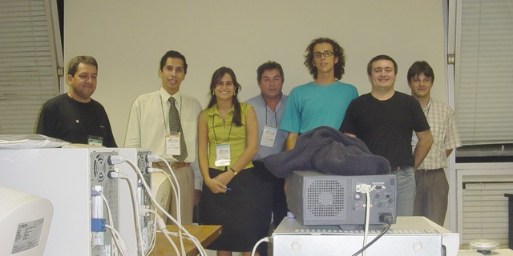|
|Turma do curso de Python|

## 28.Abr.2004 ::: Introdução ao Shell Script 

 * [Apostila](http://aurelio.net/curso/material/apostila-shell-intro.pdf)

Meu último dia em Brasília, foi o mais corrido. O dia todo era o curso
de Introdução ao Shell Script, de 8 horas.

Com 8 alunos, seguimos vendo o Shell desde o início, pois todos ali
eram principiantes. Variáveis, comandos, conceitos, e chegou o almoço.
De tarde vimos bastante exercícios, pois sem prática não há como
fixar. Se bateram, mas foram progredidndo e fazendo um por um.

|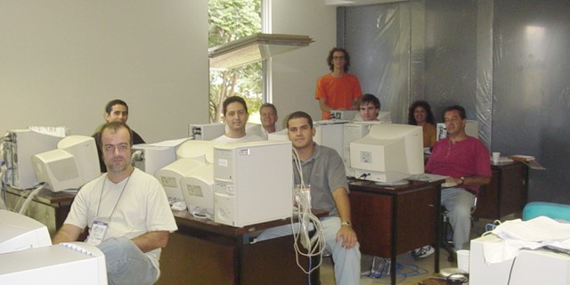|
|Turma do curso de Shell|

## A Viagem de Volta 

Meu vôo de volta para casa era às 19:40, e como ainda teria que voltar
para o Hotel e só depois ir ao aeroporto, tive que sair antes do
horário normal de acabar o curso. Estava com a saída combinada para as
17:30, mas 15 minutos antes o Helio veio correndo me avisar que a van
já estava esperando!

Tive que arrumar tudo correndo, terminar a aula de Shell antes, e nem
tive tempo de me despedir do pessoal. Como em Brasília tudo é longe,
mesmo saindo mais de duas horas antes do vôo, quando finalmente
chegamos no aeroporto já estavam chamando para embarque no meu
aviãozinho. Só correria...

Felizmente voltei direto, sem escalas e menos de duas horas depois já
estava pousando em Curitiba.

## Aleatoriedades 

|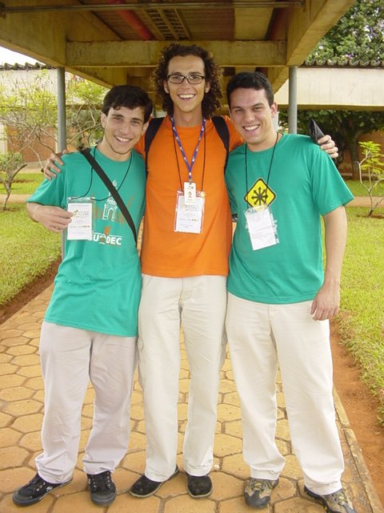|
|Grupo de pagodeiros que apareceu no evento (kov, verde, lucas)|
|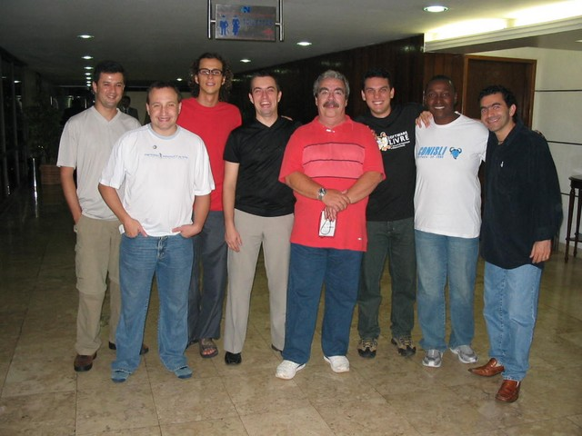|
|???, Helio, Aurelio, Márcio, Julio, Lucas, Ralf, Marcelo|
|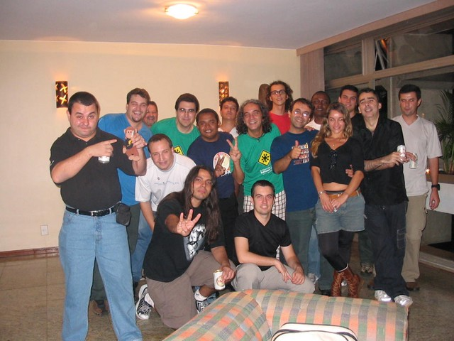|
|Festa na casa do Marcelo Branco|
|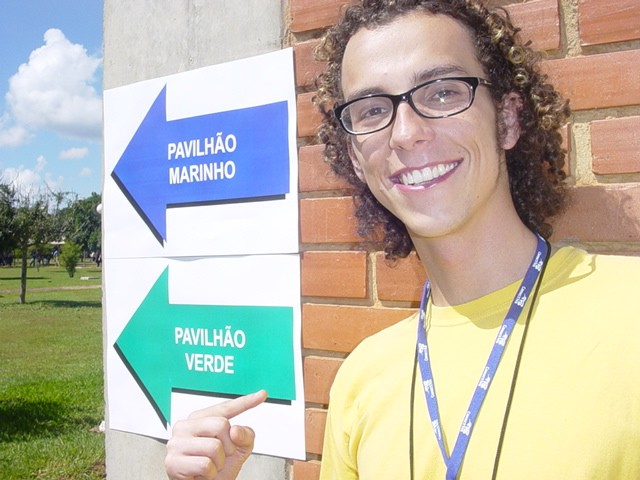|
|Não precisava, não precisava... Dois pavilhões em minha homenagem! :)|
