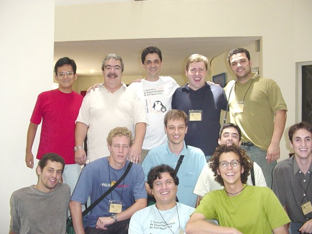
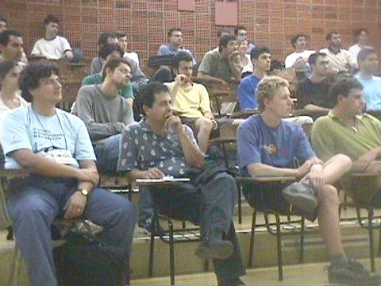
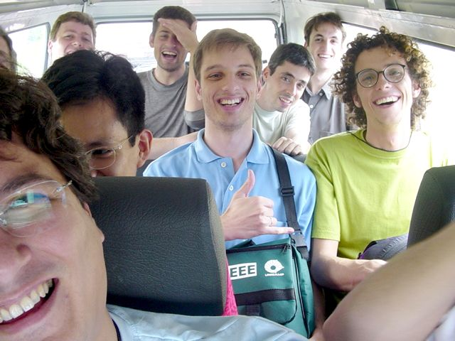

Durante os dias 9, 10, 11 e 12 de Dezembro de 2003 aconteceu em
Campinas, na Unicamp, o
[II SDSL](http://rau-tu.ccuec.unicamp.br/sdsl/index.php).

Eu fui convidado pelo amigo Rubens Queiroz a participar para ministrar
um mini-curso de Expressões Regulares e uma palestra sobre
desenvolvimento em Software Livre, com todas as despesas pagas.

Ambos ficaram marcados para a sexta-feira, último dia do evento. O
curso foi do tipo dia todo, de manhã e de tarde para uma turma de 30
alunos e a palestra foi de noite, das 18:40 às 19:30 no auditório,
para uma platéia de pouco mais de 30 pessoas.

Esta página é meu relato de como foi essa experiência.

Links para os materiais:

 * [Apostila de Expressões Regulares](http://aurelio.net/curso/material/apostila-expressoes-intro.pdf)

 * [Avaliação dos Alunos para o Curso de Expressões Regulares](avaliacao-expressoes.html)

 * [Slides da Palestra Desenvolvedor de Software Livre](desenvolvedor/)

                    

Tópicos deste relato:

## A Ida 

Primeiramente, meus sinceros agradecimentos à Conectiva, empresa onde
trabalho, por ter me liberado para ir ao evento.

A saída de Curitiba começou às 14 horas de quarta-feira dia 10, quando
peguei o táxi para ir da Conectiva até a Rodoferroviária. De lá, fui
de ônibus até o aeroporto. Às 16:20 era o horário de saída do vôo,
pela Gol, que atrasou uns 15 minutos. O piloto deve ter judiado do
avião, pois mesmo com o atraso na saída ele chegou em Campinas
praticamente no horário :)

Desembarque, espera da mala, e na saída lá estava o motorista da
Unicamp, o seu Oclair, me esperando e segurando um cartaz com o meu
nome escrito. Engraçado isso de cartaz :) Mais 30 Km de carro, e
finalmente: Unicamp.

Recapitulando:

|`Conectiva -> táxi -> ônibus -> avião -> carro -> Unicamp`|

## A Unicamp 

Pô, ninguém tinha me avisado que a Unicamp era tão grande!

Caramba, aquilo é um bairro cercado. Tem um monte de ruas, prédios,
ônibus, movimento, até posto de gasolina tem! E para meu espanto, até
o hotel em que me hospedei era lá dentro. E que hotel!

                    

Lá fora, uma piscinona (que infelizmente não tive tempo de "testar").
Dentro do quarto, tudo novinho e impecável, sem luxo, mas com muito
conforto. Tinha banheira, ar condicionado e TV à cabo!

E o melhor de tudo: rede local com **acesso liberado à Internet**.
Tudo o que um nerd precisa para ser feliz. Foi só plugar o cabão de
rede, configurar o IP e pronto, o iBook estava conectado com o mundo.

## O Primeiro Dia - Palestra do Franklin 

Como não fui lá pra ficar coçando, nem desfiz a mala e já fui direto
para o local das palestras. Aliás, o Rubens mandou um carro pra vir me
pegar, pois apesar do evento ser lá na Unicamp mesmo, era do outro
lado do campus, lonjão!

Cheguei no final de uma mesa redonda de fazer inveja: Rubens Queiroz
(Dicas-L), César Brod (Solis), Alexandre Oliva (RedHat) e Julio Cezar
Neves (livro de Shell). O tópico não sei qual era exatamente mas a
discussão era a mesma de sempre: como ganhar dinheiro com Software
Livre :)

Cheguei no fim, mas valeu, o nível estava muito bom, inclusive com
donos de empresas de software proprietário na platéia, expondo seu
ponto de vista.

O Julio pra variar, não perdeu a oportunidade de me fazer passar
vergonha. Quando me viu, pediu o microfone e "anunciou" minha chegada
no auditório, falando coisas boas a meu respeito. Como não tinha terra
para eu cavar e enfiar a cabeça dentro, tive que me contentar em ficar
vermelho &;)

Depois da mesa, pausa para o lanchinho (que foi muito bom todos os
dias!) e conversas de corredor ainda sobre o assunto "dinheiro versus
SL".

Depois começou a palestra do amigo Franklin Carvalho, com quem esqueci
de tirar foto (na próxima hein Franque!). O que posso dizer, foi
simplesmente a melhor palestra que vi em todo o evento, disparado.

Aproveitando o tema da mesa anterior, o Franklin deu uma aula de
história da informática, comentando sobre a origem e vida de várias
das grandes empresas atuais e fez seus prognósticos sobre o futuro
recente e distante.

Algumas de suas frases: "Não importa se é GPL", "O governo devia
manter (financeiramente) a Conectiva e outros patrimônios nacionais em
Linux, para não correr o risco de perdê-los" e "A China será o próximo
império". Estou contigo amigo!

Depois da palestra, papo vem, papo vai e perdi o bonde para o hotel...
Muito obrigado ao Alexandre Oliva por me dar uma carona! Quando
finalmente pus os pés no quarto já era mais de 11 da noite.

## O Segundo Dia - Curso do Julio 

Acordei cedo, às 07:30. Cafézão da manhã no hotel e voltei para o
quarto. Hoje é o dia do curso de Shell Script do Julio Neves, que irei
participar.

Mas, como anunciei há tempos o lançamento de um software novo durante
a minha palestra de amanhã, acabei passando a manhã toda trancado no
quarto com o iBook, finalizando os detalhes desse lançamento.

                    

O tal programa é o [RAC](http://aurelio.net/rac), feito em parceria com
meu amigo gaúcho [Thobias](http://thobias.org). O software já estava
pronto, mas ainda precisava fazer a sua página na Internet, preparar o
pacotão tar com a versão 1.0 e escrever o texto de anúncio do
programa.

Com a Internet na faixa no quarto, fiquei toda a manhã online
conversando com o Thobias por ICQ e juntos finalizamos tudo. Essa tal
de modernidade não é uma maravilha?

Com as pendências finalizadas, fui devorar um almoção classe A no
restaurante do hotel, com tudo pago pela organização do evento. Depois
do almoço, uma reunião do pessoal na recepção do hotel para tirar
fotos:

||
|Não sei, Julio Neves, Rubens Queiroz, Maurício de Castro, Leonardo Lemes ::: Ribamar Santarosa, Daniel Ferreira, Pablo Dall'Oglio, Marcelo Malheiros, Nasair Júnior Silva ::: César Brod, eu|

> Nota 1: Me desculpe pelo "Não sei", mas eu realmente não sei
> seu nome. Me mande e-mail avisando!
> Nota 2: O Ribamar da foto, é o "Accipitris Amici" que me
> convidou formalmente para integrar o Movimento Neofeudalista e
> ser o responsável pelo Meio Ambiente. Vida longa ao balde de
> madeira!

Já de volta ao evento, acompanhei a segunda metade do curso de Shell
do Julio. Como sempre, um show de bom humor e conhecimento
indispensável transmitido de forma tranquila e light.

A peculiaridade do curso foi o Fábio ter conseguido um mega crash em
uma das máquinas Digital, com um simples comando "trap". As máquinas
rodavam em esquema de Terminal Server com o Red Hat Linux.

                    

Depois do curso, um intervalo rápido regado com uma chuva forte de
verão e depois as vieram as palestras. Nessa noite assisti a do Djalma
Valois sobre o CIPSGA e Filosofia GNU, e depois a do Alexandre Oliva
também sobre GNU. Foi uma overdose de "Stallman isso, Stallman aquilo"
mas eu sobrevivi :)

Carona com o Rubens para o hotel, e novamente depois das 11 eu estava
pisando no quarto. Como estava pregadaço, deixei para tomar banho e
arrumar as coisas do curso e palestra no dia seguinte. Péssima
decisão...

## O Terceiro Dia - Minha Vez de Ministrar Curso e Palestra 

Como diz o ditado: "Nunca deixe para amanhã o que se pode fazer hoje".
Eu sempre sigo isso, mas dessa vez falhei e me arrependi.

Fiz caca regulando o despertador e acabei desregulando-o. Resultado:
ele não tocou e eu me atrasei. O curso começaria às 08:30, e esse foi
o horário que eu acordei :/

Tomei um banho ultra rápido, arrumei as coisas na pressa e não pude
tomar café da manhã, chegando na sala do curso às 08:50. Mas fora esse
pequeno deslize, o resto do dia foi tranquilo e gratificante.

## Curso de Expressões Regulares 

||
|Turma do curso, foto tirada ao meio-dia|

O curso foi muito bacana. Ele foi andando num ritmo tranquilo, e no
fim do dia todos os metacaracteres básicos tinham sido vistos em
detalhes.

O Rubens Queiroz fez a gentileza de me "apresentar" para a turma,
falando um pouco sobre meu trabalho e sobre o
[Guia de ERs](http://aurelio.net/regex/guia/) que escrevi. Valeu amigo!

Como a maioria da turma era "virgem" ou iniciante em Expressões
Regulares (ERs), o curso foi introdutório, ensinando a base do
assunto e como tudo funciona.

[A apostila](http://aurelio.net/curso/material/apostila-expressoes-intro.pdf) foi mais ou menos seguida, pois eu prefiro
sanar as dúvidas no momento em que elas ocorrem, e isso às vezes
adianta assuntos que só iam ser vistos mais tarde.

Este foi meu primeiro curso de Expressões Regulares, e considero a
experiência um sucesso completo. O assunto é simples, porém de difícil
assimilação e muito abstrato. Não adianta decorar comandos, é preciso
realmente **entender** como funciona.

No início do curso, pedi para cada aluno dar um valor de 1 a 10 sobre
o nível do conhecimento em ERs que ele julgava possuir naquele
momento. Estes dados foram colocados no quadro branco. No final do
curso, antes de ir embora, cada aluno colocava outro número ao lado de
seu nome, que seria o nível **após** o curso terminado.

Meu objetivo pessoal era que todos, sem exceção, aumentassem pelo
menos um ponto nessa escala. Nem todos lembraram de anotar o número no
final, mas dos que o fizeram, todos aumentaram!

| NOME |ANTES |DEPOIS |x |NOME |ANTES |DEPOIS|
|---------------|
|Adilson |3 |5 | |Luis |0 |5|
|Bruno |0 |- | |Marcos |4 |-|
|Bruno |3 |7 | |Olav |2 |-|
|Claudio |2 |7 | |Otávio |1 |-|
|Dani |0 |4 | |Pablo |0 |-|
|Daniel |6 |- | |Pedro |0 |4|
|Fabio |2 |5 | |Renne |4 |-|
|Fabricio |8 |- | |Ribamar |3 |7|
|Glauber |6 |8 | |Ricardo |3 |-|
|Gustavo |1 |- | |Silvana |2 |5|
|Henrique |0 |- | |Ulisses |3 |6|
|João |3 |4 | |Vlad |2 |8|
|Kate |0 |4 | |Wendell |3 |6|
|Leonardo |6 |- | |Yuri |2 |5|

|Ainda bem que ninguém diminuiu né? :D|

Fora essa auto-avaliação, os alunos também preencheram aquelas fichas
de avaliação do instrutor. Fiquei muito feliz ao constatar
[100% de aprovação](avaliacao-expressoes.html) com os itens das fichas
variando entre "Bom" e "Excelente".

É isso aí, mais nerds aptos a escrever Expressões Regulares! Vamos
dominar o mundo!

Ah! No final do curso aproveitei para fazer "Verde Busine$$" e vendi
nove [Apostilas de Shell](http://aurelio.net/shell/apostila/). Um estrondo de vendas! A cada
apostila vendida, duas alegrias: o dinheiro que chega, e o peso da
mala que diminui :D

## Palestra Experiências de um Desenvolvedor de Software Livre 

Do laboratório do curso direto para o auditório de palestras.

Como haviam três palestras simultâneas e o público presente não era
tão volumoso para encher três auditórios, minha palestra e a do
Felipe sobre o Kernel 2.6 foram unidas. Cada um usaria 45 minutos, e
compartilharíamos do mesmo público. Uma ótima idéia!

                    

Eu fui o primeiro, e o tema da palestra era contar as minhas
experiências como um desenvolvedor de software livre há alguns anos.
Meu objetivo principal com a palestra era incentivar e dar um gás para
os programadores anônimos **lançarem publicamente** suas obras,
participando da comunidade do Software Livre e colhendo os louros que
isso gera.

Com o tempo reduzido, não pude entrar em muitos detalhes e fiz uma
passada rápida pelos slides. Mas o recado principal foi dado, que SIM
é muito gratificante fazer Software Livre e é possível até ganhar
**dinheiro** com isso!

O dinheiro muitas vezes não vem diretamente com alguém lhe pagando
para escrever um software, mas o fato de se mostrar e publicar seu
trabalho para que todos vejam, atrai contatos, oportunidades,
admiradores e esse networking todo gera muitos frutos.

                    

Também foram passadas várias dicas de **como** lançar o software e
como divulgá-lo, fazendo marketing que funciona sem gastar um tostão
sequer.

Por falar em marketing, Lembra que eu ia lançar o RAC, programa novo,
durante a palestra? Antes de chegar no primeiro slide dele o Rubens me
sinalizou que o tempo da minha palestra já tinha acabado...

Com isso só pude falar que o nome era RAC, que era um extrator de
textos e que o endereço da página dele era http://aurelio.net/rac. E
não é que isso gerou ansiedade e curiosidade e também serviu como um
marketing pesado para o programa? Vivendo e aprendendo... :)

                    

Confira a [apresentação completa](desenvolvedor/),
para saber mais sobre todos estes assuntos.

## Aleatoriedades 

### O famigerado piá de 12 anos 

Destaque para o mito do momento, que aterroriza a vida dos empresários
de software. Citado em quase todas as palestras, o vil, o meliante
"**piá de 12 anos**" é a nova ameaça à indústria de software nacional.
Com toda sua genialidade florescendo e sem a preocupação de se manter
pois é sustentado pelos pais, o "**piá de 12 anos**" tira o sono dos
profissionais de verdade, roubando seu mercado! Cuidado! Se vir um
desses por aí, chame a ABES!

### A super GNU/Kombi 

O veículo oficial do evento, que fazia o leva e trás dos palestrantes
e instrutores entre o hotel e as salas, era a GNU/Kombi, uma Kombi da
Unicamp pilotada insandecidamente pelo Rubens Queiroz, que garantia a
"emoção" do pessoal nos passeios automotivos. Essa foto foi tirada
de dentro do veículo, durante uma curva fechada onde cantando pneu, a
Kombi ficou com apenas duas rodas no chão!

                    

OK, ok, o Rubens dirigia direitinho, mas é sempre mais legal sacanear
um pouco &;)

### Palestra de última hora 

O amigo e também Conectivo Helio chegou no último dia do evento para
dar uma palestra sobre o KDE. Mas Murphy foi muito duro com ele e além
de sua apresentação ter sido corrompida, o becape estava na sua
máquina de casa, e como tinha caído a luz em Curitiba, ela estava fora
do ar... Mesmo com todo esse imprevisto, nosso bravo amigo não
desistiu e **durante** a minha palestra, ele conseguiu escrever uma
apresentação novinha em folha, do zero.

                    

O Felipe estava ao seu lado, não acreditando que aquilo estava mesmo
acontecendo :)

### Eles, sempre eles... 

No IV FISL em Porto Alegre, foi a grande placa do "
[Rio Veadinho](http://aurelio.net/viagem/fisl-2003/rio_veadinho.jpg)"
que dá as boas-vindas aos visitantes que entram no Rio Gande do Sul
pela BR-101. Em Campinas, no mural da Engenharia Elétrica, dentro da
Unicamp...

                    

<!-- BOX -->

	
	

<!-- hlink -->

	
	

### Relatos de outros cursos que ministrei: 

 * [IV FISL - Fórum Internacional de Software Livre — Porto Alegre-RS (2003)](../../../viagem/fisl-2003/) (passeio)
 * [Treinamento na 4linux — São Paulo-SP (2003)](../../../curso/4linux/)
 * [Treinamento Interno na Conectiva — Curitiba-PR (2003)](../../../curso/conectiva/)
 * [II SDSL - Seminário de Desenvolvimento em Software Livre — Campinas-SP (2003)](../../../curso/sdsl/ii/)
 * [Palestras na Sucesu — Curitiba-PR (2004)](../../../curso/sucesu/)
 * [I Semana de Software Livre da UFPR — Curitiba-PR (2004)](../../../curso/ufpr/i/)
 * [I SCSL - Semana de Capacitação e Desenvolvimento em Software Livre — Brasília-DF (2004)](../../../curso/scsl/)
 * [II Encontro Nacional LinuxChix-BR — São Paulo-SP (2004)](../../../curso/linuxchix/)
 * [V FISL - Fórum Internacional de Software Livre — Porto Alegre-RS (2004)](../../../curso/fisl/)
 * [III SDSL - Seminário de Desenvolvimento em Software Livre — Lajeado-RS (2004)](../../../curso/sdsl/iii/)
 * [II Semana de Software Livre da UFPR — Curitiba-PR (2004)](../../../curso/ufpr/ii/)
 * [II Congresso Catarinense de Software Livre — Joinville-SC (2004)](../../../curso/ccsl/)
 * [I Semana de Informática da FAC — Campinas-SP (2004)](../../../curso/fac/)
 * [PyCon Brasil 3 — Joinville-SC (2007)](../../../mac/dev/tutorial-pyobjc)
 * [Tchelinux — Porto Alegre-RS (2008)](http://aurelio.net/blog/2008/11/14/e-nois-no-tchelinux-2008/)

<!--main-->

<!--contents-->

<!-- Begin footer -->

	<a href="http://aurelio.net">AURELIO.NET</a> 
	1999-2011

