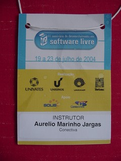
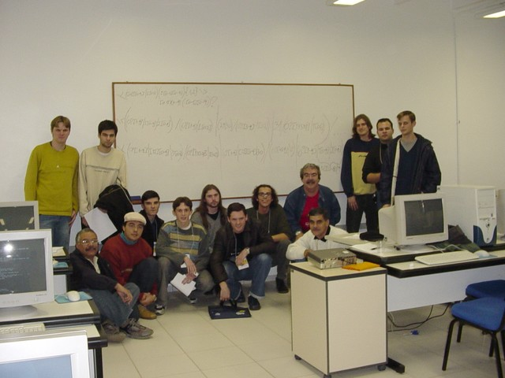
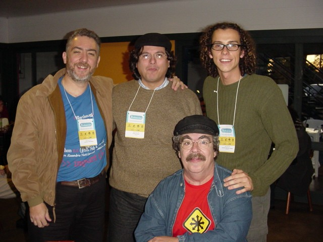

  
Durante a semana do dia 19 de Julho de 2004, aconteceu em Lajeado - RS
o [III SDSL](http://www.sdsl.org.br), nas salas do Centro Universitário Univates. Eu
fui convidado pelo amigo César Brod a participar para ministrar o
mini-curso de Expressões Regulares no dia 21.

Foi tudo bem corrido, com saída numa noite e volta no dia seguinte.
Mas o curso foi bom, com aprendizado rápido dos alunos e discussão de
temas avançados. E claro, o reencontro com os amigos, como já é
costumeiro nesses eventos.

Muito Obrigado ao amigo César pelo convite e à Conectiva por ter me
liberado para o evento.

Links para os materiais:

* [Apostila de Expressões Regulares](http://aurelio.net/curso/material/apostila-expressoes-intro.pdf)

* [Histórico da Linha de Comando](sdsl3-er-prompt.html)

* [Mais informações sobre o assunto](http://aurelio.net/regex/)

## Cheguei, Falei, Voltei

O vôo era cedo, às 19h30, então fui direto da Conectiva para o
Aeroporto. Trânsito tranquilo, tempo de sobra. Como é bom levar apenas
uma mochila nas costas, não precisa despachar malas nem ficar
esperando depois. A viagem até Porto Alegre foi rápida, menos de uma
hora de vôo.

No desembarque encontrei o Rodrigo, motorista da Univates que me
esperava com um cartaz com meu nome. Continuo achando isso engraçado
:) Ele também estava esperando alguns professores para aproveitar a
mesma "carona". Lajeado deve ficar a uns 100 Km de POA, e com pouco
mais de uma hora de carro, chegamos lá.

Muito palha chegar de noite em um lugar desconhecido. Você roda, roda
e ele continua desconhecido... Uma coisa interessante que descobri na
conversa, é que como a maioria lá é descendente de alemão, na rua se
fala português, mas dentro de casa é alemão. As crianças desde cedo já
aprendem as duas línguas, isso é massa.

Cheguei no Hotel já era tarde, lá por 11 e meia da noite. O pessoal
estava festando num boliche em algum lugar da cidade, mas eu estava
cansado e com fome, então só pensava em comer e dormir, e foi o que
fiz. Pizza boa, Ki-Kão era o nome da lanchonete.

Pensei que ia pro Rio Grande sentir bastante frio, mas estava como em
Curitiba. Frio, mas nem tanto. O dia seguinte amanheceu clássico
serrano:

  

Encontrei com o Luciano Ramalho no café da manhã, ele ia ministrar o
curso de Python. Fomos juntos papeando para a Univates, a pé. Deu uma
meia hora de caminhada, que serviu para espantar o frio e conhecer um
pouquinho a cidade, que é bem simpática.

Nota 10 para a Ana Paula e a organização do evento. Chegamos lá e
estava tudo pronto, funcionando, sem estresse. O curso começava às 9
da manhã, e assim foi.

Minha sala estava cheia, tinha 14 interessados em Expressões
Regulares. Tinha um pessoal da Solis, cooperativa local tocada pelo
César e outros de longe, como o pessoal do Exército que veio lá de
Brasília até o interior do RS para nerdear.

Alguns já conheciam algo do assunto, outros não. Comecei do início,
devagar e fomos avançando. Já de manhã conseguimos ver mais da metade
da apostila, foi um aprendizado bem rápido!

Pausa para o almoço e encontro com mais camaradas: Leo, Julio, Pablo,
Nassair, Malheiros, César. Só faltou o Rubens mesmo, que acabei nem
vendo.

Na volta, vimos a parte avançada do assunto e esmiuçamos a já
tradicional ER para casar números IP. Vou colocá-la aqui, com espaços
para ficar mais fácil de entender:

    # Expressão Regular para casar números IP: N.N.N.N, onde 0 <= N <= 255
    \<
       ( [0-9]{1,2} | 1[0-9][0-9] | 2[0-4][0-9] | 25[0-5] ) \.){3}
       ( [0-9]{1,2} | 1[0-9][0-9] | 2[0-4][0-9] | 25[0-5] )
    \>

Como o pessoal estava afiado, lasquei exercícios neles, e fizeram
sozinhos a expressão para casar horários e no final a temida expressão
para casar datas, que respeita a diferença de dias possíveis em cada
mês.

Para minha surpresa, além de conseguirem entender a abrangência do
problema e fazer a expressão, apareceram duas respostas diferentes e
fechamos o curso fazendo uma análise detalhada para decidir qual era a
melhor solução. **MEGA NERD**.

||
|A turma de feras em Expressões Regulares, com suas crias no quadro|
||
|As duas expressões de data que exercitaram os neurônios do pessoal|

Para facilitar a leitura, as expressões espaçadas:

    \<
      ( (0?[1-9] | 1[0-9] | 2[0-8]) / (0?[1-9]   | 1[012]) |
        (29 | 30)                   / (0?[13-9]  | 1[012]) |
         31                         / (0?[13578] | 1[02] )
      ) / [012][0-9]{3}
    \>

    \<
      ( (0?[1-9] | [12][0-9] | 3[01])  / (0?[13578] | 1[02]) |
        (0?[1-9] | [12][0-9] | 30)     / (0?[469]   | 11   ) |
        (0?[1-9] |  1  [0-9] | 2[0-8]) /  0?2
      ) / [012][0-9]{3}
    \>

Assim como no curso de ERs do II SDLSL em Campinas, no início eu
pedi para cada aluno dar um valor de 1 a 10 sobre o nível do
conhecimento em ERs que ele julgava possuir naquele momento. No final
do curso, cada um colocou o número que seria o nível após o curso.

Nem todos lembraram de anotar o número no final, mas dos que o
fizeram, todos aumentaram. E alguns aumentaram bastante.
**Missão cumprida!**

| NOME |ANTES |DEPOIS |x |NOME |ANTES |DEPOIS|
|---------------|
|Daniel |0 |- | |Tiago |1 |6|
|Marcos |5 |- | |Niumar |0 |7|
|Paulo |0 |5 | |Armando |1 |9|
|Fabrício |1 |8 | |Diego |2 |7|
|Eduardo M. |2 |- | |Júnior |5 |8|
|William |3 |8,5 | |Luiz |5 |-|
|Jamiel |2 |9 | |Edurado D. |0 |5|

Depois do curso, um lanche rápido com o pessoal, e às 18h eu já estava
no carro de carona com o Egídio, rumo a Porto Alegre para pegar o
avião de volta. A cidade vista de cima com as luzes acesas estava
muito legal.

Enfim, foi corrido pra caramba, mas foi muito gratificante. A turma
está de parabéns e a organização do evento também. Também consegui
terminar de ler o livro do Kelly Slater, o hexa campeão mundial de
surfe que lançou sua biografia, show de bola.

||
|Luciano Ramalho, César Brod, Julio Neves e eu|
