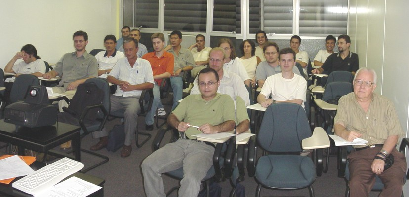
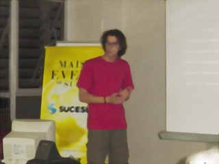
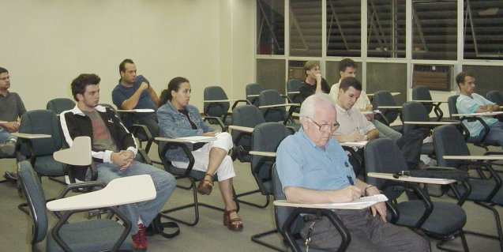

Fui convidado pelo amigo Alessandro Binhara a ministrar
palestras na [Sucesu-PR](http://www.prsucesu.org.br), uma
sociedade bacana de nerds que faz coisas para nerds.

Esta página relata como foi a minha experiência ministrando
essas palestras. Também serve de ponto de partida para os
alunos e interessados obterem o material dessas palestras.

Aproveito a oportunidade para agradecer ao Binhara e à
Sucesu-PR pela oportunidade, pelo apoio e pela transparência
nos trâmites procedurais.

Boa leitura!

## 18.Fev.2004 ::: SED e Expressões Regulares

* [Divulgação Oficial](http://www.prsucesu.org.br/Palestras/MostrarCurso.Asp?Curso=16)

* [Material de apoio](sucesu-seder-apoio.html)

* [Histórico da linha de comando](sucesu-seder-prompt.html)

O lugar fica num prédio bem no centro de Curitiba, e o local da
palestra era uma sala com cadeiras para cerca de 30 pessoas. O legal
da sala não muito grande é que todos ficam perto e podem enxergar
direito, e eu não preciso gritar.

Cheguei cedo, às 18 horas. O Binhara estava saindo, mas ainda consegui
bater um papo com ele. Lá por 18:20 os alunos começaram a chegar.

Meu material era um computador com um Linux qualquer, rodando uma
interface qualquer. O que importa é que tinha o SED instalado e um
terminal com as letras bem grandes para o pessoal poder enxergar. E é
claro, um projetorzão pra cuspir tudo na parede.

O único probleminha foi o teclado ABNT não estava configurado
corretamente no X. Algumas teclas estavam trocadas e para digitar os
caracteres `}` e `)` era preciso apertar `AltGr+9` e
`AltGr+0`. Como sou total ignorante em X e ninguém lá sabia
configurar, tive que conviver com isso até o fim da palestra :)

Comecei eram 18:30. A palestra foi 100% linha de comando e tinha 20
ouvintes. Teve o blablabla inicial de apresentação que deve ter durado
uns 5, 10 minutos e depois foram quatro (4) horas de deleite em
brincar com SED e ERs.

Até levei um [material de apoio](sucesu-seder-apoio.html) e distribuí
para os alunos, que era uma folhinha com um resumão do assunto. Bom
pra ver depois, em casa. Durante a palestra nem foi usado.

Teve uma pausa de 10 minutos para o lanche às 20 horas, com sucos e
bolachas, mas fora isso foi um intensivão, com os conceitos sendo
mostrados um a um "ao vivo", direto no prompt. Dê uma olhada no
[histórico completo](sucesu-seder-prompt.html) para ver o que você
perdeu.

Eu realmente tenho um problema de me empolgar e desembestar a falar,
pois mesmo com 4 horas direto ainda cabia mais uma meia hora de
assuntos aleatórios.

O pessoal perguntou bastante durante a palestra, então imagino que
tenham aprendido :)

Moçada, VALEU a presença e até a próxima!

*Galera que agora sabe tudo de SED e ERs*

## 03.Mar.2004 ::: Como Ser um Desenvolvedor de Software Livre

* [Divulgação Oficial](http://www.prsucesu.org.br/Palestras/MostrarCurso.Asp?Curso=22)

* [Material de apoio](sucesu-desenvolvedor-apoio.html)

* [Slides da palestra](http://aurelio.net/curso/material/desenvolvedor/)

Segunda palestra, no mesmo prédio, mas dessa vez numa sala maior, mais
ampla. Como foram poucas pessoas (12), ela ficou parecendo maior
ainda.

Mesmo esquema da anterior: das 18:30 às 22:30, com pausa para lanche às
20:00. Dessa vez o trânsito apertou e cheguei 5 minutos atrasado. Como
eu estava de carona, não podia reclamar &;)

Diferente da outra palestra, esta não foi na linha de comando, mas sim
uma palestra normal, com uma apresentação de slides e um cara falando
sem parar, que por coincidência, era eu :)

Ahhhh, como é bom fazer essa palestra. Me dá muita satisfação falar
sobre Software Livre e espalhar por aí quais foram todas as alegrias e
oportunidade que ele já me deu em troca. Foram muitas!

A palestra consiste tão somente na minha experiência como um cara que
há alguns anos faz programas (de computador!) nas horas vagas e libera
de graça (os programas!) para a comunidade.

Amigos, contatos, oportunidades de trabalho e ver seu nome em revistas
e sites gringo são alguns dos "louros" que se colhe quando se é um
Desenvolvedor de Software Livre.

O Binhara me disse que muito do que eu falei é o que prega o tal do
"Extreme Programming". Bem, isso eu não sei por que nunca estudei esse
treco, mas tudo o que falei foi o legítimo "Aurelio Programming", que
é a experiência pura da prática, pois eu não tenho formação de
programador e tampouco estudei a teoria disso, algoritmos, nada.

Falei sem parar durante as 4 horas e infelizmente ainda faltou uma
meia horinha para que eu conseguisse passar tudo o que gostaria. Tive
que acelerar no fim, mas foi tudo.

É apenas sentimento, mas acho que cumpri a minha missão de DESPERTAR
nos ouvintes a vontade de tentar. Instigar idéias, incentivar a
começar. É só isso. O resto acontece naturalmente, vencida a grande
barreira inicial da inércia.

*Futuros desenvolvedores de Software Livre!*

Quero ver daqui um tempo essa galerinha aí lançando seus próprios
softwares e mostrando ao mundo a qualidade dos programadores de horas
vagas do Brasil!
