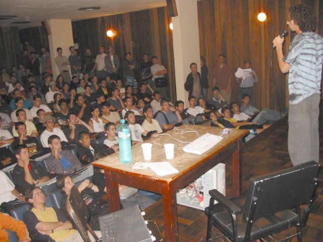
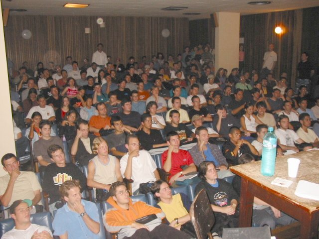
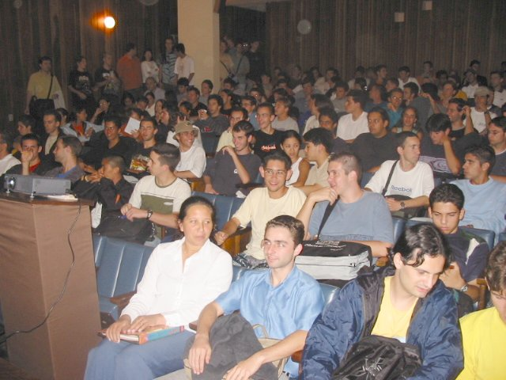
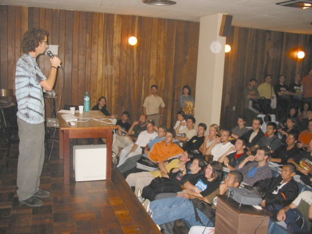
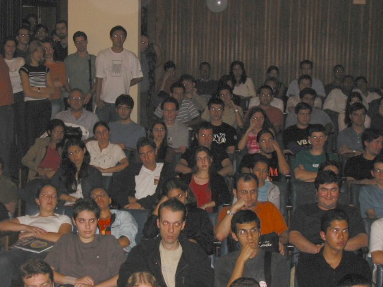
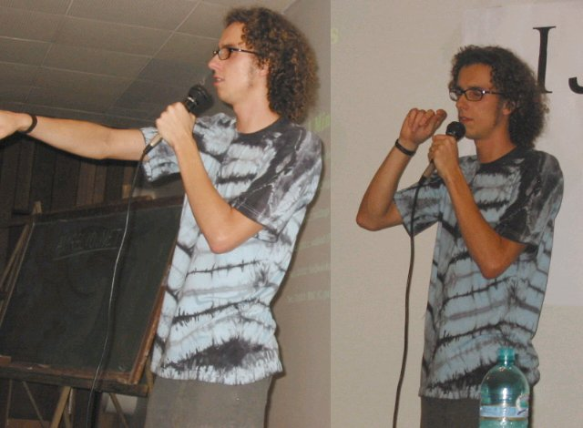

Fui convidado a participar da I Semana de Software Livre na
[UFPR](http://www.ufpr.br), a Universidade Federal do Paraná.
O evento foi composto de palestras de segunda a sexta e um
"Install Fest" de Linux no final, tudo na faixa, FREE,
gratuito.

A minha palestra foi na terça e gostei muito de falar com os
futuros profissionais da informática nacional. E melhor, o
auditório estava LOTADO!

Meus agradecimentos ao PSL-PR, ao Paulo Henrique Santana e ao
Eduardo "gaúcho" pela oportunidade e apoio.

## 30.Mar.2004 ::: Como Ser um Desenvolvedor de Software Livre

* [Divulgação Oficial](http://psl-pr.softwarelivre.org/semana-sl-ufpr/)

* [Slides da palestra](desenvolvedor/)

Estudei na UFPR em 1997, e agora, **sete anos depois**, lá estava eu
novamente no Centro Politécnico. Ainda bem que dessa vez sem precisar
assistir às aulas de Cálculo :)

A palestra foi no **auditório** Léo Groismann, que tem capacidade para
120 pessoas sentadas. A maior palestra que eu já tinha ministrado até
então contou com cerca de 40 pessoas.

Foi chegando o horário de começar e o auditório foi enchendo, enchendo
e encheu. Caramba, 120 pessoas! E melhor, continuou chegando gente e
foram se amontoando, sentando no chão, no palco, e somando tudo a
organização contou **150 pessoas**!

No final, conversando com os organizadores, fiquei sabendo que tinha
muita gente de fora, como da PUC e do Estadual, e pessoas de outros
cursos, como Enfermangem. **Enfermagem?** Pois é, também não entendi
:)

**O início** estava marcado para as 19 horas, mas comecei uns 10 minutos
depois. É que alguns professores estavam liberando suas turmas para
assistir a palestra, então tinha que dar um tempinho para que eles
pudessem chegar até o auditório.

Infelizmente, depois fiquei sabendo que muitas pessoas não puderam
assistir porque simplesmente não tinha mais espaço e
**não conseguiram entrar**. É... realmente essa palestra me pegou
desprevinido. Esperava umas 50 cabeças no máximo e de repente o
auditório estava lotado.

Até deu um frio na barriga e um **nervosismo** inicial. Também pela
primeira vez usei um microfone (óóóóóó), e posso afirmar que prefiro
ficar gritando do que me enrolando nos fios...

Mas logo que comecei a falar o nervosismo já foi embora e língua
descontrolada tomou conta do corpo, só parando quase duas horas
depois. O **nariz** também fez a sua cena, coçando insistentemente
durante todo o tempo. Depois que eu fui saber que o lugar ficava
sempre fechado, e aquele cheiro forte, meio mofo, atacou minha
alergia.

O material foi o de sempre, um computador com um projetor para mostrar
os slides da palestra. Mas o conteúdo é muito extenso e duas horas é
pouco. Acabei deixando os **slides** de lado e falei tudo na ordem em
que os temas apareciam, ficou mais dinâmico e consegui falar tudo.

É muito fácil falar sobre as próprias experiências, me sinto o próprio
**Forest Gump**, só contando histórias. E ao mesmo tempo acho que o
conteúdo é mais palpável e confiável, pois não foi "um amigo me contou
que..." ou "segundo o livro tal..." e sim "aconteceu comigo".

O pessoal parece **ter gostado**. Deram bastante risadas nas
piadinhas, o que demonstra que pelo menos estavam prestando atenção e
ficaram até o final, não havendo aquela evacuação gradual.

No dia seguinte recebi o retorno de que o pessoal realmente tinha
gostado e se empolgou com o tema. **Beleza!** Missão cumprida.

