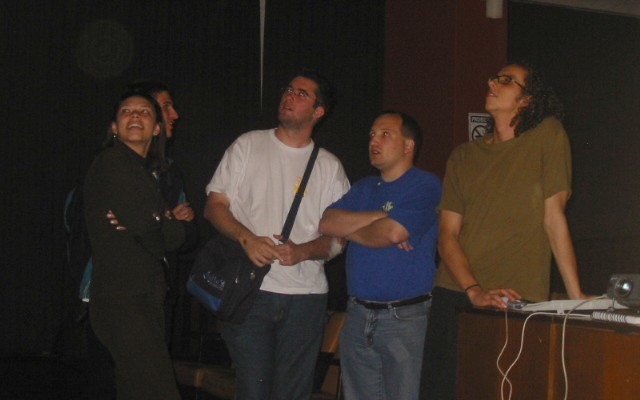
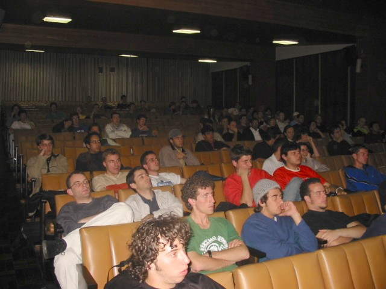
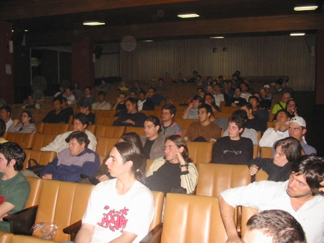
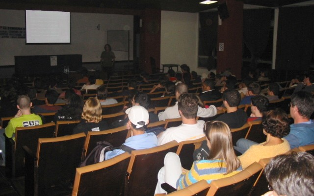

Fui novamente convidado a participar da Semana de Software
Livre na [UFPR](http://www.ufpr.br), que está na sua segunda
edição.

A minha palestra foi sobre desenvolvimento, como se fosse uma
continuação da primeira. Foi legal que minha família foi pela
primeira vez me ver falando.

Meus agradecimentos ao Paulo Henrique Santana pela
oportunidade.

## Desenvolvedor de Software Livre

 * [Divulgação Oficial](http://www.inf.ufpr.br/ssl/)

 * [Slides da palestra](http://aurelio.net/curso/material/desenvolvedor/)

Há cinco meses atrás, participei da [I Semana do Sofware Livre](../i/)
na UFPR. Agora estou novamente nessa II Semana, com a mesma palestra
sobre desenvolvimento de Software Livre.

||
|Amiguinhos vendo algo no telão: Fer, Boiko, Boto, Helio, Eu|

A diferença é o enfoque. Na primeira o tempo acabou muito rápido e
apenas a primeira parte da palestra ficou bem explicada. Dessa vez, a
criação e desenvolvimento do software foram vistas de maneira mais
rápida, ficando o destaque para o lançamento, manutenção e marketing.

Havia cerca de 90 pessoas, sendo que quase metade já havia assistido a
palestra anterior, então estava tudo ocorrendo conforme os planos.

||
|Quantos desenvolvedores de Software Livre podem nascer daqui?|

Apesar do início estar marcado para as 18h30, só fui começar às 19h15,
pois pediram para que aguardasse o pessoal sair da aula. Foram 2 horas
de falatório, com um tempo para perguntas no final, onde ficamos
papeando sobre detalhes específicos do assunto.

Na platéia, além de amigos e colegas de trabalho (Fer, Boiko, Mikio),
algumas visitas especiais, como meus pais e minha irmã, que
aproveitaram o evento local e gratuito para me ver falando pela
primeira vez. Então para mim, essa palestra teve um sabor especial.

||
|Minha família no canto inferior direito: Karla (irmã), Geny (mãe), Gabriel (padrasto)|

O Groo estava lá, amigão meu dos bons tempos de CEFET, outro que
acabou se enveredando pelo caminho nerdz também. Para completar a
festa, o Nissin, guitarrista da banda
([CORRERIA](http://aurelio.net/correria/)!) também acompanhou da metade para o
final.

Muito legal esse negócio de dar palestra na própria cidade: é chegar,
falar e ir embora, sem aquela embassação de viagem, hotel, translado,
...
