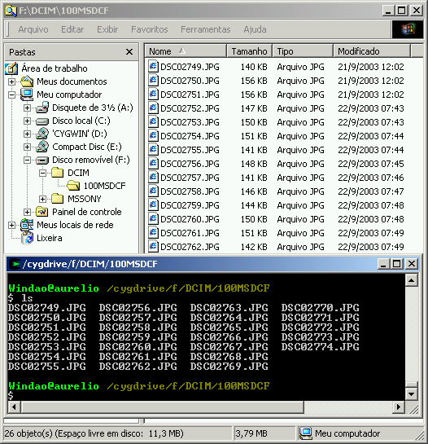
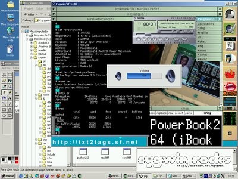

Bem-vindo ao portal brasileiro de Cygwin.

A idéia dessa página é centralizar todas as informações disponíveis em português sobre o Cygwin. Dicas, links, artigos, tutoriais, FAQ, imagens, depoimentos, se for sobre Cygwin, o lugar é aqui.

<nav>
  <ul>
    <li><a href="#toc1">O que é Cygwin?</a></li>
    <li><a href="#toc2">Instalação</a>
      <ul>
        <li><a href="#toc3">Dicas Rápidas para a Instalação do Cygwin</a></li>
        <li><a href="#toc4">Artigo sobre Cygwin na Revista do Linux</a></li>
        <li><a href="#toc5">Artigo sobre instalação do Cygwin via Internet</a></li>
        <li><a href="#toc6">Como instalar e rodar o Cygwin direto de um pendrive</a></li>
      </ul>
    </li>
    <li><a href="#toc7">Dicas / FAQ</a>
      <ul>
        <li><a href="#toc8">Como Rodar o WindowMaker</a></li>
        <li><a href="#toc9">Dialog no Cygwin!</a></li>
        <li><a href="#toc10">Sinais pra usar com o Trap</a></li>
        <li><a href="#toc11">Arquivos de Configuração</a></li>
      </ul>
    </li>
    <li><a href="#toc12">Outras Informações</a>
      <ul>
        <li><a href="#toc13">Links</a></li>
        <li><a href="#toc14">Cygwin no IRC</a></li>
        <li><a href="#toc15">Salada de Frutas: PC/PPC/Windows/Cygwin/Linux</a></li>
      </ul>
    </li>
  </ul>
</nav>

<h2 id="toc1">O que é Cygwin?</h2>

O Cygwin é um programa que se instala no Windows, trazendo o poder da telinha preta do Linux para o sistema das janelas. Não é preciso "dual boot" ou instalar o Linux, pois o Cygwin roda junto com o Windows. É mágica!



Sendo apenas mais uma janela no ambiente, você continua usando seu Windows normalmente, e com um simples `Alt+TAB`, terá toda a flexibilidade e poder dos comandos do Linux, como bash, ls, grep, find, awk e amigos.

Basta baixar o `setup.exe` do Cygwin, escolher quais os pacotes que quer instalar e turbinar seu Windows. Tem de tudo: Python, Perl, man pages, VI, Emacs, mutt, pine, Apache, PostgreSQL e inclusive a interface gráfica (XFree86 e X.org)! É possível rodar o WindowMaker, KDE ou Gnome, tudo dentro de uma janelinha do Windows!

Confie no que digo: se você usa Windows, **instale o Cygwin**. Sua vida vai mudar, o Windows vai até ficar “legal” de usar.

<h2 id="toc2">Instalação</h2>

<h3 id="toc3">Dicas Rápidas para a Instalação do Cygwin</h3>

- Baixe o [setup.exe](https://cygwin.com/install.html) e execute-o.
- Escolha `Install from Internet`, para o instalador baixar os pacotes e já instalá-los.
- Deixe sempre as opções padrão já selecionadas, não mude: `C:\cygwin`, `All Users`, `UNIX`.
- Faça a instalação mínima primeiro, apertando “Avançar” na tela da escolha de pacotes, SEM SELECIONAR NADA. Depois que o Cygwin estiver instalado e funcionando, use o Setup novamente para instalar os pacotes extras que desejar (uma coisa de cada vez pequeno gafanhoto).
- Como referência, o [Adolfo da lista cygwin-br](http://br.groups.yahoo.com/group/cygwin-br/message/110) anotou quais os pacotes que vêm na instalação básica do Cygwin, são eles:
    - ash, base-files, base-passwd, bash, bzip2, cygwin, diffutils, editrights, fileutils, findutils, gawk, gdbm, grep, groff, gzip, less, libgdbm, libgdm-devel, libgbm3, libgbm4, libgettextpo0, libiconv2, libintl1, libintl2, libncurses5, libncurses6, libncurses7, libpcre, libreadline4, libreadline2, login, man, mktemp, ncurses, readline, sed, sh-utils, tar, termcap, terminfo, texinfo, which, zlib, _update-info-dir

<h3 id="toc4">Artigo sobre Cygwin na Revista do Linux</h3>

Escrevi um artigo completo de 9 páginas sobre o Cygwin, que foi publicado na Revista do Linux edição 47, de Novembro de 2003.

Este artigo apresenta o Cygwin, ensina como instalá-lo no Windows a partir do CD da revista e dá várias dicas de configuração e uso do sistema. Leia na íntegra: [Cygwin - O Linux no Windows](rdl/).

<h3 id="toc5">Artigo sobre instalação do Cygwin via Internet</h3>

Wagner Ronieri França Costa escreveu um [artigo sobre o Cygwin](http://www.vivaolinux.com.br/artigos/verArtigo.php?codigo=2011&pagina=1) explicando como instalá-lo e também dá dicas de uso.

<h3 id="toc6">Como instalar e rodar o Cygwin direto de um pendrive</h3>

Veja o artigo [Cygwin no pendrive](http://mdicas.blogspot.com/2008/06/cygwin-no-pendrive.html), escrito por Meleu, para saber como instalar o Cygwin em um pendrive e poder usá-lo em qualquer computador.

<h2 id="toc7">Dicas / FAQ</h2>

<h3 id="toc8">Como Rodar o WindowMaker</h3>

Basta criar um arquivo .xinitrc (X init RC) no seu $HOME e torná-lo executável. Seguem os comandos necessários para fazer isso:

```console
$ echo wmaker >> ~/.xinitrc
$ chmod +x ~/.xinitrc
```

Só é preciso fazer isso uma vez. Para chamar a interface gráfica, basta usar o mesmo comando do Linux:

```console
$ startx
```

<h3 id="toc9">Dialog no Cygwin!</h3>

O Rodrigo Nakabashi disponibilizou em seu site uma [versão do Dialog compilada para o Cygwin](http://codigolivre.org.br/projects/dialogcyg/). Veja a [mensagem completa do Rodrigo](http://br.groups.yahoo.com/group/cygwin-br/message/128) com instruções de instalação.

<h3 id="toc10">Sinais pra usar com o Trap</h3>

Os sinais no Cygwin são diferentes dos do Linux. O comando `trap -l` lista quais são eles. Para sua comodidade, aqui estão:

<table class="tableborder">
  <tbody>
    <tr>
      <th>#</th>
      <th>Nome</th>
      <th>#</th>
      <th>Nome</th>
      <th>#</th>
      <th>Nome</th>
      <th>#</th>
      <th>Nome</th>
    </tr>
    <tr>
      <td class="right">1</td>
      <td>SIGHUP</td>
      <td class="right">9</td>
      <td>SIGKILL</td>
      <td>17</td>
      <td>SIGSTOP</td>
      <td>25</td>
      <td>SIGXFSZ</td>
    </tr>
    <tr>
      <td class="right">2</td>
      <td>SIGINT</td>
      <td>10</td>
      <td>SIGBUS</td>
      <td>18</td>
      <td>SIGTSTP</td>
      <td>26</td>
      <td>SIGVTALRM</td>
    </tr>
    <tr>
      <td class="right">3</td>
      <td>SIGQUIT</td>
      <td>11</td>
      <td>SIGSEGV</td>
      <td>19</td>
      <td>SIGCONT</td>
      <td>27</td>
      <td>SIGPROF</td>
    </tr>
    <tr>
      <td class="right">4</td>
      <td>SIGILL</td>
      <td>12</td>
      <td>SIGSYS</td>
      <td>20</td>
      <td>SIGCHLD</td>
      <td>28</td>
      <td>SIGWINCH</td>
    </tr>
    <tr>
      <td class="right">5</td>
      <td>SIGTRAP</td>
      <td>13</td>
      <td>SIGPIPE</td>
      <td>21</td>
      <td>SIGTTIN</td>
      <td>29</td>
      <td>SIGLOST</td>
    </tr>
    <tr>
      <td class="right">6</td>
      <td>SIGABRT</td>
      <td>14</td>
      <td>SIGALRM</td>
      <td>22</td>
      <td>SIGTTOU</td>
      <td>30</td>
      <td>SIGUSR1</td>
    </tr>
    <tr>
      <td class="right">7</td>
      <td>SIGEMT</td>
      <td>15</td>
      <td>SIGTERM</td>
      <td>23</td>
      <td>SIGIO</td>
      <td>31</td>
      <td>SIGUSR2</td>
    </tr>
    <tr>
      <td class="right">8</td>
      <td>SIGFPE</td>
      <td>16</td>
      <td>SIGURG</td>
      <td>24</td>
      <td>SIGXCPU</td>
      <td></td>
      <td></td>
    </tr>
  </tbody>
</table>

<h3 id="toc11">Arquivos de Configuração</h3>

#### .inputrc

```config
# Acentuacao
set meta-flag on
set convert-meta off
set output-meta on

# TAB tratando igual maiusculas/minusculas
set completion-ignore-case on

# Fazer a tecla Insert colar
#"\e[2~": paste-from-clipboard
```

#### .bash_profile

```bash
# Listagem de diretorios usando cores
alias ls='ls --color=auto'
alias l='ls -la'

# Usar o Cygwin em Portugues
export LANG=pt_BR

# Editor de texto nano em Portugues
alias nano="LANG=pt_BR nano"

# Usar um Prompt personalizado
#PS1='\W) '

# Expansao de nomes de arquivos tratando
# igual maiusculas/minusculas
shopt -s nocaseglob
```

#### .nanorc

```config
set smooth      # rolar texto linha a linha
#set const      # mostrar numero da coluna/linha
```

#### .vimrc

```vim
set textwidth=70 background=dark
set is hls ic scs aw ruler ls=2
syntax on
```

<h2 id="toc12">Outras Informações</h2>

<h3 id="toc13">Links</h3>

- [Artigo completo (9 páginas) publicado na Revista do Linux](/cygwin/rdl/)
- [Lista de discussão de usuários, em português](https://br.groups.yahoo.com/neo/groups/cygwin-br/info)
- [KDE no Cygwin](http://kde-cygwin.sourceforge.net)
- [Gnome 1.x no Cygwin](http://cygnome.sourceforge.net)
- [Gnome 2.x no Cygwin](http://cygnome2.sourceforge.net)
- [Página Oficial do Cygwin](http://cygwin.com) ([FAQ](http://cygwin.com/faq.html))
- [Lista completa dos pacotes disponíveis no Cygwin](http://cygwin.com/packages)

<h3 id="toc14">Cygwin no IRC</h3>

- Português: `irc.brasnet.org`, canal `#cygwin`
- Inglês: `irc.freenode.net`, canal `#cygwin`

<h3 id="toc15">Salada de Frutas: PC/PPC/Windows/Cygwin/Linux</h3>

Esses dias eu estava brincando com o Cygwin para escrever um artigo. Olha que massa o que dá pra fazer:

- _Máquina 1_ (Windão): Desktop PC com Windows 2000 e Cygwin
- _Máquina 2_ (iBook): Notebook PowerPC (Macintosh) com Linux

Ambiente de testes:

- As duas máquinas estão ligadas (ah, sério?)
- As duas máquinas estão conectadas via rede local, com um cabo crossover.
- O Cygwin está com o XFree86 instalado
- O iBook está com o Yellow Dog Linux (tipo RedHat) instalado e funcionando
- O XFree86 do Linux foi configurado para aceitar logins remotos

Procedimento:

1. Do Windão, abri uma janela do Cygwin.
2. Chamei o XFree com os parâmetros “-query IP-do-iBook”
3. O XFree do iBook respondeu, mandando a tela de login (KDM)
4. Entrei com meu usuário e senha do Linux, e...

Resultado:

- Do Windão, acessei o WindowMaker de uma máquina Linux remota, disparei programas, o usei como se estivesse na própria máquina remota. Com um Alt+TAB, estava de volta no Windows
- Tive um sistema Linux que roda num hardware PPC, funcionando numa janela de uma API POSIX (Cygwin), funcionando sobre um Windows em um hardware PC.
- Salada de conceitos, plataformas, sistemas operacionais e softwares &:)

Não acredita? Então veja:

[](salada.png)

Quem disse que a informática não é divertida? &;)
