<!--
  Artigo publicado na Revista do Linux #47, Novembro 2003

  16set2003 16:30 1h   pesquisa
  18set2003 07:30 1h   instalação (internet - 70% fora)
  22set2003 08:30 3h40 1/2 install, screenshots, 1o contato
  22set2003 14:00 6h   dicas, FAQ, explorando, pacotes novos
  23set2003 18:00 2h30 refinamento FAQ, config
  23set2003 21:30 3h   intro, config
  24set2003 10:20 2h   revisão luciano
  24set2003 12:20 0h40 1/2 install
  24set2003 15:30 5h   mais screenshots, testes, conclusão
  24set2003 22:00 1h   screenshot, revisão
  25set2003 08:00 0h40 sshot1, sshot2
  25set2003 09:30 1h   action.bmp, mini currículo, revisão final
  ... ?
  09jun2017 18:00 2h   convertido de txt2tags pra Markdown
      TOTAL      29h30
-->

Este é o artigo sobre Cygwin que foi publicado na Revista do Linux edição 47, de Novembro de 2003. Ele também foi disponibilizado no [site da revista](http://www.revistadolinux.com.br/ed/047/assinantes/capa.php), porém sem formatação e sem as imagens. Aqui está a versão completa, formatada e cheia de imagens para um melhor entendimento. O texto é o mesmo em ambos.

Apesar de ser um texto antigo, o Cygwin não mudou muito com o passar dos anos, então a maioria das informações aqui descritas ainda são válidas.

<nav>
  <ul>
    <li><a href="#toc1">Apresentando o Cygwin</a></li>
    <li><a href="#toc2">Instalação</a></li>
    <li><a href="#toc3">Primeiro Contato com o Cygwin</a></li>
    <li><a href="#toc4">Explorando o Ambiente</a></li>
    <li><a href="#toc5">Instalando e Removendo Pacotes</a></li>
    <li><a href="#toc6">Detalhes, Pegadinhas e Chatices</a>
      <ul>
        <li><a href="#toc7">O comando &lt;man,less,gcc,...&gt; não funciona!</a></li>
        <li><a href="#toc8">Como alterar tamanho/cores/fonte da janela?</a></li>
        <li><a href="#toc9">Como copiar e colar textos com o mouse?</a></li>
        <li><a href="#toc10">Meu arquivo texto está cheio de caracteres ^M. Por quê?</a></li>
        <li><a href="#toc11">Todas as linhas do arquivo ficaram grudadas em uma só!</a></li>
        <li><a href="#toc12">Tem como deixar o Cygwin em português?</a></li>
        <li><a href="#toc13">Como fazer funcionar a acentuação?</a></li>
        <li><a href="#toc14">Não consigo colar letras acentuadas na janela do Cygwin!</a></li>
        <li><a href="#toc15">Posso usar o rxvt ao invés do terminal do Windows?</a></li>
        <li><a href="#toc16">Barra pra cá ou barra pra lá?</a></li>
      </ul>
    </li>
    <li><a href="#toc17">Dicas para usuários do Windows/DOS</a></li>
    <li><a href="#toc18">Dicas para usuários do Linux/UNIX</a></li>
    <li><a href="#toc19">Configuração</a>
      <ul>
        <li><a href="#toc20">.inputrc</a></li>
        <li><a href="#toc21">.bash_profile</a></li>
        <li><a href="#toc22">.nanorc</a></li>
        <li><a href="#toc23">.vimrc</a></li>
      </ul>
    </li>
    <li><a href="#toc24">É isso</a></li>
    <li><a href="#toc25">Para saber mais</a></li>
  </ul>
</nav>


<h2 id="toc1">Apresentando o Cygwin</h2>

Esta é a Revista do Linux. O seu conteúdo é sobre Linux. Os seus leitores são fãs do Linux. Mas este artigo vai falar bastante sobre um assunto diferente: Microsoft Windows.

Pelos mais diversos motivos, mesmo sendo um usuário fanático e evangelizador do Linux, chega um dia em que vai aparecer um Windows na sua frente e você vai ter que se virar com ele. Seja na casa de um amigo, na máquina da faculdade ou em um emprego novo.

Não adianta torcer o nariz e dizer: “eu não uso Windows”. A união será inevitável. Não se preocupe, isso não é motivo de vergonha (só não conte para ninguém ;).

Um belo dia, cansados de ter que apelar para as ferramentas do Windows, imaginando como tudo seria mais fácil se o TAB completasse nomes de arquivo no DOS ou se o Bloco de Notas tivesse colorização de sintaxe e comandos avançados, programadores pensaram o impensável: emular o núcleo do Linux usando uma DLL do Windows, para que os aplicativos GNU funcionassem no sistema da Microsoft.

Isso é o Cygwin.

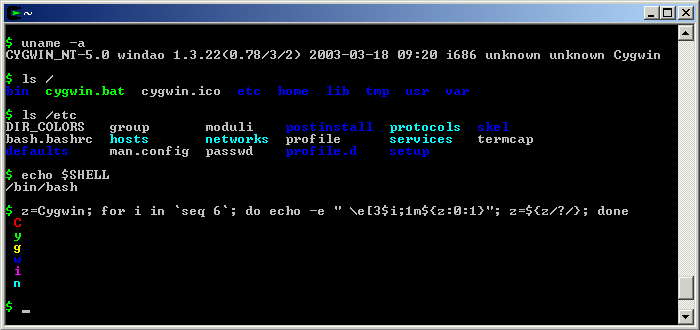

Uma casca de APIs e códigos complicados que fazem o Windows responder as chamadas de um sistema Linux. Além disso, há dezenas de aplicativos GNU inclusos que rodam sob essa casca, funcionando como se estivessem no bom e velho Linux.

Na prática, após instalar o Cygwin, você terá ao alcance de um clicar de ícone uma janela de terminal com bash, gcc, grep, sed, vi, pine, lynx e vários outros comandos e aplicativos que você já está acostumado a usar no Linux, com mesmo comportamento, opções e aparência.

Os aplicativos GNU que funcionam no Cygwin não são programas reescritos ou mímicas dos originais, são os mesmo fontes que rodam no Linux, levemente adaptados para interagir em paz com o sistema.

Com o Cygwin é possível fazer programas, compilá-los, testá-los, escrever textos, fazer shell scripts, conexões remotas, ler e-mail, navegar na Internet. Em outras palavras: você não vai notar a diferença!

Como experiência pessoal, ao ingressar no emprego novo que era “powered by Windows”, instalei o Cygwin e descompactei nele o .tar.gz de todo o meu $HOME de quase cinco anos de Linux. Para minha surpresa, tudo continuou funcionando, os links simbólicos, o VI, os scripts, os programas em Python, o Pine, fetchmail, lynx, tudo! Nenhuma adaptação foi necessária. Passado um ano e meio continuo usando máquinas com Linux e outras com Cygwin, movendo meu $HOME para lá e para cá sem estresse, tanto faz estar em um sistema ou outro, funcionam igual.

Além de ser compatível com o Linux, o Cygwin interage amigavelmente com o Windows, acessando arquivos e se deixando acessar. Do Cygwin é possível acessar o C:, D:, ou abrir no Internet Explorer um arquivo HTML que está no seu $HOME do Cygwin. E tudo isso sem bagunçar o Windows! Para ele, o Cygwin é apenas mais um programa instalado e que ocupa um diretório, ou melhor, uma “pasta”. Nada de particionamento, reiniciar a máquina, configurar hardware: instalar o Cygwin é instalar um programa comum.

Por ter a instalação extremamente facilitada e funcionar em conjunto com o Windows, o Cygwin é uma ótima opção para quem quer conhecer o Linux. É o ambiente ideal para o usuário novato dar seus primeiros comandos, instalar programas, experimentar, bagunçar e reinstalar tudo de novo...

A instalação é tão fácil, mas tão fácil, que se resume somente a escolher programas. Toda aquela chatice de configurar teclado, mouse, monitor e fuso horário é deixada de lado, pois as configurações já existentes no Windows são aproveitadas. De quebra, todo hardware, periféricos e acessórios que funcionam no Windows também funcionam no Cygwin. Nada de preocupações com drivers e recompilação de kernel. Kernel? Para que kernel? :)

Quer mais? A instalação mínima ocupa apenas 30 Mb e contém vários utilitários poderosos do mundo UNIX. Mesmo com pouquíssimo espaço livre em disco é possível aproveitar as vantagens das ferramentas GNU no Windows.

Ainda quer mais? Você aproveita e continua usando o Internet Explorer, Windows Explorer, Word, Excel e os outros programas “bonitinhos”. Na hora do aperto, ou quando a força bruta for necessária, clica no ícone do Cygwin e faz um shell script rápido para resolver seu problema.

Muito mais? Diversos programas já funcionam no Cygwin. É uma lista enorme ([http://cygwin.com/packages/](http://cygwin.com/packages/)). E novos programas estão sendo adaptados e mantidos por voluntários, sempre aparece uma novidade. Até o XFree86 funciona! É possível rodar o WindowMaker ou o KDE numa janelinha do Windows.

E então? Está convencido a pelo menos experimentar? O Cygwin é GPL e o site do projeto fica em [http://cygwin.com](http://cygwin.com).


<h2 id="toc2">Instalação</h2>

Continua lendo? Ótimo, então vamos logo instalar e testar esse tal de Cygwin.

Como já citei anteriormente, a instalação é “light”, fácil e rápida. Não há configurações ou detecções a serem feitas. Basta escolher a pasta local onde ele vai ficar e que programas vai ter.

O Cygwin é um “ambiente” que funciona dentro do Windows. Dentro desse ambiente estão os diversos programas GNU, os arquivos do usuário e as configurações. O mesmo programa que é usado para instalar o ambiente também serve para gerenciá-lo, adicionando e removendo programas.

Antes de executar o instalador, atente para dicas importantes que garantirão um procedimento tranqüilo, sem dores de cabeça.

Como qualquer outra instalação de programa no Windows, é aconselhável fechar todas as janelas de outros programas, para evitar problemas. Prevenir não dói e faz bem.

Outra medida aconselhável é desligar o antivírus, se houver algum presente na sua máquina. Desative-o durante toda a instalação, pois alguns insistem em implicar com os pacotes .tar.gz do Cygwin.

Com o antivírus desativado e todas as janelas fechadas (do computador!), podemos prosseguir.

Acesse o CD-ROM da Revista do Linux e entre na pasta que contém os arquivos do Cygwin. Com dois cliques no `setup.exe`, iniciamos o programa de instalação. Ele não é antenado, translúcido e futurista, mas funciona.

<!--
  Para os afobados que querem ver tudo funcionando logo, aqui está o resumo do processo, para clicar sem pensar:

  - Tela 1: Avançar >
  - Tela 2: (o) Install from Local Directory, Avançar >
  - Tela 3: Avançar >
  - Tela 4: Avançar >
  - Tela 5: (Espere a checagem dos pacotes terminar)
  - Tela 6: Avançar >
  - Tela 7: (Espere a instalação dos pacotes terminar)
  - Tela 8: Concluir

  Para os que gostam dos detalhes, aqui está a instalação passo a passo.
-->


Esta é a primeira tela do programa de instalação. Além das boas-vindas, serve para checar qual a versão do `setup.exe`. Clique no botão “Avançar” para continuar a instalação.

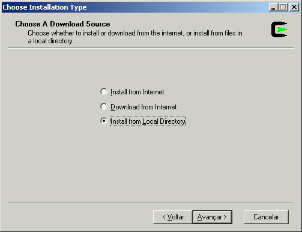

Aqui escolhemos uma das três tarefas que o setup pode fazer:

- _Install from Internet_ -- Instalar direto pela Internet
- _Download from Internet_ -- Baixar os pacotes da Internet
- _Install from Local Directory_ -- Instalar a partir de um diretório local

Como uma das funções da Revista do Linux é facilitar a vida do leitor, não é preciso gastar pulsos de Intenet, pois todos os componentes do Cygwin já foram baixados e estão no CD-ROM desta edição. Com isso, escolha a última opção, para instalar a partir do CD, e aperte o botão “Avançar”.

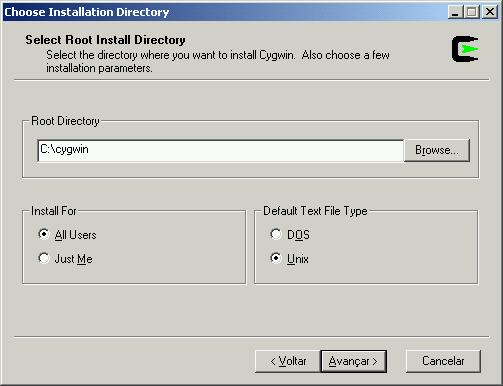

De todo o proceso de instalação, essa é única tela de “configuração”. É extremamente aconselhável que nada seja alterado, e simplesmente se aperte o botão “Avançar”, deixando as configurações padrão.

O item “Root Directory” é a pasta onde o Cygwin vai ser instalado. Todo este artigo se baseará na escolha padrão `C:\cygwin`. Esta pasta será o diretório raiz, o /. Você pode colocá-lo em outra pasta se julgar apropriado, mas nunca, NUNCA instale o Cygwin no `C:\` ou numa outra pasta que já tenha outros arquivos dentro.

O item “Install For” indica se o ambiente deve ser instalado para todos os usuários da máquina (All Users) ou somente para você (Just Me). Mesmo que você seja o único a usar o Cygwin, deixe no padrão "All Users".

O item “Default Text File Type” indica o tipo de texto padrão para leitura e gravação de arquivos, se será o do Windows o do Unix. Deixe como “Unix”, sempre.

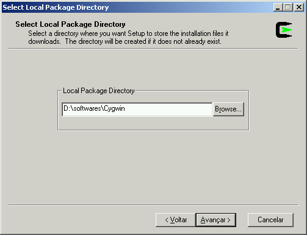

Nesta tela é escolhida a pasta onde estão os arquivos de instalação do Cygwin e seus programas. Os arquivos estão no CD da revista, dentro do mesmo diretório do setup.exe. O local já selecionado é o correto. Basta apertar o botão “Avançar”.


Nesta tela não há nada a se fazer a não ser esperar. O programa de instalação está fazendo uma checagem de todos os programas disponíveis, para garantir que nenhum esteja corrompido ou incompleto. Dependendo da velocidade de seu computador, este procedimento pode demorar um pouco. Aproveite para já ir pensando em como o Cygwin mudará a sua vida :).

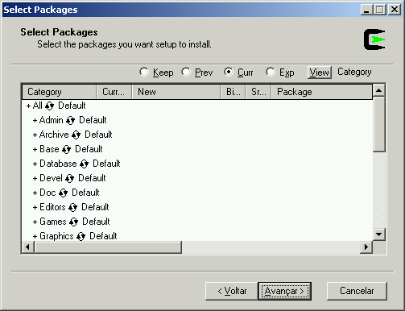

Esta é a tela mais divertida, onde se escolhe quais “pacotes” serão instalados. Quem nunca usou um Linux, pode encarar pacotes como se fossem arquivos .ZIP com um ou vários programas dentro. Por exemplo, o pacote “grep” contém os programas “grep”, “fgrep” e “egrep”, sua documentação e arquivos auxiliares.

Mas não vamos brincar de escolher pacotes agora. Simplesmente aperte o botão “Avançar” para que seja feita uma instalação mínima. Depois voltaremos a essa tela para escolher os pacotes um a um.

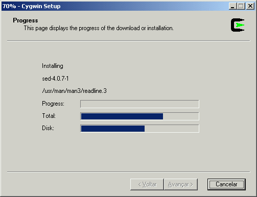

Mais uma tela para somente esperar que o setup faça seu trabalho. Aqui, ele está instalando um a um os pacotes com os programas escolhidos no passo anterior. Como estamos fazendo a instalação mínima, são poucos e não demora muito. Aproveite para acompanhar e conferir o que está sendo instalado.

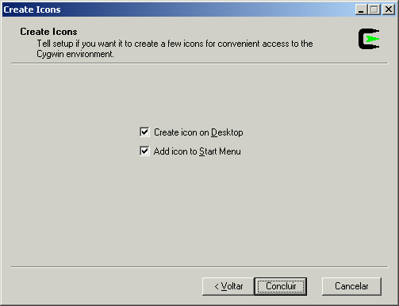

Os pacotes já foram instalados no Cygwin. Antes de apertar o botão “Concluir”, note que você tem a chance de escolher criar ou não os atalhos no Desktop (Área de Trabalho) e no menu Iniciar. Deixe as duas opções marcadas para que os atalhos sejam criados.


Não se assuste! Vão pipocar e desaparecer várias janelas pretas com textos, tão rapidamente que não vai dar tempo de ler. É a maneira do Cygwin acertar os últimos detalhes antes de finalmente aparecer a janelinha tão esperada, informando que a instalação foi concluída:


Tudo certo! O Cygwin foi instalado com sucesso e já está pronto para usar. Atenção: não é necessário reiniciar a máquina! Clique no ícone do Cygwin na Área de Trabalho ou acesse o menu _Iniciar -> Programas -> Cygwin -> Cygwin Bash Shell_.


<h2 id="toc3">Primeiro Contato com o Cygwin</h2>

Senhoras e senhores, este é o Cygwin:

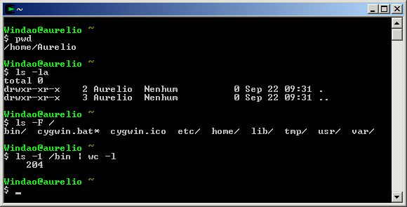

Uma janela preta, com letras em cinza. Quem já conhece o Linux no modo texto (console) está em casa. Quem conhece o Linux no modo gráfico (X) deve encarar o Cygwin como um Xterm. Se ainda não conhecer o Linux, encare o Cygwin como um MSDOS mais poderoso.

Essa janela preta é chamada de terminal, e este terminal está rodando um “shell”. “Shell” é o robozinho que está esperando por seus comandos. Basta digitá-los, e quando você apertar ENTER, este robô vai executar o comando.

O texto que aparece é chamado de “prompt”. Ele indica que o sistema está esperando por seus comandos. Na figura, o texto é “_Windao@aurelio ~_”. Ele significa que esta é a máquina chamada “Windao”, o usuário chama-se “aurelio” e o diretório atual é o “~”, que é o diretório do usuário, ou seja, o $HOME.

Logo abaixo está um sinal de cifrão ($) e o cursor (_) piscando, indicando que agora é sua vez: você deve digitar algum comando.

Não faz parte do escopo deste artigo uma introdução ao Linux e seus comandos, pois em várias edições anteriores da Revista do Linux esse assunto já foi visitado. Consulte suas revistas ou o site http://www.RevistadoLinux.com.br (Nota: site retirado do ar).

Com seus modestos 30 Mb, a instalação mínima contém vários utilitários de manipulação de arquivos e texto, úteis para a criação de shell scripts e uso diário. Para se ter uma idéia desse conjunto básico de comandos, aqui vai uma lista longa, porém incompleta, com os comandos mais conhecidos:

awk, basename, bash, bzip2, cat, chroot, cmp, comm, cp, cut, date, dd, df, diff, dirname, du, env, expand, expr, find, fmt, grep, gzip, head, join, kill, ln, locate, ls, md5sum, mkdir, mount, mv, nice, od, paste, pr, printf, ps, pwd, rm, rmdir, sed, seq, sort, tac, tail, tar, tee, touch, tput, tr, uname, uniq, wc, which, who e xargs.


<h2 id="toc4">Explorando o Ambiente</h2>

Você pode estar se perguntando agora: "Peraí, foi usado um setup.exe para instalar um tal de Cygwin que contém vários programas do Linux dentro e tudo isso funciona numa janela do meu Windows! Estou sonhando?"

Não, isso não é um sonho, isso é só o começo. Depois de ver todas as possibilidades que essa integração Linux-no-Windows oferece, você vai se perguntar: “Por que eu não instalei o Cygwin antes?”.

A primeira grande sacada do conceito é que o Cygwin roda de maneira completamente integrada com o Windows. Todo o sistema funciona dentro de uma pasta do Windows. Essa pasta é o `C:\cygwin` e o “Linux” do Cygwin roda inteiro ali dentro, construindo e modificando seu próprio “mundinho” num canto isolado do sistema de arquivos de seu maior rival.

> O diretório raiz `/` do Cygwin é a pasta `C:\cygwin` do Windows.

Num teste rápido dessa integração transparente, vá até a janela do Cygwin que está aberta (“shell”) e digite os seguintes comandos:

```console
$ cd /tmp
$ touch teste
$ ls -l
total 0
-rw-r--r--     1 Usuario   Nenhum       0 Sep 22 14:34 teste
$
```

Note que o cifrão no início da linha representa o prompt de comando e não deve ser digitado!

Com estes comandos foi criado um arquivo vazio chamado “teste” dentro do diretório `/tmp` do Cygwin.

Agora vamos ver a integração funcionando. Como todo o sistema de arquivos do Cygwin está dentro de uma pasta do Windows, também é possível acessar e modificar estes arquivos com as ferramentas e programas do Windows.

Abra o Windows Explorer e acesse a seguinte pasta: `C:\cygwin\tmp`. Lá está o arquivo que acabamos de criar. Pelo Windows, conseguimos enxergar arquivos criados no Cygwin.

Agora selecione o `teste.txt` e apague-o, como faria normalmente com qualquer arquivo do Windows. Foi embora, sem problemas. Voltando à janela do Cygwin e repetindo o comando para ver os arquivos do `/tmp`:

```console
$ ls -l
total 0
$
```

Não existe mais. Então, pelo Windows temos acesso total e irrestrito a todos os arquivos do Cygwin. Assim como o Windows Explorer, qualquer outro programa pode ser utilizado para manipular os arquivos do sistema do Cygwin. Pode-se abrir no Internet Explorer uma página local, fazer uma imagem no Paint e gravar no seu HOME, limpar o /tmp, e todo tipo de tarefa normal.

> Para o Windows, `C:\cygwin` é uma pasta normal, como qualquer outra.

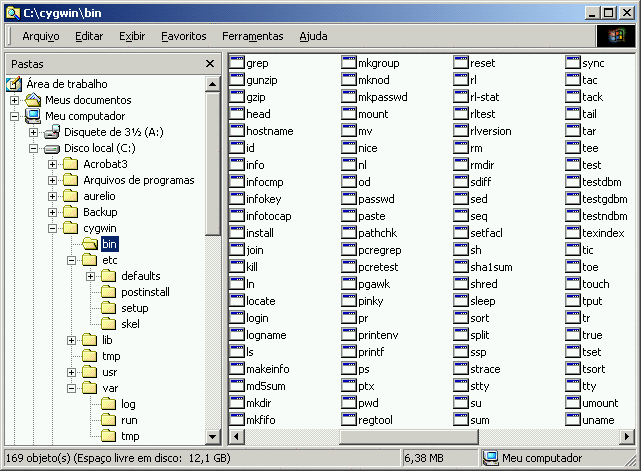

Mas e o caminho inverso, será que o Cygwin consegue acessar os arquivos do Windows, que estão acima do seu diretório raiz? Sim! Listando os arquivos do diretório raiz, aparece:

```console
$ ls -F /
bin/  cygwin.bat*  cygwin.ico  etc/  home/  lib/  tmp/  usr/  var/
$
```

O ls não mostra, mas há um diretório especial chamado `/cygdrive` que provê acesso ao C:, D: e assemelhados. Veja:

```console
$ cd /cygdrive
$ ls
c   d
$ cd c/WINNT/system32
$ ls e*.exe
edlin.exe     eudcedit.exe  exe2bin.exe  extrac32.exe
esentutl.exe  eventvwr.exe  expand.exe
```

E pronto, estamos navegando “as pastas” do Windows como se fossem diretórios normais dentro do ambiente Cygwin. Note que continuamos usando as barras normais / e não \. Também é possível criar, modificar, salvar e apagar qualquer arquivo do Windows pela linha de comando do Cygwin. Cuidado para não apagar o que não deve!

Este diretório cygdrive é “inteligente”, mostrando apenas os drives disponíveis no momento. Ao colocar um disquete, o diretório “a” aparecerá. O mesmo para CD, Zip, Câmera Digital, Memory Card, etc. Qualquer periférico que use algum drive do Windows pode ser acessado por este diretório especial.

Começou a ter idéias? Já imaginou não depender mais exclusivamente das ferramentas do Windows e poder usar todo o poder da linha de comando do Linux, interagindo com outros programas e acessórios do sistema da Microsoft?

Para os já iniciados no modo texto: você conecta o cabo USB da sua câmera fotográfica digital e precisa passar para o computador todas as fotos armazenadas nela. O que é mais rápido:

1.  Abrir o Windows Explorer
2.  Clicar em “Meu Computador”
3.  Clicar em “E:” (ou “F:” ou ...)
4.  Clicar nas pastas da câmera até chegar na fotos
5.  Selecionar todos os arquivos
6.  Apertar Ctrl+X (recortar)
7.  Clicar em “C:”
8.  Clicar nas pastas até escolher o destino
9.  Apertar Ctrl+V (colar)
10. Fechar o Windows Explorer

Ou simplesmente:

```console
$ mv /cygdrive/<TAB><TAB>e/d<TAB>/<TAB>/*.jpg /tmp
```

Não tem comparação :)


Esta pequena demonstração serviu para confirmar que, realmente, os dois sistemas funcionam de maneira totalmente integrada. As ferramentas de um não conflitam com as do outro e todos os arquivos são acessíveis.

A grande vantagem do Cygwin contra um sistema “dual boot”, com Windows e Linux instalado no mesmo HD em partições diferentes, é que as ferramentas do Linux estão acessíveis instantaneamente, sem precisar reiniciar a máquina. E outra, com o Windows cuidando do hardware, nem precisa se preocupar com periféricos recém-saídos da fábrica, que o Linux ainda não tem drivers, WinModem e outros aliens. Você pode estar jogando Counter Strike com os amigos, e com um Alt+TAB roda um shell script para relaxar ;)


<h2 id="toc5">Instalando e Removendo Pacotes</h2>

Usuários com algum conhecimento prévio em sistemas Linux vão notar que a instalação mínima deixou de fora alguns programas importantes como man, less e gcc. Para instalar programas novos ou remover programas já existentes, basta executar novamente o `setup.exe`.

As mesmas recomendações de desativar o antivírus e fechar todas as janelas antes de começar continuam valendo!

> **MUITO IMPORTANTE:** Feche todas as janelas do Cygwin antes de começar

O procedimento é o mesmo da instalação, exatamente igual, até chegar na tela da escolha dos pacotes. Relembrando:

- Tela 1: Avançar >
- Tela 2: (o) Install from Local Directory, Avançar >
- Tela 3: Avançar >
- Tela 4: Avançar >
- Tela 5: (Espere a checagem dos pacotes terminar)

Na tela de seleção de pacotes, vá abrindo cada uma das categorias (+ Admin, + Archive, + Base, ...) e escolha os programas novos que você quer instalar.

Se você já tem alguma experiência em Linux, aperte o botão “View” para ver todos os pacotes de uma vez, em ordem alfabética. Apertando o mesmo botão mais vezes, outras visões serão ativadas:

<table class="tableborder">
  <tbody>
    <tr>
      <td><em>Category</em></td>
      <td>lista das categorias de programas</td>
    </tr>
    <tr>
      <td><em>Full</em></td>
      <td>lista de todos os pacotes</td>
    </tr>
    <tr>
      <td><em>Partial</em></td>
      <td>lista dos pacotes que serão instalados ou removidos</td>
    </tr>
    <tr>
      <td><em>Up to Date</em></td>
      <td>lista dos pacotes que já estão instalados</td>
    </tr>
    <tr>
      <td><em>Not Installed</em></td>
      <td>lista dos pacotes ainda não instalados</td>
    </tr>
  </tbody>
</table>

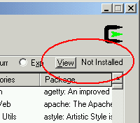

Como a idéia é instalar pacotes novos, fique com a visão "Not Installed". Para cada pacote que você quiser instalar, clique na palavra “Skip” e ela mudará para o número da versão do pacote. Isso significa que este pacote está selecionado para instalação.

Ao escolher alguns pacotes, outros serão marcados automaticamente para instalação. Ao escolher o pacote “man” por exemplo, os pacotes “groff”, “less” e “mktemp” serão selecionados. Deixe-os marcados, pois alguns pacotes precisam de outros para funcionarem corretamente. São pré-requisitos.

Caso queira remover algum pacote já instalado, clique no botão “View” até chegar na visão “Up to Date”. Nos pacotes que quiser remover, clique em “Keep” até mudar para “Uninstall”.

<table class="tableborder">
  <tbody>
    <tr>
      <td><em>Skip</em></td>
      <td>Não instalar este pacote</td>
    </tr>
    <tr>
      <td><em>Keep</em></td>
      <td>Manter este pacote instalado</td>
    </tr>
    <tr>
      <td><em>Reinstall</em></td>
      <td>Reinstalar este pacote</td>
    </tr>
    <tr>
      <td><em>Uninstall</em></td>
      <td>Remover este pacote</td>
    </tr>
  </tbody>
</table>

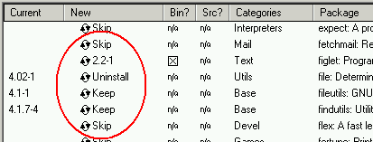

Depois de escolher todos os pacotes desejados, clique no botão “View” até chegar na visão “Partial”, para conferir que pacotes serão instalados ou removidos. Ainda dá tempo de arrumar alguma coisa.

> IMPORTANTE: Ao lado do botão “View” há quatro opções: Keep, Prev, Curr e Exp. Deixe o “Curr” selecionado. Se você escolher outra opção, toda a sua escolha de pacotes já feita será perdida.

Como dica geral, ignore os pacotes que começam com “lib”, como “libintl”, “libpng” e “libungif”. Eles são bibliotecas auxiliares, pré-requisitos para outros programas e serão selecionados automaticamente conforme for necessário.

Como a instalação mínima já tem a maioria das ferramentas para um uso normal do Cygwin, poucos pacotes precisam ser instalados agora para completar o ambiente. São eles:

- **clear** - Limpa a tela (similar ao CLS)
- **cygutils** - Diversos programas: dos2unix, rev, cal, ...
- **file** - Identifica conteúdo de arquivos
- **less** - Paginador, substituto do 'more'
- **man** - Leitor de páginas de manual
- **nano** - Editor de textos amigável
- **openssh** - Cliente para conexões seguras ssh
- **rxvt** - Terminal alternativo antenado :)
- **wget** - Baixa arquivos da Internet

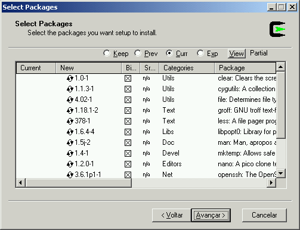

Além destes, usuários com necessidades específicas podem escolher outros pacotes.

- Editores de Texto: vi, emacs, ed
- Programação: gcc, gdb, make, cvs, patch, ctags, ...
- Linguagens de Programação: perl, python, ruby
- E-mail: pine, mutt, procmail, fetchmail
- Outros: Postgresql, cpio, rsync, ncftp, fortune, ...

E tem muito mais. Uma lista completa e atualizada de todos os pacotes disponíveis com uma breve descrição está em [http://cygwin.com/packages/](http://cygwin.com/packages/).

Mas faça um favor a si mesmo: NÃO INSTALE TUDO! Há muitos programas disponíveis e dificilmente alguém necessitará de todos eles. Quanto mais enxuto e otimizado o ambiente do Cygwin, mais rápido ele será e futuras atualizações de pacotes serão mais tranqüilas, não tendo que esperar baixar da Internet vários pacotes não utilizados.


<h2 id="toc6">Detalhes, Pegadinhas e Chatices</h2>


<h3 id="toc7">O comando man/less/gcc/... não funciona!</h3>

É necessário instalá-los. Eles não fazem parte da instalação mínima. Basta usar o setup.exe conforme já explicado.


<h3 id="toc8">Como alterar tamanho/cores/fonte da janela?</h3>

Clique com o botão direito do mouse na barra de título da janela e acesse “Propriedades”. Nas abas “Layout”, “Fonte” e “Cores”, é possível alterar as características da janela do Cygwin. Se estiver disponível, a fonte “Lucida Console” é uma boa escolha. Ao apertar o botão OK, escolha “_Modificar o atalho que iniciou esta janela_” para que as configurações sejam salvas. Uma alternativa é usar o terminal `rxvt` (veja adiante) e usar suas opções de linha de comando.


<h3 id="toc9">Como copiar e colar textos com o mouse?</h3>

Usando o terminal padrão:

- **Copiar:** Selecione com o botão esquerdo pressionado, solte-o e aperte o direito
- **Colar:** Aperte o botão direito

Usando o rxvt:

- **Copiar:** Selecione com o botão esquerdo pressionado
- **Colar:** Aperte o botão do meio


<h3 id="toc10">Meu arquivo texto está cheio de caracteres ^M. Por quê?</h3>

Porque é um texto que está no formato do Windows. Para consertá-lo, converta-o para o formato do Cygwin com o comando `dos2unix arquivo.txt`.


<h3 id="toc11">Todas as linhas do arquivo ficaram grudadas em uma só!</h3>

Você está usando um programa do Windows, como o Bloco de Notas ou o Word, para abrir um arquivo feito no Cygwin. Primeiro converta-o para o formato do Windows com o comando `unix2dos arquivo.txt`.


<h3 id="toc12">Tem como deixar o Cygwin em português?</h3>

Sim e não. Adicione a linha `export LANG=pt_BR` no final do arquivo `.bash_profile`, dentro do seu diretório (`/home/usuário`). Se o arquivo ainda não existir, crie-o. Isso fará com que alguns programas que já foram traduzidos mostrem mensagens e o `--help` em português. Mas como não são todos, o sistema ficará metade em inglês, metade em português. As páginas de manual serão sempre em inglês.


<h3 id="toc13">Como fazer funcionar a acentuação?</h3>

Para que os acentos funcionem, é preciso criar um arquivo chamado `.inputrc` dentro do seu diretório (`/home/usuário`) com o seguinte conteúdo:

```config
set meta-flag on
set convert-meta off
set output-meta on
```


<h3 id="toc14">Não consigo colar letras acentuadas na janela do Cygwin!</h3>

Infelizmente, o terminal padrão do Cygwin sofre deste problema. É possível copiar, mas não colar acentos. Para contornar essa limitação, é possível colar corretamente usando a tecla “Insert” do teclado. Adicione no final do arquivo `.inputrc` a seguinte linha: `"\e[2~": paste-from-clipboard`. Outra solução é usar o terminal `rxvt` que não sofre desse problema (veja adiante).


<h3 id="toc15">Posso usar o rxvt ao invés do terminal do Windows?</h3>

Sim! O `rxvt` é um emulador de terminal que pode ser usado como o terminal padrão do Cygwin. A vantagem é que o `rxvt` aceita várias opções de linha de comando, lê o arquivo `.Xdefaults`, tem fundo branco (configurável), redimensiona corretamente a janela e lida melhor com caracteres acentuados. Basta instalar o pacote `rxvt` e editar o arquivo `C:\cygwin\cygwin.bat`, alterando a última linha para: `rxvt -e bash --login -i`

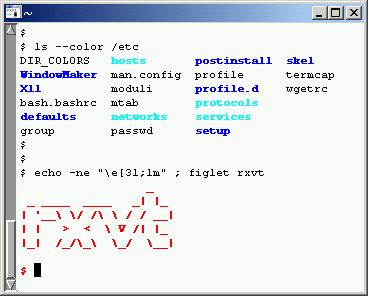


<h3 id="toc16">Barra pra cá ou barra pra lá?</h3>

Dentro do Cygwin, todos os diretórios são acessados usando as barras /, como no Linux. Já no Windows, são usadas as barras \ para separar diretórios. Há um programinha chamado `cygpath` que se encarrega de traduzir diretórios de um formato para o outro. Por exemplo:

```console
$ echo $PWD
/home/aurelio/pessoal/aurelio.net/doc

$ cygpath -w $PWD
C:\cygwin\home\aurelio\pessoal\aurelio.net\doc
```


<h2 id="toc17">Dicas para usuários do Windows/DOS</h2>

- Não crie arquivos com espaços em branco, caracteres estranhos e letras acentuadas no nome. Ao invés de `Ramones - I don't care.mp3`, prefira `Ramones-I_dont_care.mp3`.

- O diretório atual não faz parte do PATH (como no DOS). É preciso usar `./programa` para executar um programa que esteja no diretório corrente.

- O TAB é o canivete suíço da linha de comando. Use-o para completar automaticamente nomes de arquiv\<TAB>, diretó\<TAB> e comand\<TAB>.

- Diretórios remotos (compartilhados) também podem ser acessados via linha de comando, com a seguinte sintaxe: `//máquina/nome-compartilhamento`.

- O arquivo especial `/dev/clipboard` representa a "Área de Transferência". Confira também os programas `getclip` e `putclip`.

- Para saber o que faz um comando, digite `man comando` ou `comando --help`.

- Pode continuar usando o Bloco de Notas, EDIT.EXE, WinWord ou qualquer outro editor para criar seus textos. Lembre-se de usar o comando `dos2unix` para converter as quebras de linha. Alguns editores já possuem uma opção para gravar no formato UNIX.

- Instale o editor `nano` se quiser um editor de textos amigável no Cygwin. Use `nano arquivo.txt`, Ctrl+O salva e Ctrl+X sai.

- Algum comando do Cygwin “congelou” e o prompt não volta mais? Quer matar um programa que está rodando? Aperte Ctrl+C. Caso não seja suficiente, feche a janela. Caso ainda não funcione, abra o Gerenciador de Tarefas do Windows e finalize o processo `bash.exe`.

- Use o comando `cygstart` como substituto para o comando `start`.

- O Windows não gosta dos arquivos ocultos do Cygwin, que iniciam com um ponto (.) no nome. Use o comando `mv arquivo .arquivo` para renomear um arquivo, colocando um ponto no início.

- Os arquivos especiais como PRN, LPT1, COM1 também funcionam como no DOS. Exemplo: `cat arquivo > PRN`

- Todos os comandos que estão no PATH do DOS também estão disponíveis no Cygwin. Os do COMMAND.COM não.


<h2 id="toc18">Dicas para usuários do Linux/UNIX</h2>

- Esqueça `chmod`. Arquivos executáveis são automaticamente detectados pela extensão ou pela primeira linha mágica, como `#!/bin/sh`.

- O diretório `/usr/bin` é um link para o `/bin`, são a mesma coisa.

- Você é sempre root! Usuário “Administrador” ou usuário normal no Windows, ao usar Cygwin, tem poderes de root. Cuidado pois você pode apagar o `/home` ou outros diretórios importantes.

- O `mount` do Cygwin é usado para mapear drives (D:, E:) e compartilharmentos de rede (shares) em diretórios normais. Diferente do `mount` do Linux, o ponto de montagem (diretório) não precisa existir. E o mapeamento é definitivo, permanecendo mesmo quando reiniciar a máquina. Use o `umount` para cancelar um mapeamento. Ex.: `mount C: /c`

- Se for alterar o PATH, lembre-se que o PATH original do Windows (`$PATH`) deve sempre estar anexado no final, exemplo: `PATH="/usr/local/bin:/usr/bin:/bin:$PATH"`

- Ping, telnet, ftp e outros comandos comuns não precisa instalar no Cygwin, pois os já existentes no Windows podem ser usados na linha de comando.

- O programa `abc.exe` tem preferência de execução se houver um script `abc` no mesmo diretório.

- Os comandos também podem ser digitados EM MAIÚSCULAS. Estranho...

- Os atalhos criados com o “ln -s” são, na verdade, atalhos do Windows (arquivos .lnk) e funcionam nos dois sistemas. Não se preocupe, se forem guardados com `tar` e expandidos num sistema Linux, viram links simbólicos normais.

- Não há o comando `ifconfig`. Para ver as configurações de rede, use `WINIPCFG` ou `IPCONFIG /ALL`.

- Use o comando `cygstart` para abrir um arquivo em seu programa respectivo. É o mesmo que clicar duas vezes sobre o arquivo, só que mais legal :) Exemplos: `cygstart imagem.gif` e `cygstart documento.pdf`


<h2 id="toc19">Configuração</h2>

Crie estes arquivos dentro do seu diretório (`/home/usuário`) para que o Cygwin fique bem configurado.

Se for criar estes arquivos em algum editor de textos do Windows, lembre-se de depois remover a extensão .txt com o comando `mv .arquivo.txt .arquivo` e usar o comando `dos2unix` para convertê-los para o formato UNIX.

Nota: Há uma cópia destes arquivos em [https://aurelio.net/cygwin](/cygwin).


<h3 id="toc20">.inputrc</h3>

```config
# Acentuacao
set meta-flag on
set convert-meta off
set output-meta on

# TAB tratando igual maiusculas/minusculas
set completion-ignore-case on

# Fazer a tecla Insert colar
#"\e[2~": paste-from-clipboard
```


<h3 id="toc21">.bash_profile</h3>

```bash
# Listagem de diretorios usando cores
alias ls='ls --color=auto'
alias l='ls -la'

# Usar o Cygwin em Portugues
export LANG=pt_BR

# Editor de texto nano em Portugues
alias nano="LANG=pt_BR nano"

# Usar um Prompt personalizado
#PS1='\W) '

# Expansao de nomes de arquivos tratando
# igual maiusculas/minusculas
shopt -s nocaseglob
```


<h3 id="toc22">.nanorc</h3>

```config
set smooth      # rolar texto linha a linha
#set const      # mostrar numero da coluna/linha
```


<h3 id="toc23">.vimrc</h3>

```vim
set textwidth=70 background=dark
set is hls ic scs aw ruler ls=2
syntax on
```


<h2 id="toc24">É isso</h2>

Bem, aqui acaba nossa viagem ao mundo do Cygwin. O assunto vai longe, mas com estas dicas é possível se virar no sistema, resolvendo a maioria dos problemas que todo iniciante se depara.

Um segundo passo, seria explorar os poderes do Cygwin como ambiente de desenvolvimento e programação, demonstrar como fazer uma atualização dos pacotes direto da Internet, como adaptar um programa já existente para que ele funcione no Cygwin e a grande vedete: instalar o XFree86 e usar o modo gráfico do Linux dentro de uma janela do Windows.

Este último tópico em especial, pode parecer inútil num primeiro momento, pois já se tem o modo gráfico do Windows. Mas que tal usar o XFree do Cygwin para conectar-se num servidor de aplicações Linux da rede interna, e remotamente utilizar o desktop gráfico a partir do Windows? Mas isso fica para uma outra conversa...

Vai dizer que você leu até aqui e ainda não se convenceu a usar o Cygwin? Que tal instalar só para ter o prazer de uma vez na vida dar um `rm -rf /` despreocupado?

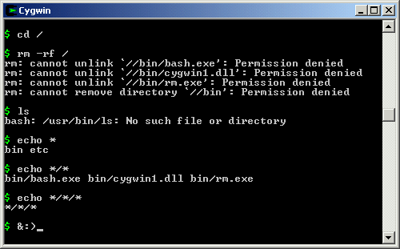

> **Mensagem aos puristas:** Tecnicamente, o Cygwin não é um Linux e sim um ambiente POSIX. A apologia foi usada para fins didáticos.


<h2 id="toc25">Para saber mais</h2>

- Lista de discussão de usuários, em português: [https://br.groups.yahoo.com/neo/groups/cygwin-br/info](https://br.groups.yahoo.com/neo/groups/cygwin-br/info)

- Página com links e informações, em português: [https://aurelio.net/cygwin](/cygwin)

- Página do Cygwin: [http://cygwin.com](http://cygwin.com)

**Aurelio Marinho Jargas** é programador e pesquisador. Já escreveu um livro sobre Expressões Regulares, é autor de vários artigos na Revista do Linux e como membro ativo da comunidade do Software Livre, escreve e disponibiliza documentação e programas GPL em seu site [https://aurelio.net](https://aurelio.net)
