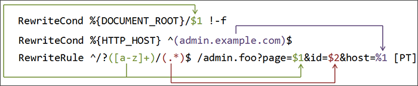

## Diretivas que aceitam Expressões Regulares

<table class="tableborder">
<thead>
  <tr>
    <th>Módulo</th>
    <th>Diretiva</th>
    <th>Formato</th>
    <th>Onde</th>
  </tr>
</thead>
<tbody>
  <tr>
    <th rowspan="8">core</th>
    <td><a href="http://httpd.apache.org/docs/current/mod/core.html#directory">&lt;Directory&gt;</a></td>
    <td>~ er</td>
    <td>sv</td>
  </tr>
  <tr>
    <td><a href="http://httpd.apache.org/docs/current/mod/core.html#directorymatch">&lt;DirectoryMatch&gt;</a></td>
    <td>er</td>
    <td>sv</td>
  </tr>
  <tr>
    <td><a href="http://httpd.apache.org/docs/current/mod/core.html#files">&lt;Files&gt;</a></td>
    <td>~ er</td>
    <td>svdh</td>
  </tr>
  <tr>
    <td><a href="http://httpd.apache.org/docs/current/mod/core.html#filesmatch">&lt;FilesMatch&gt;</a></td>
    <td>er</td>
    <td>svdh</td>
  </tr>
  <tr>
    <td><a href="http://httpd.apache.org/docs/current/mod/core.html#location">&lt;Location&gt;</a></td>
    <td>~ er</td>
    <td>sv</td>
  </tr>
  <tr>
    <td><a href="http://httpd.apache.org/docs/current/mod/core.html#locationmatch">&lt;LocationMatch&gt;</a></td>
    <td>er</td>
    <td>sv</td>
  </tr>
  <tr>
    <td><a href="http://httpd.apache.org/docs/current/mod/core.html#if">&lt;If&gt;</a></td>
    <td><a href="http://httpd.apache.org/docs/current/expr.html">… =~ /er/</a></td>
    <td>svdh</td>
  </tr>
  <tr>
    <td><a href="http://httpd.apache.org/docs/current/mod/core.html#elseif">&lt;ElseIf&gt;</a></td>
    <td><a href="http://httpd.apache.org/docs/current/expr.html">… =~ /er/</a></td>
    <td>svdh</td>
  </tr>
  <tr>
    <th>mod_authz_core</th>
    <td><a href="http://httpd.apache.org/docs/current/mod/mod_authz_core.html#require">Require</a></td>
    <td><a href="http://httpd.apache.org/docs/current/expr.html">… =~ /er/</a></td>
    <td>dh</td>
  </tr>
  <tr>
    <th rowspan="3">mod_alias</th>
    <td><a href="http://httpd.apache.org/docs/current/mod/mod_alias.html#aliasmatch">AliasMatch</a></td>
    <td>er</td>
    <td>sv</td>
  </tr>
  <tr>
    <td><a href="http://httpd.apache.org/docs/current/mod/mod_alias.html#redirectmatch">RedirectMatch</a></td>
    <td>er</td>
    <td>svdh</td>
  </tr>
  <tr>
    <td><a href="http://httpd.apache.org/docs/current/mod/mod_alias.html#scriptaliasmatch">ScriptAliasMatch</a></td>
    <td>er</td>
    <td>sv</td>
  </tr>
  <tr>
    <th rowspan="2">mod_headers</th>
    <td><a href="http://httpd.apache.org/docs/current/mod/mod_headers.html#header">Header</a></td>
    <td>er</td>
    <td>svdh</td>
  </tr>
  <tr>
    <td><a href="http://httpd.apache.org/docs/current/mod/mod_headers.html#requestheader">RequestHeader</a></td>
    <td>er</td>
    <td>svdh</td>
  </tr>
  <tr>
    <th>mod_log_debug</th>
    <td><a href="http://httpd.apache.org/docs/current/mod/mod_log_debug.html#logmessage">LogMessage</a></td>
    <td><a href="http://httpd.apache.org/docs/current/expr.html">… =~ /er/</a></td>
    <td>d</td>
  </tr>
  <tr>
    <th>mod_log_config</th>
    <td><a href="http://httpd.apache.org/docs/current/mod/mod_log_config.html#customlog">CustomLog</a></td>
    <td><a href="http://httpd.apache.org/docs/current/expr.html">… =~ /er/</a></td>
    <td>sv</td>
  </tr>
  <tr>
    <th rowspan="3">mod_proxy</th>
    <td><a href="http://httpd.apache.org/docs/current/mod/mod_proxy.html#proxymatch">&lt;ProxyMatch&gt;</a></td>
    <td>er</td>
    <td>sv</td>
  </tr>
  <tr>
    <td><a href="http://httpd.apache.org/docs/current/mod/mod_proxy.html#proxypassmatch">ProxyPassMatch</a></td>
    <td>er</td>
    <td>svd</td>
  </tr>
  <tr>
    <td><a href="http://httpd.apache.org/docs/current/mod/mod_proxy.html#proxyremotematch">ProxyRemoteMatch</a></td>
    <td>er</td>
    <td>sv</td>
  </tr>
  <tr>
    <th rowspan="2">mod_rewrite</th>
    <td><a href="http://httpd.apache.org/docs/current/mod/mod_rewrite.html#rewritecond">RewriteCond</a></td>
    <td>er</td>
    <td>svdh</td>
  </tr>
  <tr>
    <td><a href="http://httpd.apache.org/docs/current/mod/mod_rewrite.html#rewriterule">RewriteRule</a></td>
    <td>er</td>
    <td>svdh</td>
  </tr>
  <tr>
    <th rowspan="5">mod_setenvif</th>
    <td><a href="http://httpd.apache.org/docs/current/mod/mod_setenvif.html#browsermatch">BrowserMatch</a></td>
    <td>er</td>
    <td>svdh</td>
  </tr>
  <tr>
    <td><a href="http://httpd.apache.org/docs/current/mod/mod_setenvif.html#browsermatchnocase">BrowserMatchNoCase</a></td>
    <td>er</td>
    <td>svdh</td>
  </tr>
  <tr>
    <td><a href="http://httpd.apache.org/docs/current/mod/mod_setenvif.html#setenvif">SetEnvIf</a></td>
    <td>er</td>
    <td>svdh</td>
  </tr>
  <tr>
    <td><a href="http://httpd.apache.org/docs/current/mod/mod_setenvif.html#setenvifexpr">SetEnvIfExpr</a></td>
    <td><a href="http://httpd.apache.org/docs/current/expr.html">… =~ /er/</a></td>
    <td>svdh</td>
  </tr>
  <tr>
    <td><a href="http://httpd.apache.org/docs/current/mod/mod_setenvif.html#setenvifnocase">SetEnvIfNoCase</a></td>
    <td>er</td>
    <td>svdh</td>
  </tr>
  <tr>
    <th>mod_substitute</th>
    <td><a href="http://httpd.apache.org/docs/current/mod/mod_substitute.html#substitute">Substitute</a></td>
    <td>s///</td>
    <td>dh</td>
  </tr>
  <tr>
    <th>mod_version</th>
    <td><a href="http://httpd.apache.org/docs/current/mod/mod_version.html#ifversion">&lt;IfVersion&gt;</a></td>
    <td>~ er</td>
    <td>svdh</td>
  </tr>
</tbody>
<tfoot>
  <tr>
    <td align="center" colspan="4">Legenda: (s)erver, (v)host, (d)irectory, (h)taccess</td>
  </tr>
<tfoot>
</table>

## mod_rewrite

O mod_rewrite é muito complexo. É preciso ler muito sobre ele para entender seu funcionamento e criar suas regras com mais sabedoria e confiança. Invista um tempo para estudar estes documentos, nesta ordem:

1. http://httpd.apache.org/docs/current/rewrite/intro.html
2. http://httpd.apache.org/docs/current/mod/mod_rewrite.html
3. http://httpd.apache.org/docs/current/rewrite/flags.html
4. http://httpd.apache.org/docs/current/rewrite/remapping.html
5. http://httpd.apache.org/docs/current/rewrite/avoid.html
6. http://httpd.apache.org/docs/current/rewrite/tech.html

Os retrovisores são parte importante do mod_rewrite, inclusive há dois tipos de retrovisores: $1 para grupos do RewriteRule e %1 para grupos do RewriteCond:

Fonte: http://httpd.apache.org/docs/current/images/rewrite_backreferences.png

## Links

* [Directive Quick Reference](http://httpd.apache.org/docs/current/mod/quickreference.html)
Lista completa com todas as diretivas do Apache, com links para sua documentação.

* [How the sections are merged](http://httpd.apache.org/docs/current/sections.html#merging)
Saiba mais sobre a ordem de execução das diretivas: primeiro todas as `<Directory>`, depois suas equivalentes regex (`<Directory ~ ...>` e `<DirectoryMatch>`) e depois vem na fila `Files*`, `Location*` e `If`.

* [Apache RewriteRule and query string](http://www.simonecarletti.com/blog/2009/01/apache-rewriterule-and-query-string/)
Artigo rápido e bem explicado sobre como lidar com as query strings da URL original ao usar o mod_rewrite.

* [Wiki — mod_rewrite recipes and guides](http://wiki.apache.org/httpd/Rewrite)
Wiki oficial dos usuários do Apache, com vários artigos pequenos, com dics valiosas. Recomendo a leitura dos artigos desta seção especial sobre o mod_rewrite.

* [Apache mod_rewrite](http://httpd.apache.org/docs/current/rewrite/)
Portal de entrada para a documentação do mod_rewrite, com vários links para outros documentos sobre ele.
