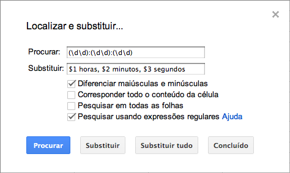

## Busca

## Funções

* `REGEXMATCH` — Testa se a expressão casou ou não
* `REGEXREPLACE` — Faz substituições
* `REGEXEXTRACT` — Extrai o texto casado

## Minha planilha de testes

Decidi disponibilizar publicamente a planilha em que fiz todos os meus testes com as expressões, enquanto escrevia este tópico para o livro. Há muita informação importante concentrada ali, além de todos os exemplos que usei no texto. Faça uma cópia para o seu Google Docs (Google Drive) e brinque à vontade:

https://docs.google.com/spreadsheet/ccc?key=0AkhT49x22EfMdG9TU2JHOGZPdEV6bzlESUNIc2xKMUE

## Links

* [Find and replace in spreadsheets](http://support.google.com/docs/bin/answer.py?hl=en&answer=141704)
Documentação oficial do Google sobre o “Localizar e substituir” nas planilhas. Tem uma tabela com um resumo dos metacaracteres, e exemplos de uso. Este é o link "Ajuda" que aparece na janelinha da busca.

* [RE2 Syntax](http://code.google.com/p/re2/wiki/Syntax)
Referência completa dos metacaracteres usados pelo engine do Google, chamado RE2.

* [Google spreadsheets function list](https://support.google.com/docs/bin/static.py?hl=en&topic=25273&page=table.cs&ctx=tooltip)
Lista de todas as fórmulas disponíveis. Eu sugiro uma lida com calma, para conhecer as várias ferramentas úteis que você pode usar em suas fórmulas.

* [Array formulas](http://support.google.com/docs/bin/answer.py?hl=en&answer=71291)
Guia sobre o uso de ArrayFormula(), a função que possibilita usar arrays em funções que normalmente só recebem texto. Excelente companheira para as funções REGEX*. É similar ao Ctrl+Shift+Enter do Excel.
