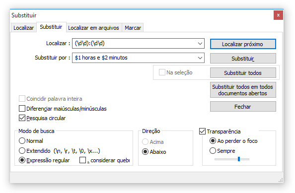

## Painel de busca e substituição

## Dicas

* O Notepad++ usa [PCRE](http://www.pcre.org) desde sua versão 6.0 (de 2012).
* Use o **Localizar** (Ctrl+F) ou **Substituir** (Ctrl+H).
* A aba **Marcar** é meio que um [RegexPal](http://regexpal.com) dentro do editor, destacando tudo o que a regex casa.
* A opção “**. considerar queb**” é equivalente ao modificador `(?s)`, que faz o ponto casar a quebra de linha.
* Acentuação funciona normalmente no `\w`, `\l` e `\u`.
* Retrovisores na substituição: `$0`, `$1`, `${1}`, `$+{nome}`.
* Substituição, escapar para inserir literal: `\$`, `\(`, `\)`, `\\`.
* Substituição, converter maiúsculas/minúsculas: `\l$1`, `\u$1`, `\U$1$2\E`.
* Ligue a opção de menu **Visualizar > Mostrar símbolo > Exibir todos os caracteres** para poder enxergar tabs, espaços e quebras de linha.

## Referência

* [Documentação oficial sobre regex no Notepad++](http://docs.notepad-plus-plus.org/index.php/Regular_Expressions)
Página Wiki oficial sobre as Expressões Regulares no Notepad++. Lista quais são os metacaracteres suportados e traz algumas dicas de uso.

* [PCRE (boost) - Documentação](http://www.boost.org/doc/libs/1_59_0/libs/regex/doc/html/boost_regex/syntax/perl_syntax.html)
Guia de referência da biblioteca PCRE que é usada no Notepad++, com a lista completa de todos metacaracteres suportados.
