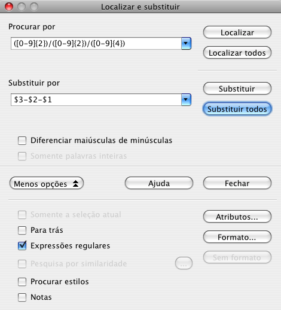

## Usar regex na busca

 

## Funções do Calc que suportam regex

<table class="tableborder">
<thead>
  <tr>
    <th></th>
    <th>português</th>
    <th>inglês</th>
  </tr>
</thead>
<tbody>
  <tr>
    <th>Texto</th>
    <td>PESQUISAR</td>
    <td><a href="http://wiki.openoffice.org/wiki/Documentation/How_Tos/Calc:_SEARCH_function">SEARCH</a></td>
  </tr>
  <tr>
    <th rowspan="2">Matemática</th>
    <td>CONT.SE</td>
    <td><a href="http://wiki.openoffice.org/wiki/Documentation/How_Tos/Calc:_COUNTIF_function">COUNTIF</a></td>
  </tr>
  <tr>
    <td>SOMASE</td>
    <td><a href="http://wiki.openoffice.org/wiki/Documentation/How_Tos/Calc:_SUMIF_function">SUMIF</a></td>
  </tr>
  <tr>
    <th rowspan="4">Planilha</th>
    <td>CORRESP</td>
    <td><a href="http://wiki.openoffice.org/wiki/Documentation/How_Tos/Calc:_MATCH_function">MATCH</a></td>
  </tr>
  <tr>
    <td>PROC</td>
    <td><a href="http://wiki.openoffice.org/wiki/Documentation/How_Tos/Calc:_LOOKUP_function">LOOKUP</a></td>
  </tr>
  <tr>
    <td>PROCH</td>
    <td><a href="http://wiki.openoffice.org/wiki/Documentation/How_Tos/Calc:_HLOOKUP_function">HLOOKUP</a></td>
  </tr>
  <tr>
    <td>PROCV</td>
    <td><a href="http://wiki.openoffice.org/wiki/Documentation/How_Tos/Calc:_VLOOKUP_function">VLOOKUP</a></td>
  </tr>
  <tr>
    <th rowspan="12">Banco de dados</th>
    <td>BDCONTAR</td>
    <td><a href="http://wiki.openoffice.org/wiki/Documentation/How_Tos/Calc:_DCOUNT_function">DCOUNT</a></td>
  </tr>
  <tr>
    <td>BDCONTARA</td>
    <td><a href="http://wiki.openoffice.org/wiki/Documentation/How_Tos/Calc:_DCOUNTA_function">DCOUNTA</a></td>
  </tr>
  <tr>
    <td>BDDESVPA</td>
    <td><a href="http://wiki.openoffice.org/wiki/Documentation/How_Tos/Calc:_DSTDEVP_function">DSTDEVP</a></td>
  </tr>
  <tr>
    <td>BDEST</td>
    <td><a href="http://wiki.openoffice.org/wiki/Documentation/How_Tos/Calc:_DSTDEV_function">DSTDEV</a></td>
  </tr>
  <tr>
    <td>BDEXTRAIR</td>
    <td><a href="http://wiki.openoffice.org/wiki/Documentation/How_Tos/Calc:_DGET_function">DGET</a></td>
  </tr>
  <tr>
    <td>BDMULTIPL</td>
    <td><a href="http://wiki.openoffice.org/wiki/Documentation/How_Tos/Calc:_DPRODUCT_function">DPRODUCT</a></td>
  </tr>
  <tr>
    <td>BDMÁX</td>
    <td><a href="http://wiki.openoffice.org/wiki/Documentation/How_Tos/Calc:_DMAX_function">DMAX</a></td>
  </tr>
  <tr>
    <td>BDMÉDIA</td>
    <td><a href="http://wiki.openoffice.org/wiki/Documentation/How_Tos/Calc:_DAVERAGE_function">DAVERAGE</a></td>
  </tr>
  <tr>
    <td>BDMÍN</td>
    <td><a href="http://wiki.openoffice.org/wiki/Documentation/How_Tos/Calc:_DMIN_function">DMIN</a></td>
  </tr>
  <tr>
    <td>BDSOMA</td>
    <td><a href="http://wiki.openoffice.org/wiki/Documentation/How_Tos/Calc:_DSUM_function">DSUM</a></td>
  </tr>
  <tr>
    <td>BDVAREST</td>
    <td><a href="http://wiki.openoffice.org/wiki/Documentation/How_Tos/Calc:_DVAR_function">DVAR</a></td>
  </tr>
  <tr>
    <td>BDVARP</td>
    <td><a href="http://wiki.openoffice.org/wiki/Documentation/How_Tos/Calc:_DVARP_function">DVARP</a></td>
  </tr>
</tbody>
<tfoot>
  <tr>
    <td colspan="3">Ferramentas → Opções → OpenOffice.org Calc → Calcular → Permitir expressões regulares em fórmulas</td>
  </tr>
</tfoot>
</table>

## Artigos

* [Powerful text matching with regular expressions](http://www.oooninja.com/2007/12/powerful-text-matching-with-regular.html)
Artigo introdutório sobre Expressões Regulares no OpenOffice, com várias tabelas úteis e exemplos. Uma boa fonte de referência e aprendizado.

* [Example regular expressions for Writer](http://www.oooninja.com/2007/12/example-regular-expressions-for-writer.html)
Artigo com vários exemplos úteis de expressões para o OpenOffice.

* [Wiki — HOWTO: Regular Expressions in Writer](http://wiki.openoffice.org/wiki/Documentation/How_Tos/Regular_Expressions_in_Writer)
Página Wiki oficial sobre o funcionamento das Expressões Regulares no Writer. Contém informações valiosas sobre as várias “pegadinhas” (na verdade, problemas) com o suporte às expressões no Writer. Leitura obrigatória se você pretende usar seriamente as expressões no editor.

* [Wiki — HOWTO: Regular Expressions in Calc](http://wiki.openoffice.org/wiki/Documentation/How_Tos/Regular_Expressions_in_Calc)
Página Wiki oficial sobre o funcionamento das Expressões Regulares no Calc. Complementa o documento anterior sobre o Writer, trazendo detalhes adicionais sobre o uso das expressões nas planilhas, para as buscas e uso nas funções (fórmulas).

* [Searching and replacing paragraph returns (carriage returns), tabs, and other special characters in OpenOffice Writer](http://openoffice.blogs.com/openoffice/2009/08/searching-and-replacing-paragraph-returns-carriage-returns-tabs-and-other-special-characters-in-open.html)
Artigo que fala das pegadinhas de se usar o `\n` para casar quebras de parágrafo e quebras de linha manuais.

## Referência

* [Wiki — Regexp](http://wiki.services.openoffice.org/wiki/Regexp)
Página Wiki oficial sobre o pacote de Expressões Regulares no OpenOffice. Traz informações técnicas e status atual do suporte às expressões.

* [List of Regular_Expressions](http://help.libreoffice.org/Common/List_of_Regular_Expressions)
Uma tabelona que lista todos os metacaracteres, com exemplos de uso. Excelente! Também possui uma [versão em português](http://help.libreoffice.org/Common/List_of_Regular_Expressions/pt-BR).

* [Issue 46165](http://qa.openoffice.org/issues/show_bug.cgi?id=46165)
* [Issue 85269](http://qa.openoffice.org/issues/show_bug.cgi?id=85269)
Bug tracker que descreve várias inconsistências e problemas no comportamento das Expressões Regulares no OpenOffice. Leia para conhecer os problemas e procurar evitá-los. Segundo os desenvolvedores, é preciso uma faxina geral nas Expressões Regulares para resolver todos estes problemas, e a solução planejada é trocar o código atual pelo pacote ICU (veja item seguinte).

* [Pacote de expressões regulares do ICU](http://userguide.icu-project.org/strings/regexp)
O suporte atual de Expressões Regulares no OpenOffice é problemático, e o próprio time de desenvolvimento admite isso. O objetivo futuro (para a série 3.x da suíte) é abandonar o pacote atual e trocá-lo por este pacote do ICU, que é mais maduro e funcional.

## Plugins

* [Alternative dialog Find & Replace for Writer](http://extensions.services.openoffice.org/project/AltSearch)
Uma extensão bem bacana que traz um painel “Localizar e Substituir” diferente, bem mais poderoso que o normal. Além do suporte melhorado às Expressões Regulares, possui várias funções adicionais.
