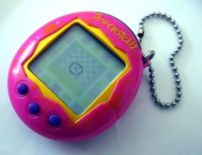
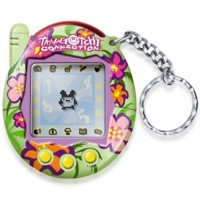
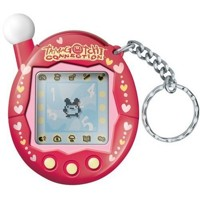
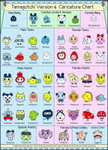
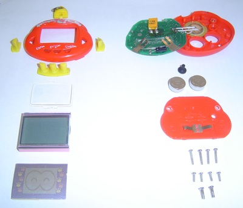

## O que é um Tamagotchi?

O tamagotchi (たまごっち tamagotti em japonês) é um brinquedo em que se cria um animal de estimação virtual. O tamagotchi foi lançado pela Bandai em 1996 no Japão.

A motivação do brinquedo consiste em cuidar do animalzinho virtual como se fosse real, dando-lhe carinho virtual, comida virtual, banho virtual, cuidados virtuais etc.

Já existe duas novas versões do Tamagochi (ou Tamagothi). O Tamagochi apresentado na imagem é a primeira versão. Já na versão 2 ele vem com **sensor infravermelho** permitindo que os Tamas se comuniquem entre si e até tenham filhos.

O **Tamagotchi Connection V3** foi lançada em 2005 no Japão e só agora está se espalhando pela Europa. É o novo Tamagothi Connection, que, além do sensor infravermelho e de jogos e funções adicionais àquelas conhecidas, tem interação com o computador, em um site "Tamagothi Town", onde pode-se adquirir produtos virtuais através dos pontos ganhos em jogos. Não paga nada para entrar e se divertir. Nem para adquirir os produtos virtuais. Estes são armazenados em seu Tamagochi V3. Na Península Ibérica já o **Tamagotchi Connection Jinsei**, uma 4ª versão melhorada, que permite ao dono ter mais liberdade quanto à comida que dá ao seu "animal", mais jogos, receber cartas, visitar os outros Tamagotchis e até ligá-lo através de um código ao site oficial. Custa entre 19,99 e 22,00 euros e pode facilmente ser adquirido em lojas de Centros comerciais.

Agora o **Tamagotchi Connection V5** vem com opção de família, onde ao se comunicar com outro tamagotchi você pode até ter filhotes. A V5 tem 3 tamagotchis dentro de um ovo. Depois quando tiverem idade para casar pode casar por TV (do tamagotchi) ou por comunicação (infra-vermelhos).

> Fonte: [Wikipedia](http://pt.wikipedia.org/wiki/Tamagotchi)

## Onde comprar um Tamagotchi?

Procure nas lojas de 1 e 99 e nas lojinhas que vendem produtos trazidos do Paraguai. Pergunte pelo "bichinho virtual".

## Qual o preço de um Tamagotchi?

Anos atrás eles eram vendidos por cerca de R$ 25,00. Mas hoje estão mais baratos e podem ser encontrados por cerca de R$ 7,00 ou menos.

## Os vários nomes do Tamagotchi

Tamagotchi foi o nome do primeiro bichinho virtual que lançaram, mas depois dele vieram vários outros. O nome Tamagotchi, porém, é usado para chamar de maneira genérica qualquer bichinho virtual. Assim como Bombril virou sinônimo de palha de aço. Alguns dos bichinhos existentes são:

- BabyDino
- Chickpet
- Compu Kitty
- Dinopet
- Gyaoppi
- Menino Gênio
- My Pocket Kitty
- My Sweet Puppy
- Nekotcha
- Octo Pets
- Pocket Fish
- Puppy do Gugu
- Rakuraku Dinokun (Dinky Dino)
- TakoSeijin (Alien)
- Tama Puppy
- Yuki Pengin (Pingüim)

Há outros termos que também são usados para descrever a espécie:

- Bichinho Digital
- Bichinho Eletrônico
- Bichinho Virtual
- Bicho Virtual
- Cyber Pet
- Pet Digital
- Pet Virtual

Muitos não sabem escrever Tamagotchi do jeito correto, então também é possível encontrar informações usando algumas das seguintes variações:

- Tamagoshi
- Tamagochi
- Tamagoxi
- Tamagoti
- Tamagotti
- Tamagothi
- Tamagotshi
- Tomagoshi
- Tomagochi
- Tomagoxi
- Tomagoti
- Tomagotti
- Tomagothi

## Acabei de comprar um Tamagotchi, e agora?

- Ligue o Tamagotchi
- Ajuste o relógio
- Aperte o botão Clock para o seu bichinho nascer
- Assista ao "vídeo" de seu nascimento
- o botão Escolha um nome legal para o seu bichinho
- A hora que ficar só uma bolinha dançando na tela, o Tamagotchi está pronto para ser cuidado

## Tá, ele nasceu, e agora?

Agora você pode começar a cuidar do seu Tamagotchi. Como um recém-nascido, ele precisa de cuidados.

- Dê comida e bebida umas três vezes, para garantir que ele não passará fome.
- Faça carinho e brinque um pouco para que ele fique feliz.
- Faça ele estudar para ficar inteligente.
- Vá no perfil e acompanhe qual o estado atual do seu bichinho.

## Meu Tamagotchi morreu, e agora?

Se ele morrer, faça um minuto de silêncio e aperte o botão Reset para fazer nascer um bichinho novo.

## Como colocar a hora certa no relógio?

Só é possível ajustar a hora ao ligar o Tamagotchi. Aperte o botão Reset ou retire e coloque novamente as pilhas. Feito isso, na tela ficará aparecendo as horas, como 0:00.

- Aperte o botão Enter, a hora vai piscar
- Aperte o botão Esquerda para aumentar até a hora desejada
- Aperte o botão Direita para piscar os minutos
- Aperte o botão Esquerda para aumentar até a hora desejada
- Aperte o botão Enter para o relógio começar a funcionar
- Aperte o botão Clock para o bichinho nascer e a brincadeira começar!

*Obs.: Informações relativas ao Rakuraku Dinokun. No seu bichinho pode ser diferente.*

## Como ver as horas?

Aperte o botão Clock para ver o relógio. Aperte o botão Clock novamente para voltar a cuidar do seu Tamagotchi.

## Como brincar de "pedra, papel e tesoura"?

- Aperte os botões da direita ou esquerda para escolher qual posição:
  - Pedra - mão fechada
  - Papel - mão aberta
  - Tesoura - dois dedos esticados
- Aperte o botão Enter
- O Tamagotchi vai escolher uma posição também, sem saber a sua!
- Como saber quem ganha:
  - A pedra ganha da tesoura (pois quebra ela)
  - A pedra perde do papel (pois ele embala a pedra)

  - O papel ganha da pedra (pois embala ela)
  - O papel perde da tesoura (pois ela corta o papel)

  - A tesoura ganha do papel (pois corta ele)
  - A tesoura perde da pedra (pois ela quebra a tesoura)
- Jogue algumas vezes seguidas, até aparecerem corações na tela
- Seu Tamagotchi ficará muito feliz porque você brincou com ele

*Obs.: Informações relativas ao Rakuraku Dinokun. No seu bichinho pode ser diferente.*

## Esse bicho só dorme e não faz nada!

Primeiro, certifique-se que o relógio está com a hora correta.

Assim como um bicho de verdade, seu Tamagotchi também precisa descansar, então ele vai dormir quando escurece. Isso acontece por volta das oito da noite.

Quando ele está dormindo, não quer ser incomodado, então nenhum botão funciona. Não adianta querer brincar nem dar comida, tem que esperar ele acordar. Ele só acorda de manhã, no dia seguinte.

Por isso é bem importante deixar o relógio com a hora certa, para que o bichinho tenha horários parecidos com os seus e não fique incomodando no meio da noite.

## Meu Tamagotchi fica apitando no meio da noite!

Ele deve estar com o relógio desregulado.

O normal é ele dormir de noite, sem incomodar nem ficar querendo sua atenção. Ele só saberá que é noite se seu relógio estiver com a hora correta.

Aperte o botão Clock para ver qual a hora atual do seu Tamagotchi.

Se estiver errada, será preciso ajustar o relógio.

## Opções do menu da esquerda

- Bebida
  - Só tem um tipo de bebida
  - Quando ele já estiver cheio, vai negar
- Comida
  - Sanduíche
  - Frango
  - Maçã
  - Cenoura
  - Sorvete
  - Macarrão (Miojo)
  - Quando ele já estiver cheio, vai negar
- Luz (ON OFF)
- Carinho na cabeça (pode fazer quantas vezes quiser)
- Perfil
  - Felicidade (quanto maior o sorriso, melhor)
  - Inteligência (é bom quando está em A+)
  - Peso e idade (em dias)
  - Comida (não deixe ficar vazio!)
  - Bebiba (não deixe ficar vazio!)
  - Temperatura

*Obs.: Informações relativas ao Rakuraku Dinokun. No seu bichinho pode ser diferente.*

## Opções do menu da direita

- Brincar (pedra, papel, tesoura)
- Estudar (ler um livro)
- Banho
- Ar condicionado (ON OFF)
- Remédio (só aceita quando está doente, com olhos de cruz)

*Obs.: Informações relativas ao Rakuraku Dinokun. No seu bichinho pode ser diferente.*

## Dicas para cuidar bem de seu Tamagotchi

- É muito importante que o relógio esteja com a hora certa.

- Ao entrar em qualquer tela, o o botão Esc serve para sair, voltando para a tela principal.

- Se apertar o botão Reset você perde tudo, é como se seu bichinho morresse. Cuidado!

- Quando o Tamagotchi é pequeno, ele é mais frágil e precisa de cuidados o tempo todo. Se você o deixar sozinho cerca de 6h, ele morrerá.

- Quando seu bichinho não quer comer ou tomar banho, ele vai balançar a cabeça, dizendo NÃO. Nem perca tempo insistindo que ele não muda de idéia. Espere um tempo, depois tente novamente.

- O Tamagotchi apita quando quer sua atenção. Sempre veja o que ele quer quando ele fizer barulho.

- De tempos em tempos, vá no perfil do bichinho e veja do que ele está precisando. A primeira tela, da felicidade, indica se ele está bem. Mas veja também se não está precisando de comida, bebida e estudos.

*Obs.: Informações relativas ao Rakuraku Dinokun. No seu bichinho pode ser diferente.*

## Fotos do Tamagotchi Connection

## Manual do usuário do Tamagotchi Connection V2

*[Veja em tamanho maior](http://www.freewebs.com/tamasrule/tamagotchi_connection_ver2.gif)*

## Lista dos bichinhos do Tamagotchi V4

*[Veja em tamanho maior](http://img125.imageshack.us/img125/452/chartredo2ir8.gif)*

## Foto do Tamagotchi aberto/desmontado

