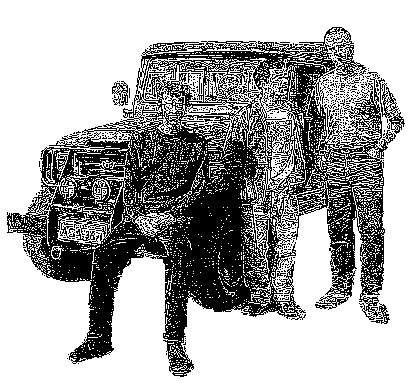

Eu nunca tinha me interessado pelas edições anteriores
[desse fórum](http://www.softwarelivre.org/forum2003/),
nem por essa pra falar a verdade. Mas depois que eu soube que dois
grandes amigos virtuais meus iriam (Julio Neves e Thobias Salazar),
comecei a ponderar a hipótese de ir.

Tudo conspirou para a viagem dar certo, então a mulher concedeu o
alvará de soltura e dois intrépidos amigos ex-Conectivos de Curitiba
toparam ir junto. Estava formado o time para a viagem:

- Aurelio Marinho Jargas
- Leslie Harlley Watter
- Rudá Sumé Tente de Moura
- TOYOTA Banderante 89 SuperCharger XR3 GTi Luxo

O Rudá e o Leslie vieram de Curitiba até Floripa de ônibus na quarta à
noite (dia 4), e no dia seguinte entulhamos a TOYOTA de tralhas e
saímos às 7 da manhã em direção à Porto Alegre.

Foi praticamente a viagem toda debaixo de chuva forte (MAAAAALA),
dando um trégua somente na divisa dos estados. Finalmente, entramos no
Rio Grande do Sul TCHÊ, terra do chimarrão TCHÊ, do churrasco e dos
farroupilhas TCHÊ! Mas logo ao cruzar a fronteira, para nossa surpresa
nos deparamos com esta placa:

Mas BAH TCHÊ!!! Rodando mais um pouco encontramos o "Arroio do
Pinto"... TCHÊ BARBARIDADE!

Mais algumas poucas horas de viagem, finalmente chegamos à capital
Porto Alegre! Fomos direto à casa do amigo Domingos (ainda Conectivo),
e sua esposa Bianca (ex-Conectiva), que gentilmente cederam espaço em
sua casa para nos abrigar durante os dias do evento TCHÊ!

 

BAH TCHÊ! Escondido atrás da cabeça do Domingos está o Bernardo,
herdeiro da família gaúcha, que nasceu há +- 6 meses atrás, TCHÊ!

Quanto ao Fórum TCHÊ, as palestras variavam entre chatas, mal
preparadas, boas e excelentes. O legal é que para as palestras de
gringos tinham uns aparelhinhos individuais de tradução, show de
buela. No geral, achei o Fórum muito bom, organizado e interessante
TCHÊ!

Mas TCHÊ, fiquei surpreso e assustado quando alguns ilustres
desconhecidos me abordavam perguntando se eu era o Aurelio, e pediam
para tirar foto e até para dar autógrafo (!!?!). TCHÊ! Será que virei
Pop-Star e não sei? Se sim, logo logo vou poder comprar uma mansão e
um iate! Ei, me mandem as fotos para eu colocar aqui também!

> **Mico da viagem:** O Julio me concedeu a honra de ir ao palco
> e falar ao microfone no final de sua palestra sobre
> Shell-Script. Desculpa amigo Julio, você esperava que eu
> falasse algo de bom, mas com a surpresa da situação aliado ao
> total despreparo psicológico para falar em público naquele
> momento, tudo o que consegui falar foi "A página é AURELIO.NET
> e eu realmente não tenho nada pra falar". CapiaRRR do mato é
> assim meRRRmo... Meu consolo é que o Thobias conseguiu falar
> menos ainda! Hehehehe

Mas GURI, melhor ainda do que as palestras, foi a possibilidade de
encontrar "ao vivo" amigos que eram apenas virtuais TCHÊ. Outros fazia
muito tempo que eu não via:

*Rubens Queiroz (Dicas-L)*

*Julio Cezar Neves (Livro Shell Script)*

*Marcus Vinicius "Paradise"*

*Thobias Salazar Trevisan (Funções ZZ)*

*Augusto César Radtke*

*Klayson Bonatto*

*Alessandro Binhara*

*Marcelo Tosatti (Kernel)*

## Sessão EXTRA - Rudá encontra seus ídolos

Não há muito o que comentar, as fotos já dizem tudo &amp;:) O Rudá deixou
desabrochar seu lado fã e se desmanchou de alegria ao encontrar seus
ídolos. Humildade do Rudá, pois ele mesmo é uma personalidade, tendo
sido o protagonista principal do filme
"[O PESTE](http://movieweb.com/movie/thepest/)".

*Rudá & Alexandre Oliva (gcc, RedHat)*

*Rudá & Miguel de Icaza (Gnome, MONO)*

